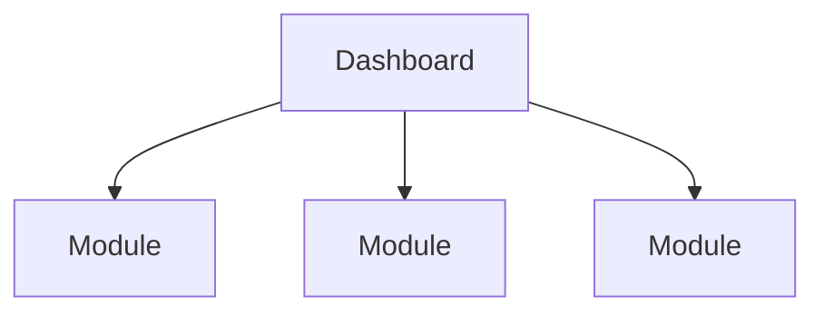
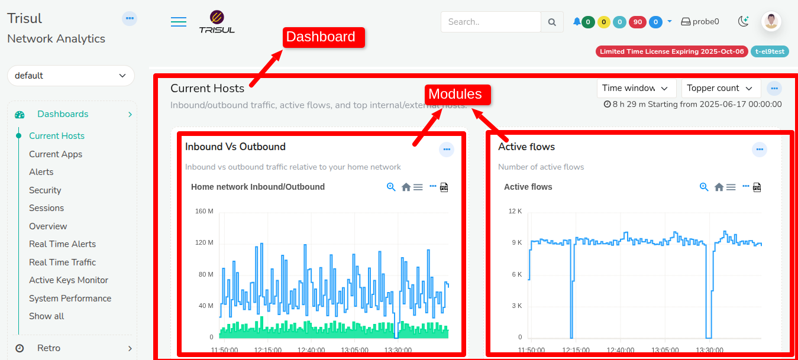
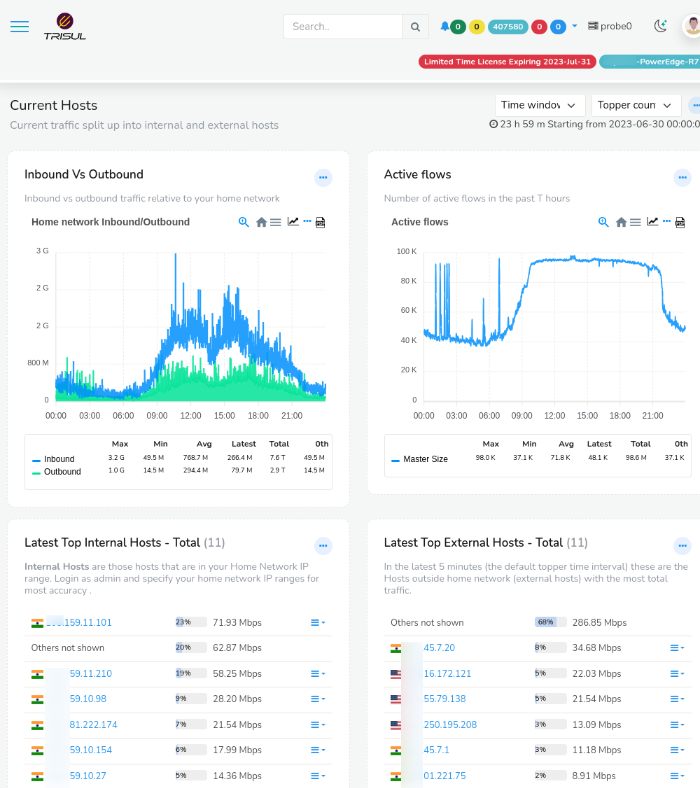
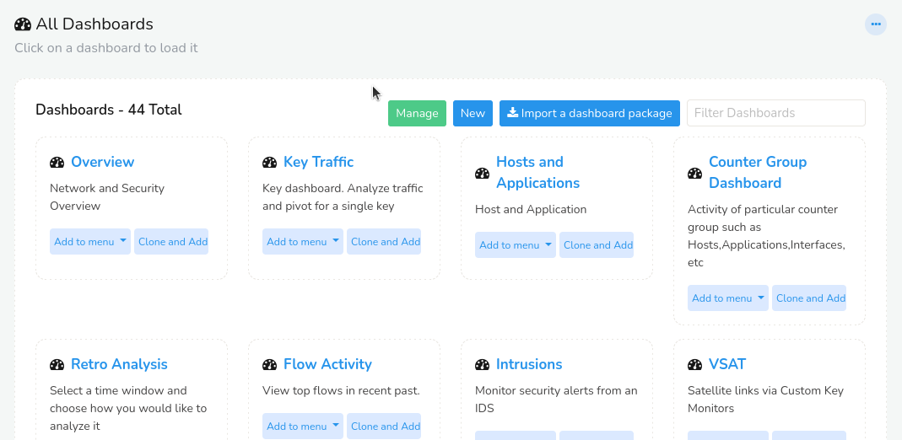
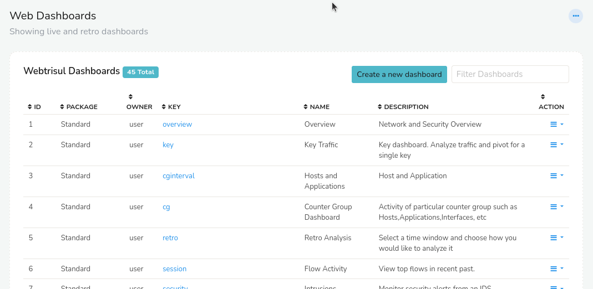
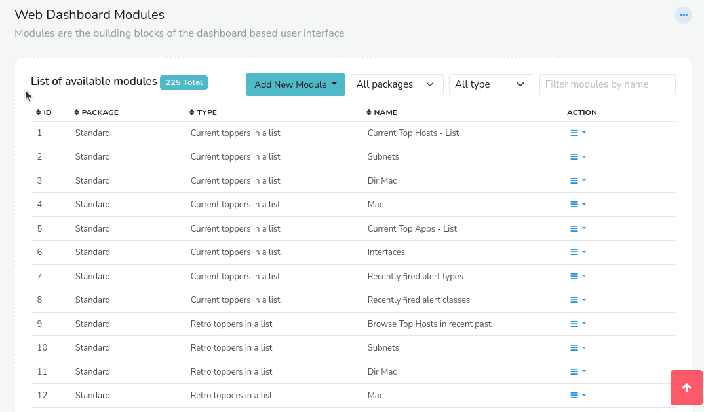
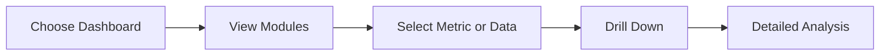

# Introduction to Dashboards and Modules

Dashboards and modules are the primary way Trisul presents network data in the Web UI.

A **dashboard** provides a workspace for viewing related network information, while **modules** are the individual components placed on a dashboard that present specific metrics or analysis.

The relationship is:


```mermaid
flowchart TD
    A[Dashboard] --> B[Module]
    A --> C[Module]
    A --> D[Module]
```

A dashboard can contain multiple modules, and a module can be used in multiple dashboards.

## What are Dashboards?

A **dashboard** is a collection of modules arranged to provide a particular view of network activity.

For example, a dashboard might combine modules showing:

- Current traffic
- Top hosts
- Top applications
- Active connections

The dashboard provides the overall context, while each module presents a specific view of the underlying network data.

  
*Figure: Showing Dashboard and Modules*

### Why use dashboards?

Dashboards are useful when you want to:

- Monitor network activity from a single view.
- Bring related metrics together.
- Compare different aspects of network activity.
- Quickly identify changes or unusual activity.
- Drill down from a high-level view into more detailed analysis.

Dashboards can be customized to suit different monitoring and investigation requirements.

> **Note:** The dashboards available to you depend on the Trisul deployment, Product Mode, User privileges, and dashboard configuration.

For information about the dashboards that Trisul provides by default, see **[Default Dashboards](/docs/ug/ui/dashboards)**.

For information about creating and customizing dashboards, see **[Dashboards](/docs/ug/ui/create_dashboards#create-a-dashboard)**.

## What is a Module?

A **module** is an individual component within a dashboard that presents a specific metric, chart, table, or other network analysis view.

For example, a dashboard may contain:

```text
Dashboard
│
├── Top Hosts
├── Top Applications
├── Traffic
└── Active Connections
```

Each module answers a particular network question.

For example:

- **Top Hosts** → Which hosts are generating the most traffic?
- **Top Applications** → Which applications are consuming the most traffic?
- **Traffic** → How has traffic changed over time?
- **Active Connections** → Which connections are currently active?

Trisul provides a library of prebuilt modules, and modules can also be created and customized using the available module templates.

For information about creating and managing modules, see **[Modules](/docs/ug/ui/modules)**.

## How Dashboards and Modules Work Together

A dashboard provides the **context and layout** for its modules.

A module provides the **individual analysis view**.

This separation allows the same module to be used in different dashboards without having to recreate the module each time.

For example, the same **Top Hosts** module could be included in:

- A general network monitoring dashboard.
- A security investigation dashboard.
- A custom dashboard created for a specific operational requirement.

### Module Reuse

A module can be:

- Used in multiple dashboards.
- Added more than once to the same dashboard.
- Positioned differently on different dashboards.

This makes dashboards flexible without requiring every analysis view to be created from scratch.

> **Important:** Changes to a module's properties can affect every dashboard that uses that module. Consider this when modifying a module that is shared across dashboards.


## Dashboard Layout

Modules are placed into defined positions within a dashboard.

The dashboard automatically adjusts its layout based on the modules present.

If a particular position does not contain a module, Trisul does not render an empty space for that position. Other modules can adjust to use the available width.

This allows dashboards to remain compact when modules are added, removed, or rearranged.

For details about arranging modules and changing dashboard layouts, see **[Dashboards](/docs/ug/ui/create_dashboards)**.


## Example: Current Hosts Dashboard

The **Current Hosts** dashboard provides a view of current host activity.

It combines multiple modules into a single dashboard so that related host and traffic information can be viewed together.

  
*Figure: Current Host Dashboard*

The dashboard contains modules that provide different views of current host and traffic activity.

For the current list of default dashboards and the modules they contain, see **[Default Dashboards](/docs/ug/ui/dashboards)**.


## Viewing Dashboards

You can access the dashboards available to your account from the **Dashboards** menu.

To view the available dashboards:

:::info navigation

:point_right: From the Menu, Go to *Dashboards* &rarr;  *Show all*

:::



*Figure: Showing All Dashboards*

This opens the list of dashboards available to your account.

Select a dashboard to open it.

You can also access dashboards through 

:::info navigation

:point_right: **Customize → Show All → Dashboards**

:::

when you need to manage or customize them.




*Figure: Showing All Dashboards*

> **Note:** The dashboards and options available to you depend on your User privileges and the configuration of the deployment.

For dashboard creation, editing, layout management, and other dashboard operations, see **[Dashboards](/docs/ug/ui/create_dashboards#dashboard-menu-options)**.


## Viewing Modules

Modules are normally viewed as part of a dashboard.

To view the modules available in the system:

:::info Navigation

👉 From the Menu, go to **Customize → Show All → Modules**.

:::



*Figure: Showing All Modules*

This displays the available modules.

To understand how a particular module is used, open the dashboard containing that module.

For creating, editing, cloning, deleting, and configuring modules, see **[Modules](/docs/ug/ui/modules)**.


## Dashboard and Module Customization

Dashboards and modules can be customized to match different monitoring and analysis requirements.

At a high level:

| Object | What you can customize |
| --- | --- |
| **Dashboard** | Layout, modules, name, description, visibility, and other dashboard properties |
| **Module** | Module configuration, metrics, presentation, and other properties |

The exact options available depend on the object being customized and the permissions of the logged-in account.


For detailed procedures:

- See **[Dashboards](/docs/ug/ui/create_dashboards)** for dashboard creation and customization.
- See **[Modules](/docs/ug/ui/modules)** for module creation and configuration.

## Understanding the Dashboard Workflow

A typical workflow is:


```mermaid
flowchart LR
    A[Choose Dashboard] --> B[View Modules]
    B --> C[Select Metric or Data]
    C --> D[Drill Down]
    D --> E[Detailed Analysis]
```

This represents the basic relationship between dashboards and the Trisul analysis workflow:

**Dashboard → Module → Data → Drilldown → Analysis**

The exact drilldown options depend on the module and the type of data it presents.

## Related Documentation

- **[User Layout](/docs/ug/ui/userlayout)** - Understand the main areas of the Trisul User UI.
- **[Dashboards](/docs/ug/ui/create_dashboards)** - Create, customize, manage, and import dashboards.
- **[Modules](/docs/ug/ui/modules)** - Create and manage dashboard modules.
- **[Default Dashboards](/docs/ug/ui/dashboards)** - Explore the dashboards provided with Trisul.
- **[Module Templates](/docs/ug/ui/module_templates)** - Understand the templates used to create modules.


