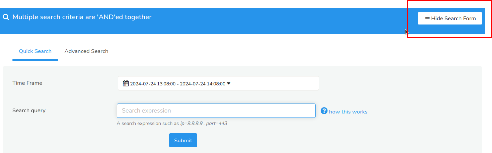
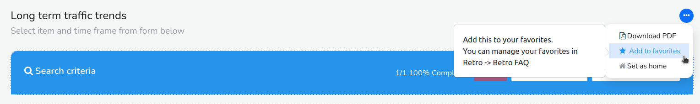
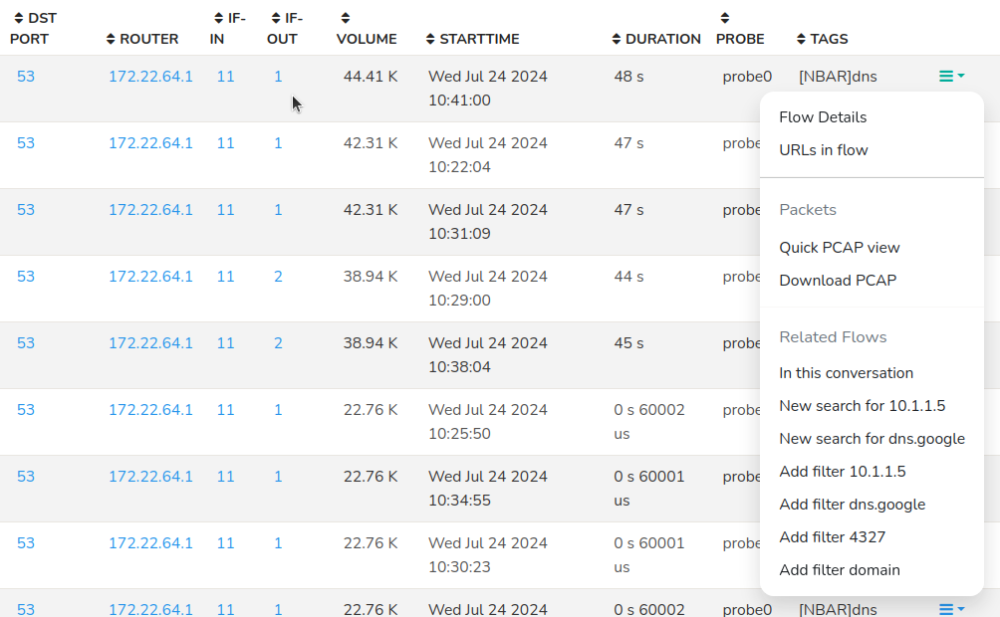
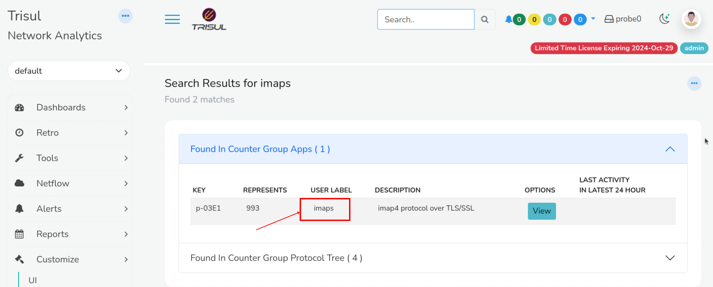
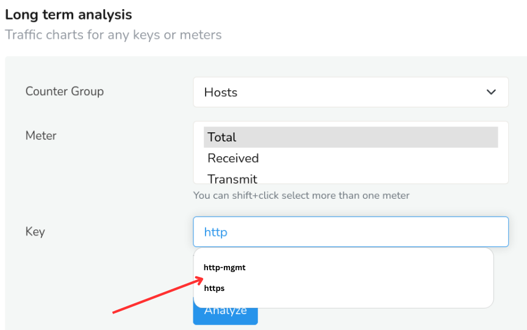
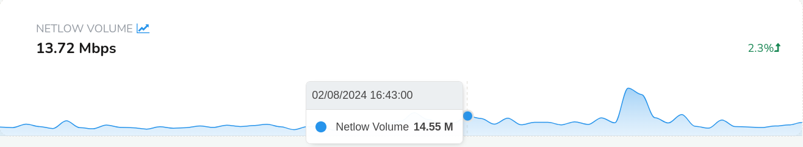
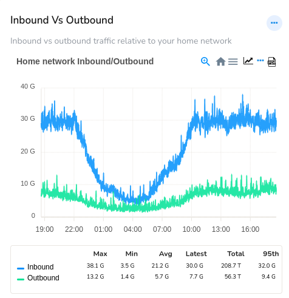
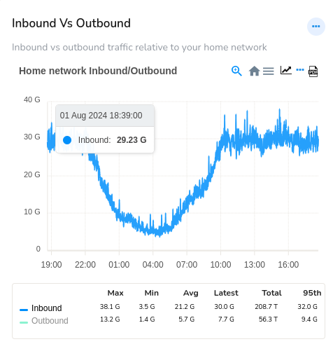
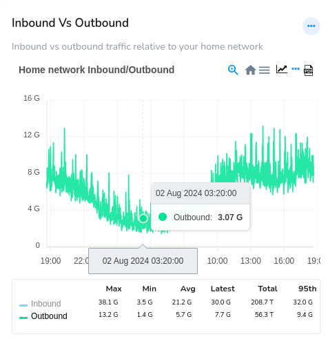
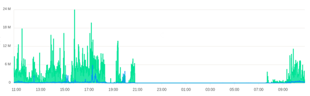

# UI Elements

This section contains a quick overview of the user interface elements
used by Trisul.

## Analysis Forms

These forms have a striped background throughout the app.

- You can collapse the form for analysis results.
- You can expand the form to tweak your analysis.

In the sample form below, you can notice the *Hide* button on the top
right corner.

## Toolbars

The toolbar area is the big title area at the top.There are two options
available currently.

- PDF -\> Click to convert the current page into PDF report.

- Retro FAQ -\>Name the analysis and add it to the
  [Q&A](/docs/ug/cg/retrofaq)

Sample form shows the analysis

## Packets and Flows drilldown buttons

In the sample form below,common cues to indicate that you can view
related flows or download a PCAP is mentioned.

### Using search

You can use the *Search* tool to find items of interest.

> You can :

- Search by an IP address, Port number, etc.
- Search by user labels like host names, alert signature names, etc.
- Directly type in a trisul key like p-0050

> If you wish to search for resources like HTTP URLs and DNS
> names, you will be redirected to their search forms which are more
> flexible. See [URL Resources](/docs/ug/resources/url) and [DNS Resources](/docs/ug/resources/dns)

## The search box

The search box is located below the side menu bar as shown here.

Enter some search text here and press *Enter*

## Search results

The *search results* page contains all items that might match your
query.

1. Searching for amazon.com will return x.y.amazon.com.
2. Searches are case insensitive

Click on the View Details button to explore further

 

## Autocomplete

All relevant form fields in Trisul are autocomplete capable. This
functionality is triggered when you enter three or more characters.

## Charts

Trisul supports a number of intuitive chart surfaces that render the statistical data in a rich interactive way.

### Module Icons

The module icons are useful in traversing the graphical chart in detail. Icons from right to left includes,

- **PDF**- Click on the PDF icon on the top righ corner of the module to download the chart data in PDF.

- **Key Dashboard**- Click on the Key Dashboard icon to view and edit the Key details of this module

- **Live SNMP**- To view the Live data i.e., until the latest one minute click Live SNMP icon and it gets refreshed every 10 seconds. This icon is not available on all modules rather on relevant ones.

- **Menu**- Click on the three lines icon and select from the list of download options SVG, PNG and CSV to donwload in that particular format

- **Home**- Click on the home icon to reset zoom.

### Chart Interactions

Many modules allow you to select a chart surface and enables you to view the data at that particular point of time.

With interactive charts you can,

1) Hover your mouse over an item such as a PIE slice and get a tooltip with
   values  

2) You can click on any key items on the chart and it will take you to the [Key dashboard](/docs/ug/ui/key_dashboard) of that Key.

3) Click on a chart item in the legend area to `show/hide` the item  

For example in the following chart both Inbound and Outbound items in the legend are enabled.

|  |
| ----------------------- |

You can click on any of the items like Inbound or inbound in the legend area to hide or unhide that data from the chart like in these examples.

|  |  |
| ----------------------- | ----------------------- |

- Click on the `Expand Legend` spot to get a detailed legend  
  Auto refresh the charts via Ajax calls

The retro chart is even more interactive :  

- Click and select an area  

- Zoom into a selection  

- Pan left and right  

- Use the selected time interval to perform drill down retro analysis

### Trisul Chart Surfaces

These are some of the intuitive chart surfaces in Trisul. 

|                                    |     |                               |
| ---------------------------------- | --- | ----------------------------- |
| PIE                                |     | MRTG                          |
|          |     |    |
| STACKEDAREA                        |     | LINE                          |
|  |     |    |
| SQUARELINE                         |     | BUBBLE                        |
|   |     |  |
| BAR                                |     | AREA                          |
|          |     |    |
|                                    |     |                               |

## Download PCAP button

On tables featuring a “Download PCAP” button, clicking on the button
will result in Trisul computing a “Packet Scan plan” and then
downloading all of the requested entities into a single merged PCAP
file.
