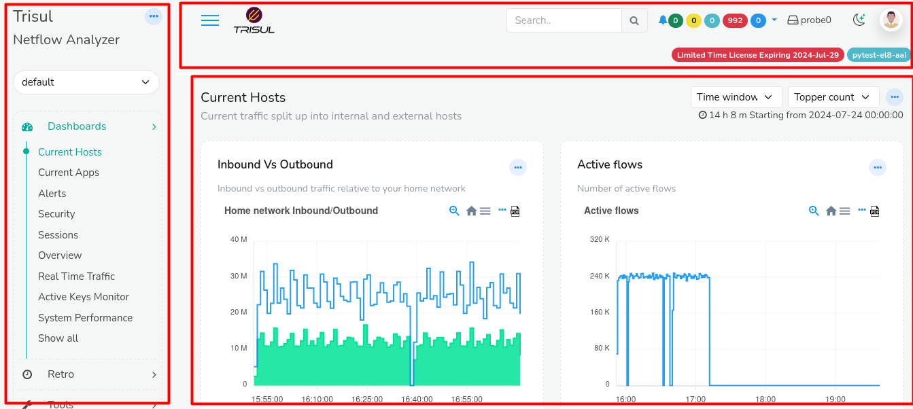
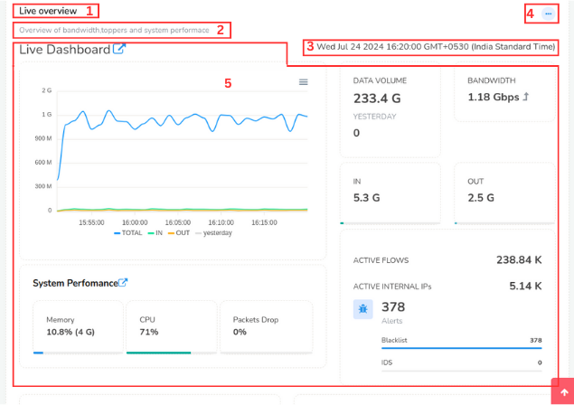
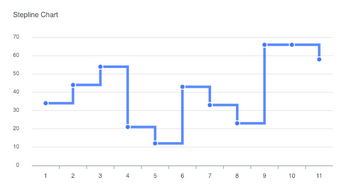

# UI Elements

This section contains a quick overview of the user interface elements
used by Trisul.

## UI Layout

There are two layouts in Trisul 

- Admin Layout 
- User Layout

### User Layout

When you login as a non admin user you will see the following layout 

  

Observe three sections 

- Top Panel
- Menu Panel
- Dashboard Panel 

### Top Panel details

The top panel contains the following items

  

1) #### Menu Toggle
   
   Click on the Menu toggle button to hide and unhide the side menu. This will provide you with extra screen space when necessary.

2) #### Trisul Logo

Clicking on the logo takes you to the home page.

3) #### Search Bar

You can use the Search bar tool to find items of your interest.

4) #### Alerts and Notifications

You can check for the alerts and notifications on External IDS, Threshold Crossing, Threshold Band Alerts, Blacklist Activity and Flow tracker here.

5) #### License Detail

You can check the validity of your License here.

6) #### Probe Switch
   
   
   
   You can switch between probes and check on the probe health by clicking on the probe switch. By default it is set to Probe0.

7) #### Dark/Light Mode
   
      You can switch between dark and light modes to change the appearance of the screen here.

8) #### Host Name

This shows the host's name. All time zones in Trisul are displayed in the host's time zone.

9) #### Account
   
    
    Clicking on the account button you can get the account history, change password, and signout from the current account. 

## Menus

A fully customizable multi open collapsible menu system.

#### Basic operations

Clicking on menu item opens a page with all options.

Expanding a menu item opens most popular items.

Trisul remembers the expanded state of the menu per user.

1) #### Shortcut Menu
   
   

## Dashboards

Dashboards are used to present network analysis modules by placing them
on specific locations on a web page. 

Dashboards are used to present network analysis modules by placing them
on specific locations on a web page.

The Dash board contains the following elements

| Elements                                                             | Function                                                                                                                                                                                                                            |
| -------------------------------------------------------------------- | ----------------------------------------------------------------------------------------------------------------------------------------------------------------------------------------------------------------------------------- |
| 1) Dashboard Name                                                    | This is the name of the dashboard.                                                                                                                                                                                                  |
| 2)  Dashboard Description                                            | This gives you the description of the dashboard                                                                                                                                                                                     |
| 3) Data Time Period                                                  | The time shown on the top right corner of the dashboard is the time data was available since till now.                                                                                                                              |
| 4) [Dashboard Toolbar](/docs/ug/ui/dashmod_intro#dashboard-toolbars) | By clicking on the three dots at the top right corner of the dashboard you can edit the dashboard including customizing it, toggle labels, set as default dashboard, expand all modules, collapse all modules, and download as PDF. |
| 5) Modules                                                           | Modules are represented in the forms of charts and tables.                                                                                                                                                                          |

For more information see also:  

- [About the built in dashboards](dashboards).   

- [Dashboards and modules](dashmod_intro).

##### 

## Analysis Forms

These forms have a striped background throughout the app.

- You can collapse the form for analysis results.
- You can expand the form to tweak your analysis.

In the sample form below, you can notice the *Hide* button on the top
right corner.

## Toolbars

The toolbar area is the big title area at the top.There are two options
available currently.

- PDF -\> Click to convert the current page into PDF report.

- Retro FAQ -\>Name the analysis and add it to the
  [Q&A](/docs/ug/cg/retrofaq)

Sample form shows the analysis

## Packets and Flows drilldown buttons

In the sample form below,common cues to indicate that you can view
related flows or download a PCAP is mentioned.

## Autocomplete

All relevant form fields in Trisul are autocomplete capable. This
functionality is triggered when you enter three or more characters.

## Charts

Trisul supports rich interactive charts. Many modules allow you to
select a chart surface and specify other parameters such as width and
height.

### Interactions

Charts are interactive.

You can :  

- Hover your mouse over an item such as a PIE slice and get a tooltip with
  values  

- Click on a chart item and go to the `key` dashboard  

- Click on a chart item in the legend area to `show/hide` the item  

- Click on the `Expand Legend` spot to get a detailed legend  
  Auto refresh the charts via Ajax calls

The retro chart is even more interactive :  

- Click and select an area  

- Zoom into a selection  

- Pan left and right  

- Use the selected time interval to perform drill down retro analysis

### Available surfaces

The following surfaces are available

|                                    |     |                             |
| ---------------------------------- | --- | --------------------------- |
| PIE                                |     | MRTG                        |
|          |     |                             |
| STACKEDAREA                        |     | LINE                        |
|  |     |  |
| SQUARELINE                         |     | BUBBLE                      |
|   |     |                             |
| BAR                                |     | AREA                        |
|          |     |  |
| LINETABLE                          |     |                             |

### Download PCAP button

On tables featuring a “Download PCAP” button, clicking on the button
will result in Trisul computing a “Packet Scan plan” and then
downloading all of the requested entities into a single merged PCAP
file.

### Column select

On tables featuring a “Cols” link, clicking on it will let you choose
the columns you want displayed.
