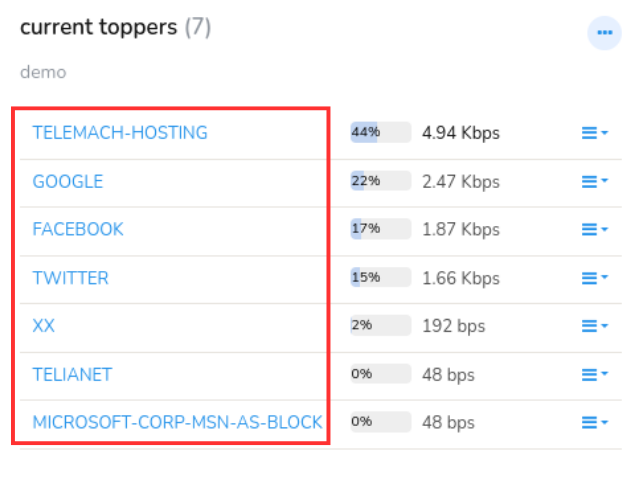

# Other UI Elements

This section contains a quick overview of the user interface elements.
Besides the already explained user layout and admin layout elements, Trisul provides other essential interactive elements like Buttons, Forms, Search box, Tooltips and more. Lets dive in and explore where you can find all these user friendly elements in the Trisul dashboards and modules and how you can interact with them. 

## Hide/ Show Search Form

Throughout the app, forms featuring a distinctive *Hide/ Show search form* button on the top blue bar providing a consistent and intuitive interface for analysis and configuration.

In the sample form below, you can notice the *Hide* button on the top right corner. Click on the button for hide or show search form.

- **Collapse Form**  
Click to minimize the form, hiding its contents and allowing you to focus on analysis results. This is ideal for when you want to view more data or focus on other aspects of the app.
- **Expand Form**  
Click to restore the form to its full height, revealing its contents and enabling you to refine your analysis parameters. This is useful when you need to adjust settings or tweak your analysis.

*Figure: Analysis Form Showing Hide Button*

## Packets and Flows Drilldown Buttons

In the sample form below,common cues to indicate that you can view
related flows or download a PCAP is mentioned.

*Figure: Showing Packets and Flows Drilldown Buttons*

### Using Search

You can use the *Search* tool to find items of interest.

> You can :

- Search by an IP address, Port number, etc.
- Search by user labels like host names, alert signature names, etc.
- Directly type in a trisul key like p-0050

> If you wish to search for resources like HTTP URLs and DNS
> names, you will be redirected to their search forms which are more
> flexible. See [URL Resources](/docs/ug/resources/url) and [DNS Resources](/docs/ug/resources/dns)

## The Search Box

The search box is located below the side menu bar as shown here.

Enter some search text here and press *Enter*

*Figure: Search Box*

## Search Results

The *search results* page contains all items that might match your
query.

1. Searching for amazon.com will return x.y.amazon.com.
2. Searches are case insensitive

Click on the View button to explore further

 

*Figure: Search Result Page*

## AutoComplete

All relevant form fields in Trisul are autocomplete capable. This
functionality is triggered when you enter three or more characters.

*Figure: Showing AutoComplete Option of Long Term Analysis Form*

### Key Dashboard

You can click on any key items on the chart and it will take you to the [Key dashboard](/docs/ug/ui/key_dashboard) of that Key.

*Figure: Key Dashboard*

## Download PCAP button

On tables featuring a “Download PCAP” button, clicking on the button
will result in Trisul computing a “Packet Scan plan” and then
downloading all of the requested entities into a single merged PCAP
file.

## Time Selector
The Time Selector feature enables you to define a temporal scope for functionalities like report generation, query search, flow trackers, alerts etc with a default setting of the most recent 15 minutes. Once a time window is selected, it remains fixed for functioning all the features on the page and their associated drill-downs. 

  
*Feature: Time Selector*

You can choose from a range of pre-defined time ranges, including:

- Last 1 hour

- Last 24 hours

- This month

- Last month and more.

Alternatively, you can specify a custom date range by selecting the *Custom Range* option, which allows for the selection of a specific period from the past.

## Download Button

This is one of the most commonly found UI elements across Trisul. Clicking on the *Download* button enables you to download the data for sharing, backup and archive.

  
*Figure: Download button*

You can export data, reports, or analytics in various formats like,  
**PDF**: Downloads the data in Portable Document Format (PDF), suitable for printing or sharing.  
**XLSX**: Downloads the data in Microsoft Excel format (XLSX), suitable for editing or analysis.  
**CSV**: Downloads the data in Comma Separated Values format (CSV), suitable for importing into other applications or analysis.  

## Toggle Labels

*Toggle Labels* button in Trisul is like a toggle switch to display the labels of keys in the search results or downloaded file.
>Note that the resolved names or labels will be displayed only if the names are already assigned.

  
*Figure: Toggle Labels*

When enabled, the search result or downloaded file will include labels. When disabled, only the raw data i.e., the actual keys without labels is displayed.

## Column Sorter

*Figure: Column Sorter*

*Column Sorter* is a small up/down toggle element located typically on the column header of a table of dataset containing large volume of data. When you find the *Column Sorter* arrow(up/down) button on the column header of a table, it indicates each column in the table of data are sortable, that enables you to rearrange data in ascending or descending order by clicking it, for flexible data analysis and visualization.

### Column Selector

The *Cols* dropdown menu allows users to customize the columns displayed in the resulting table.

  
*Figure: Column Options*

Selecting specific columns enables users to tailor the table to display the information for those columns.