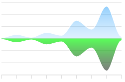
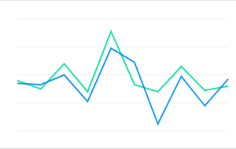

# UI Elements

This section contains a quick overview of the user interface elements
used by Trisul.

## Menus

A fully customizable multi open collapsible menu system.

#### Basic operations

Clicking on menu item opens a page with all options.

Expanding a menu item opens most popular items.

Trisul remembers the expanded state of the menu per user.

### User panel

You can logout, change password, and view the current Trisul Context in
the user panel.

### Hiding the menu

You can hide the entire side menu panel.

- Click -\> gripper or Ctrl+ M.

## Dashboards

Dashboards are used to present network analysis modules by placing them
on specific locations on a web page.

You can :  

- Add / remove / reposition modules.  

- Change module parameters.  

- Create your own new dashboards.  

- Share your dashboards.

For more information see also:  

- [About the built in dashboards](dashboards.html).   

- [Dashboards and modules](dashmod_intro.html).

## Context Menus

A context menu available can be identified by a little tag next to an
item.

**The context menu is a very handy way to get around Trisul**

## Analysis Forms

These forms have a striped background throughout the app.

- You can collapse the form for analysis results.
- You can expand the form to tweak your analysis.

In the sample form below, you can notice the *Hide* button on the top
right corner.

## Toolbars

The toolbar area is the big title area at the top.There are two options
available currently.

- PDF -\> Click to convert the current page into PDF report.

- Retro FAQ -\>Name the analysis and add it to the
  [Q&A](/docs/ug/cg/retrofaq.html)

Sample form shows the analysis

## Packets and Flows drilldown buttons

In the sample form below,common cues to indicate that you can view
related flows or download a PCAP is mentioned.

## Autocomplete

All relevant form fields in Trisul are autocomplete capable. This
functionality is triggered when you enter three or more characters.

## Charts

Trisul supports rich interactive charts. Many modules allow you to
select a chart surface and specify other parameters such as width and
height.

### Interactions

Charts are interactive.

You can :  

- Hover your mouse over an item such as a PIE slice and get a tooltip with
  values  

- Click on a chart item and go to the `key` dashboard  

- Click on a chart item in the legend area to `show/hide` the item  

- Click on the `Expand Legend` spot to get a detailed legend  
  Auto refresh the charts via Ajax calls

The retro chart is even more interactive :  

- Click and select an area  

- Zoom into a selection  

- Pan left and right  

- Use the selected time interval to perform drill down retro analysis

### Available surfaces

The following surfaces are available

|                                    |     |                                  |
| ---------------------------------- | --- | -------------------------------- |
| PIE                                |     | BUTTERFLY                        |
|          |     |  |
| STACKEDAREA                        |     | LINE                             |
|  |     |       |
| SQUARELINE                         |     | BUBBLE                           |
|   |     |     |
| BAR                                |     | AREA                             |
|          |     |       |
| LINETABLE                          |     |                                  |

### Download PCAP button

On tables featuring a “Download PCAP” button, clicking on the button
will result in Trisul computing a “Packet Scan plan” and then
downloading all of the requested entities into a single merged PCAP
file.

### Column select

On tables featuring a “Cols” link, clicking on it will let you choose
the columns you want displayed.
