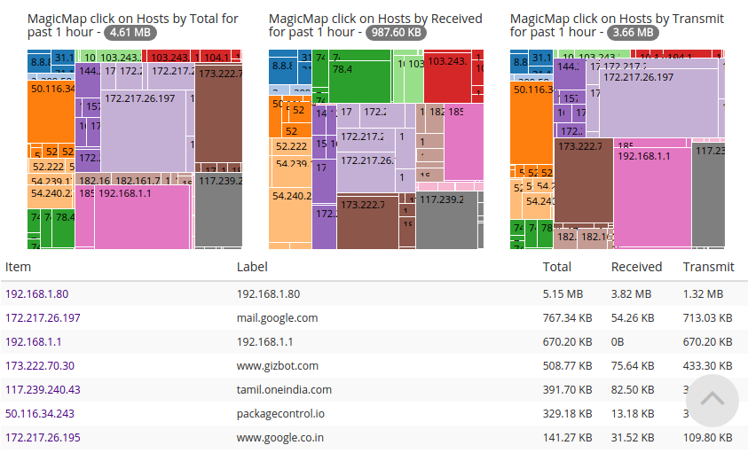
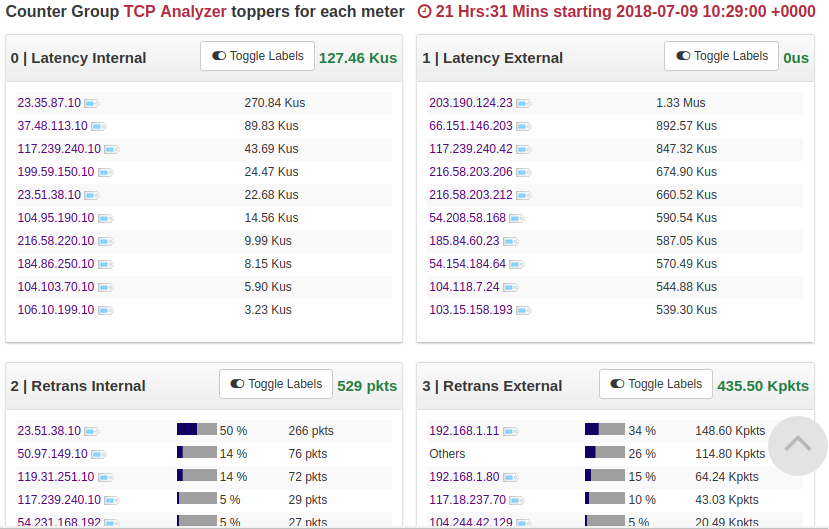
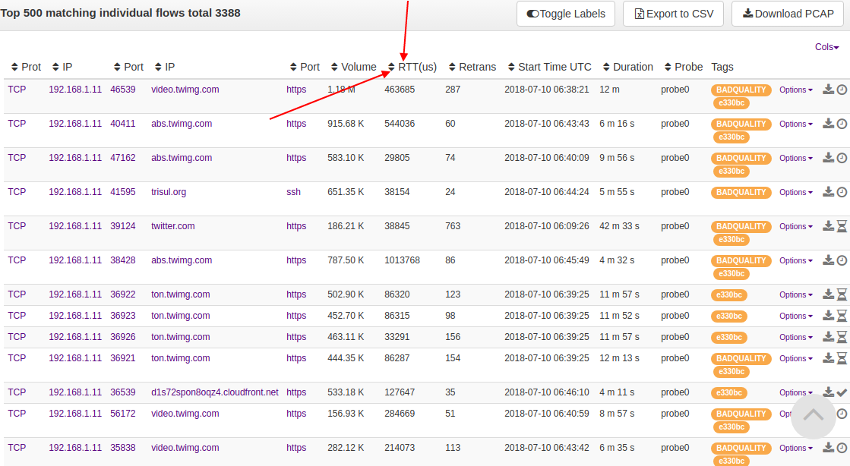
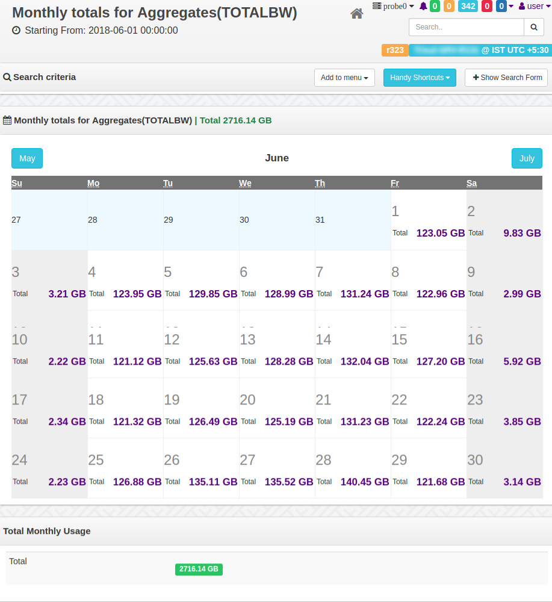

# Interesting dashboards

This page contains some interesting dashboards that can help you with
analytics, and planning.

## Key Space Explorer

> You have to install the [Key Space Explorer Trisul App](/docs/ug/webadmin/apps) to get this dashboard.

Imagine you are monitoring a subnet and would like to know the occupancy
and usage of an address space. The Key Space Dasboard gives you a magic
map chart of which keys are most active on a particular metric in the
key space. For example : If your IP Range is 172.16.0.0 to 172.0.1.255
you can enter that and get a chart like the one shown below.

  
*Show usage of keys within a key space*

## TCP Latency Analysis

> You have to install the [TCP Analyzer TrisulApp](/docs/ug/webadmin/apps) to get this dashboard.

A common problem in network environment is degraded network causing
application performance problems. Many of them can be attributed to TCP
level issues. This dashboard tracks the following :

***Latency (Round Trip Time)*** 
monitors latency based on TCP ACKs for both internal and external
traffic. Shows the worst performing hosts for each.

***Retransmissions***  
retransmission rate for both internal and external.

***Timeouts***  
a good indicator of poor network performance is TCP Timeout rate.

### Latency and retransmission

The following screenshot sample shows latency in microseconds for both
internal and external hosts.

  
*Showing retransmission rate and latency (RTT) for flows*

### Dashboard showing worst performing flows

Module shows flows having poor (\>5%) retransmit rate.

### Showing Per-Flow latency

You can drilldown to Per-Flow latency by viewing the RTT and Retrans
metrics.

  
*Show per flow latency and retransmission metrics*

------------------------------------------------------------------------

## Monthly summary dashboard

The Monthly summary dashboard is very useful for planning, billing,
traffic management, and other activities. It shows totals of any metric
on a calendar with per-day metrics.

  
*Monthly totals chart showing total bandwidth usage*
