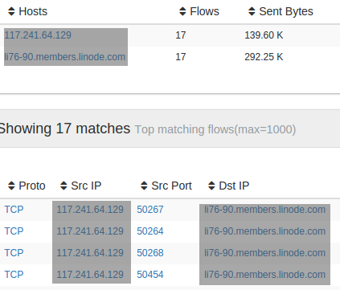
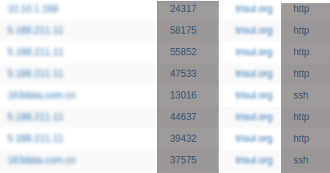
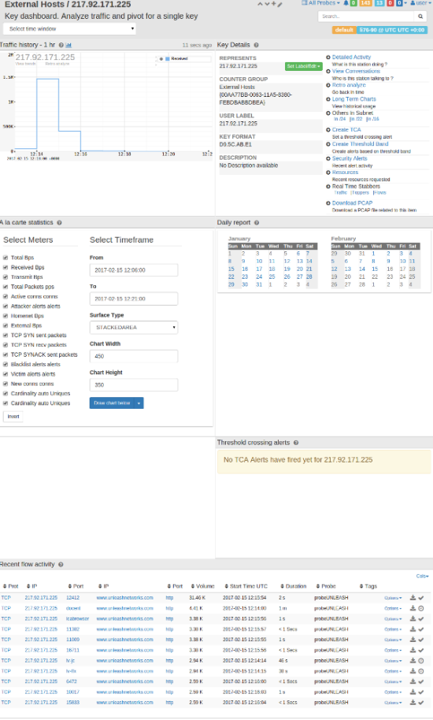
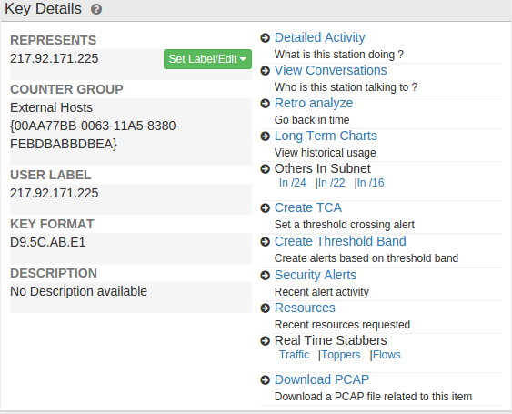

# Key dashboard

The *Key Dashboard* is a special type of dashboard used to view and
drilldown from “Keys”. In Trisul terminology a Key is an item within a
counter group. Clicking on any key will take you to the Key Dashboard
from there you can pivot to a number of different analysis paths.

A quick recap of the hierarchy and terminology first:

- **Counter Group** - A type or entity being measured. For example
  (Hosts)
  - **Key** - A specific item being measured within the Counter group.
    For example (google.com)
    - **Meter** - A metric within the key. For example ( Number of
      connections )

For more read [Traffic Metering Concepts](/docs/ug/cg/intro)

### How to access the key dashboard

There are two ways to get to the key dashboard

#### 1. By clicking

Click on any item in any page to open the key
dashboard for that item

Some examples :

|                                |                                                         |
| ------------------------------ | ------------------------------------------------------- |
|  | All hosts are linked to their respective key dashboards |
|  | Hosts/Ports for these malware alerts are linked         |

Note that you can also click on PIE and BUBBLE chart items.

#### 2. By searching

Type in a search and click on search results

The search method is very useful if you want to see details of something
that is not visible on any of the screens shown by Trisul. For example :
You want to search for a host `mail.trisul.org` but it isnt showing up
on any lists for you to click on.

### Using the key dashboard

The default key dashboard has the following modules. Here is a brief
description of each of these modules. They are mostly self explanatory.

| Module                                               | Usage                                                                                                                                  |
| ---------------------------------------------------- | -------------------------------------------------------------------------------------------------------------------------------------- |
| Traffic History                                      | Most recent 1hr traffic history. Note you can click on *View Trends* and *Retro Analysis* within the chart to expand this time window. |
| [Key Details](/docs/ug/ui/key_dashboard#key-details) | Various drilldown options pertaining to this key                                                                                       |
| A la carte statistics                                | Flexible charting tool (quick and easy)                                                                                                |
| TCA Details                                          | Shows recent threshold crossing alerts, if any                                                                                         |
| Flow Activity                                        | Displays recent top flows                                                                                                              |
| Daily Report                                         | Click on a calendar day to get a PDF report with detailed usage                                                                        |

## Key Details

Lets pay special attention to the **Key Details** module. This is the
jumping point where you have access to various drilldown tools related
to the key.

This module is split into two panels.

1. Info on left -\> Contains details about the key including
   resolved/user assigned labels.
2. Tools on right -\> Drilldown tools for further investigation about
   key

### Name Resolution

Assigning a user friendly name such as a hostname to an IP is a common
operation.

***Resolve***  
Resolve the name for this key. Works for all IP addresses and AS Numbers

***Edit***  
Edit the User label for this key manually

See the [resolve name](/docs/ug/cg/resolve) section for more
details.

### Drilldown options

> The contents shown here depend on the type of key being displayed

The most common ones are described below.

|                       |                                                                                                                                                                                                                                                                                                                                                        |
| --------------------- | ------------------------------------------------------------------------------------------------------------------------------------------------------------------------------------------------------------------------------------------------------------------------------------------------------------------------------------------------------ |
| Detailed Activity     | What is this station doing ? Open up the Investigate IP tool for this key for the last 1 hour.                                                                                                                                                                                                                                                     |
| View Conversations    | Who is this station talking to ?   Open up a Flow Based Investigation for this IP/Port/or Netflow Router Interface for the past one hour.                                                                                                                                                                                                          |
| Retro analyze         | Go back in time Open up a historical reto analysis for this key. The retro forms are all pre-filled with details about this key.                                                                                                                                                                                                                   |
| Long Term Charts      | View historical usage. Open up the Long term analysis tool                                                                                                                                                                                                                                                                                         |
| Others In Subnet      | #In /24 → Find active 24 subnet keys in past traffic #In /22 → Find active 22 subnet keys in past traffic #In /16 → Find active 16 subnet keys in past traffic                                                                                                                                                                                 |
| Create TCA            | Create a threshold crossing alerts for this key. See this for more                                                                                                                                                                                                                                                                                 |
| Create Threshold Band | Create and view training data                                                                                                                                                                                                                                                                                                                          |
| Security Alerts       | Recent IDS alert activity                                                                                                                                                                                                                                                                                                                              |
| Resources             | Recent resources requested Recent URL and DNS resources requested by this key                                                                                                                                                                                                                                                                      |
| Real Time Stabbers    | Open real time monitoring stabbers (5 sec) You can now watch specific network activity with a 5 second delay. The three options available are # Traffic → Real time traffic chart for this key # Toppers → View top keys in the same counter group as this one # Flows → View live flows related to this key (only for Hosts and Apps) |
| Download PCAP         | Download a PCAP file related to this item                                                                                                                                                                                                                                                                                                              |
