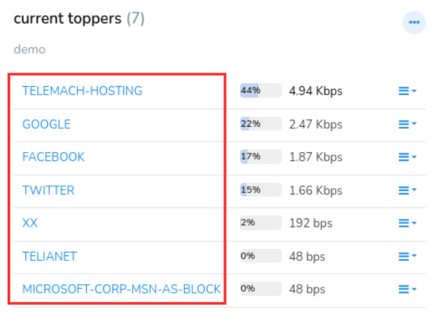
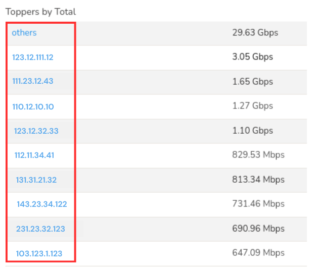
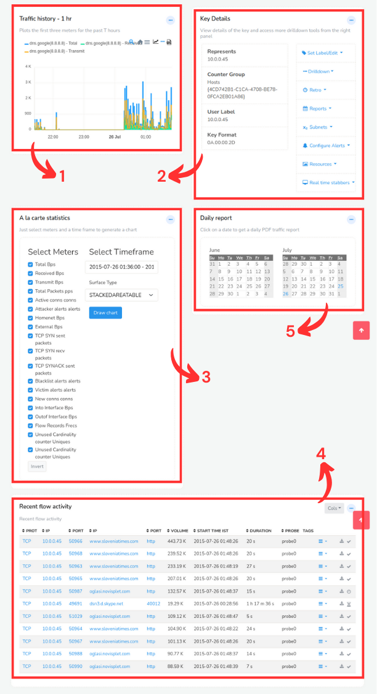
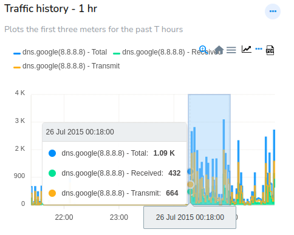
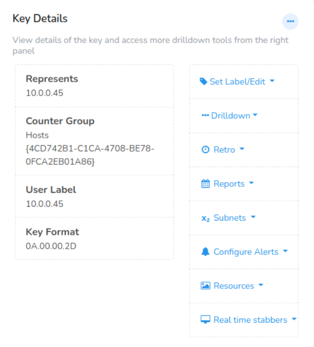
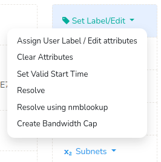
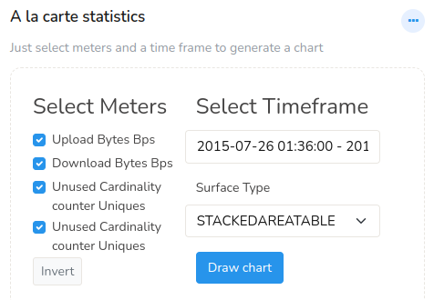
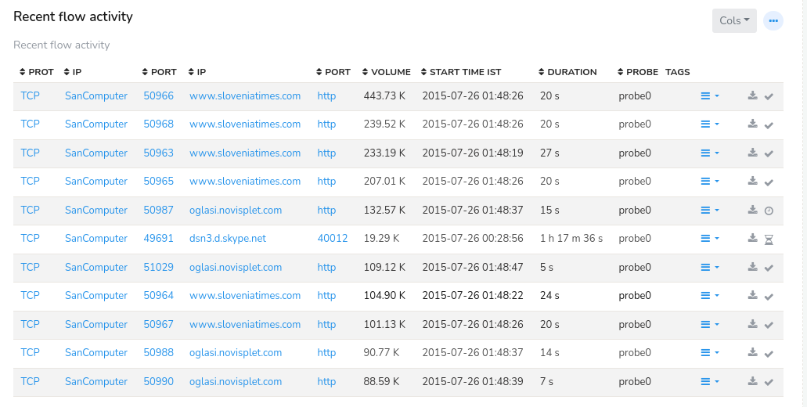
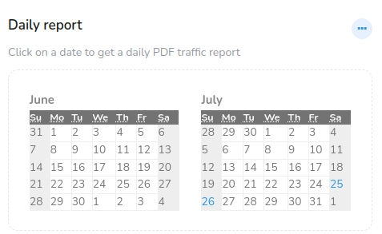

# Key dashboard

The Key Dashboard is like a hub that allows you to dive deeper into a specific Key's data and explore related analysis paths. It's a powerful tool for investigating and understanding network traffic in Trisul. Clicking on any key in a dashboard will take you to the Key Dashboard of that particular key.

A quick recap of the hierarchy and terminology first:

- CounterGroup is a collection of related counters that measure specific aspects of network traffic like hosts. 

- A Key is a unique identifier that defines a specific counter within a CounterGroup. For example, google.com.

- A Meter is a single counter that measures a specific aspect of network traffic, such as upload bytes, packets, or number of connections.

For more read [Traffic Metering Concepts](/docs/ug/cg/intro)

### How to access the key dashboard

There are two ways to get to the key dashboard

#### 1. By clicking

Click on any Key on any dashboard in any page to open the Key Dashboard for that Key

Some examples :

|                               |                                                             |
| ----------------------------- | ----------------------------------------------------------- |
|  | All ASNumbers are linked to their respective key dashboards |
|  | All hosts are linked to their respective key dashboards     |

Note that you can also click on PIE and BUBBLE chart items.

#### 2. By searching

Type in a search item and click on search results

The search method is very useful if you want to see details of something
that is not visible on any of the screens shown by Trisul. For example :
You want to search for a host `mail.trisul.org` but it isnt showing up
on any lists for you to click on.

### Using the key dashboard

The default key dashboard has the following modules. Here is a brief
description of each of these modules. They are mostly self explanatory.

| Module                                                  | Usage                                                           |
| ------------------------------------------------------- | --------------------------------------------------------------- |
| 1) Traffic History                                      | Most recent 1hr traffic history                                 |
| 2) [Key Details](/docs/ug/ui/key_dashboard#key-details) | Various drilldown options pertaining to this key                |
| 3) A la carte statistics                                | Flexible charting tool (quick and easy)                         |
| 4)Flow Activity                                         | Displays recent top flows                                       |
| 5)Daily Report                                          | Click on a calendar day to get a PDF report with detailed usage |
| TCA Details                                             | Shows recent threshold crossing alerts, if any                  |

1) ## Traffic History

With Traffic History module you can view the amount of data total, transmitted or received over a specific period for that particular Key. The most recent one hour traffic history can be drilled down in more detail over different time points.

2) ## Key Details

Lets pay special attention to the **Key Details** module. This is the
jumping point where you have access to various drilldown tools related
to the key.

This module is split into two panels.

1. Info on the left -\> Contains details about the key
2. Tools on the right -\> Drilldown tools for further investigation about
   key

The information on the left includes,

1) Represents: Represensts the IP address

2) Counter Group: Information on which counter group of the key

3) User Label: This is the tag name assigned to the particular key

4) Key Format: This is the hexadecimal of the key
   
   Tools on the right side are already existing menus from home page available here handily for investigation of the key. 

### Set Label/ Edit

   

1) Assigning a user friendly name such as a hostname to an IP is a common
   operation. Click on **Assign User Label/Edit attributes** if you want to change the label name, description, or edit attributes  and click update. See the [resolve name](/docs/ug/cg/resolve) section for more details.

2) Click **Clear attributes** to clear the attributes of the key.

3) Click **Set Valid Start Time** to set start time for the key.

4) Clicking on **Resolve**, and this resolves the name for this key. Works for all IP addresses and AS Numbers.

5) You can click **Resolve using nmblookup**, to resolve names using nmblookup. nmblookup, a part of samba suite resolves NetBIOS names (example, computer names) to IP addresses

6) Click **Create Bandwidth Cap**, and set the amount of data you can upload or download. Exceeding this limit can result in a additional fee and can be viewed in the chart. Bandwidth is usually given in JSON format. For example, 5 Mbps should be given as `{"bw": 5000000}`.

### Drilldown options

> The contents shown here depend on the type of key being displayed

The most common ones are described below.

|                        |                                                                                                                                                                                                                                                                                                                              |
| ---------------------- | ---------------------------------------------------------------------------------------------------------------------------------------------------------------------------------------------------------------------------------------------------------------------------------------------------------------------------- |
| Host Conversations     | Shows the Raw Flow conversations of the selected Key                                                                                                                                                                                                                                                                         |
| Aggregated Flows       | Shows the aggregated conversations like top 10 source IPs, top 10 destination ports etc.                                                                                                                                                                                                                                     |
| Alerts                 | Shows the alerts found in the selected Key                                                                                                                                                                                                                                                                                   |
| Traffic Chart          | Shows the traffic chart of the particular Key selected                                                                                                                                                                                                                                                                       |
| Long Term Charts       | You can view the historical usage. Opens up the Long term analysis tool                                                                                                                                                                                                                                                  |
| View Edge Graph        | You can view the relationships between different network entities such as hosts, protocols, IP addresses etc as a graphical representation.                                                                                                                                                                                  |
| Download PCAP          | Download a PCAP file related to this Key                                                                                                                                                                                                                                                                                     |
| Detailed Activity      | What is this station doing ? Open up the Investigate IP tool for this key for the last 1 hour.                                                                                                                                                                                                                           |
| Query Flows by Tag     | Filter and analyze network traffic based on specific tags or labels. These tags can be assigned to network flows like sequences of packets based on various criteria, such as: Protocol (e.g., HTTP, FTP, SSH) Port numbers etc.  The filtered flows are displayed, showing detailed information about each flow |
| Aggregate Flows by Tag | Group and summarize network traffic based on specific tags or labels.                                                                                                                                                                                                                                                        |

### Subnets

#In /24 → Find active 24 subnet keys in past traffic  
#In /22 → Find active 22 subnet keys in past traffic  
#In /16 → Find active 16 subnet keys in past traffic

3) ## A La Carte Statistics

With A La Carte Statistics you can select specific statistical metrics, select a time frame, and a chart surface you prefer and click Draw chat. This displays a personalized view on your dashboard. 

4) ## Flow Activity
   
   
   
   With Flow Activity you can gain insights into network traffic details like Protocol, Source IP, Source Port, Destination IP, Destination Port, Volume, Start time, Duration, Probe, Tags, Packet Capture available for that item and Flow State. Each Flow can be further filtered using the three lines option button against each flow.

5) ### Daily Report
   
   
   
   You can click on any date on the daily report module and get the traffic report for that date in PDF format.
