# Module Templates

Module templates are predefined layouts that help you create modules for a dashboard.

Instead of building a module from scratch, you select a template, configure its parameters, and Trisul creates the module for you.

For example, if you want to display the top 10 AS Numbers by Upload Bytes, you can use the Toppers Traffic template and configure:

- Counter Group: ASNumber  
- Meter: Upload Bytes  
- Top Count: 10  

The template determines how the data is displayed, while the parameters determine which data is displayed and how it is presented.

## Understanding the terms used in module templates

Before creating a module, it helps to understand three basic terms:

### Counter Group

A Counter Group defines the type of entities that you want to analyze.

Examples include:

- ASNumber  
- Applications   
- Hosts  
- Interfaces  

The available counter groups depend on the data available in your Trisul deployment.

### Meter

A Meter defines what is being measured for the selected counter group.

Examples include:

Upload Bytes
Download Bytes
Total
Packets
Flows

For example:

> Counter Group: ASNumber   
Meter: Upload Bytes

means that the module displays traffic measured in upload bytes for AS Numbers.

### Key

A Key identifies a specific item within a counter group.

For example, if the counter group is ASNumber, an individual AS Number can be selected as a key.

Some templates allow you to select multiple keys, filter keys, or create a separate module for each key.

## Creating a module from a template

To create a module:

1. Open the Dashboard Customization option.  
2. Select Module Templates.  
3. Choose the template that best matches what you want to display.  
4. Configure the template parameters.  
5. Create the module.  

This is a list of all module templates supported by Trisul.

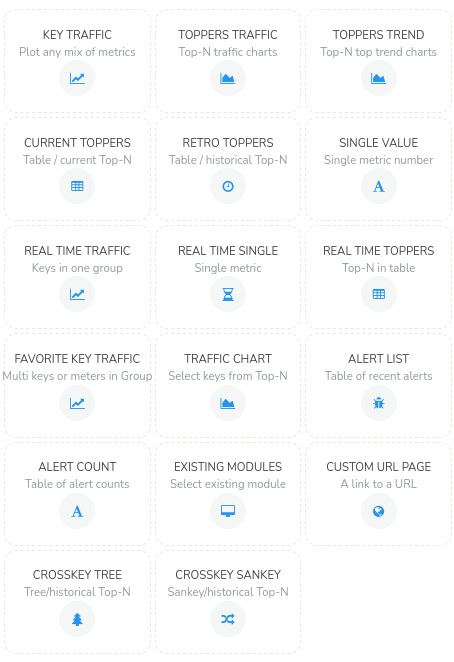

*Figure: Module Templates from Dashboard Customization Option*

|     | Module Templates                                                          |
| --- | ------------------------------------------------------------------------- |
| 1   | [Key Traffic](/docs/ug/ui/module_templates#key-traffic)                   |
| 2   | [Toppers Traffic](/docs/ug/ui/module_templates#toppers-traffic)           |
| 3   | [Toppers Trend](/docs/ug/ui/module_templates#toppers-traffic)             |
| 4   | [Current Toppers](/docs/ug/ui/module_templates#current-toppers)           |
| 5   | [Retro Toppers](/docs/ug/ui/module_templates#retro-toppers)               |
| 6   | [Single Value](/docs/ug/ui/module_templates#single-value)                 |
| 7   | [Real Time Traffic](/docs/ug/ui/module_templates#real-time-traffic)       |
| 8   | [Real Time Single](/docs/ug/ui/module_templates#real-time-single)         |
| 9   | [Real Time Toppers](/docs/ug/ui/module_templates#real-time-toppers)       |
| 10  | [Favorite Key Traffic](/docs/ug/ui/module_templates#favorite-key-traffic) |
| 11  | [Traffic Chart](/docs/ug/ui/module_templates#traffic-chart)               |
| 12  | [Alert List](/docs/ug/ui/module_templates#alert-list)                     |
| 13  | [Alert Count](/docs/ug/ui/module_templates#alert-count)                   |
| 14  | [Existing Modules](/docs/ug/ui/module_templates#existing-modules)         |
| 15  | [Custom URL Page](/docs/ug/ui/module_templates#custom-url-page)           |
| 16  | [Crosskey Tree](/docs/ug/ui/module_templates#crosskey-tree)               |
| 17  | [Crosskey Sankey](/docs/ug/ui/module_templates#crosskey-sankey)       

## Module Parameters

Every module has a set of parameters that controls what is displayed and
how it is displayed. Common parameters include:

- Name: The name displayed for the module.  
- Description: A short explanation of what the module is intended to show.  
- Counter Group: The type of entity being analyzed.  
- Meter: The measurement used for the analysis.  
- Key: The specific item or identifier being analyzed.  
- Surface: The type of chart or visualization used.  
- Top Count: The number of top items to display.  
- Filter: Limits the data displayed by matching specific keys.  

Some templates also have advanced parameters for controlling the chart appearance, time selection, aggregation, and other display options.

## Key Traffic

Use Key Traffic when you want to monitor the traffic associated with a specific key.

For example, you can use it to display upload traffic for a particular AS Number, host, application, or other key available in the selected counter group.

The module displays the selected traffic as a chart and can also display related statistics in a table.

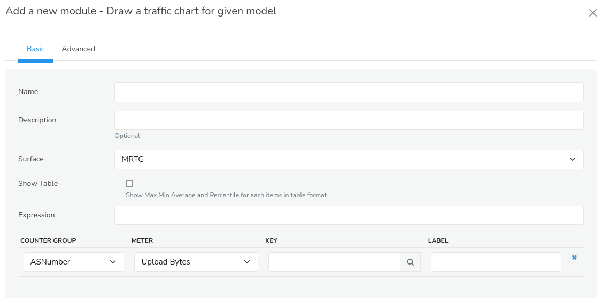

*Figure: Key Traffic Module*

### Basic Parameters

| Parameter name | Default value | Description     |
| -------------- | ------------- | --------------- |
| Name           | -            | Enter a name for the module. Choose a name that clearly identifies what the module displays.                                         |
| Description    | -             | Enter a short description explaining the purpose of the module.                       |
| Surface        | MRTG          | Select the chart type or visualization surface used to display the data.                   |
| Show Table     | -             | Displays additional statistics such as maximum, minimum, average, and percentile values in a table.   |
| Expression     | -             | Use an [arithmetic expression](/docs/ug/ui/modules#creating-modules-with-arithmetic-expressions) to customize the data shown by the module.    |
| Counter Group  | ASNumber      | Select the counter group whose keys you want to analyze.                                    |
| Meter          | Upload Bytes  | Select what should be measured for the selected counter group.                                    |
| Key            | -             | Select or enter the key whose traffic you want to display.|
| Label          | -             | Enter the label that should be displayed for the selected data.         |

### Advanced Parameters

| Parameter name                 | Default value | Description                                                   |
| ------------------------------ | ------------- | ------------------------------------------------------------- |
| Legend Position                | Top           | Controls where the chart legend is displayed. Select Top, Bottom, or Hide.                        |
| Chart Title                    | -             | Enter a custom title for the chart.                         |
| Height                         | 300           | Set the height of the chart.  |
| Enable Range Slider            | -             | Enables a [range slider](/docs/ug/ui/charts#range-slider), so users can select a specific portion of the displayed time range.                                            |
| Mark PCAP Availability         | -             | Displays [availability of PCAP (Packet Capture) data](/docs/ug/ui/charts#pcap-availability), on the chart when packet capture data is available.                        |
| Show Retro Tabs/ Time Selector | -             | Toggle to display or hide [retro tabs](/docs/ug/ui/charts#retro-tabs) and [time selector](/docs/ug/ui/elements#time-selector), allowing users to navigate through historical data                                                                                                  | 
| Counter Group (Ref Model)      | Aggregates    | Select the counter group used by the reference model to compare aggregated data.                         |
| Meter (Ref Model)              | Total         |  Select the meter used by the reference model.                     |
| Key (Ref Model)                | -             | Select the key used by the reference model.                                                           |
| Label (Ref Model)              | -             | Enter a custom label for the reference model.                | 

## Toppers Traffic

Use Toppers Traffic when you want to find the keys generating the most traffic.

Unlike Key Traffic, where you select a particular key, Toppers Traffic automatically identifies the top keys based on the selected Counter Group and Meter.

For example, you can configure:

- Counter Group: ASNumber
- Meter: Upload Bytes
- Top Count: 10

The resulting module displays the 10 AS Numbers with the highest upload traffic.

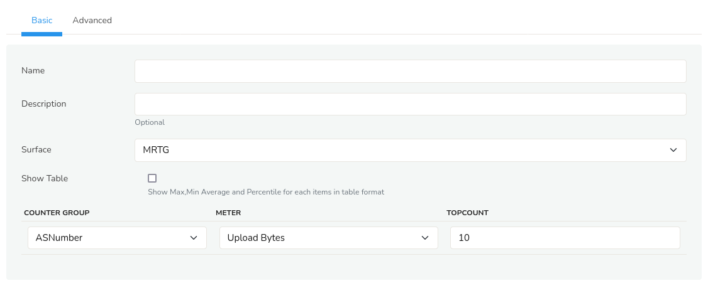

*Figure: Toppers Traffic Module*

### Parameters

| Parameter name | Default value | Description                      |
| -------------- | ------------- | -------------------------------- |
| Name           | -            | Enter a name for the module        |
| Description    | -             | Provide a short description of the module |
| Surface        | MRTG          | Diplays the selected chart surface  |
| Show Table     | -             | Displays the meta data of the chart like Max,Min Average and Percentile for each items in table format |
| Counter Group  | ASNumber      | Shows the list of Counter groups to select from |
| Meter          | Upload Bytes  | Shows the list of Meters to select from   |
| Top Count      | 10            | Enter the number of traffic data items to be displayed  |

## Toppers Trend

Use Toppers Trend when you want to see how the traffic of top keys changes over time.

For example, you can use it to compare the traffic trends of the top 10 AS Numbers.

This can help identify changes in traffic patterns, including increases, decreases, or unusual spikes.

This sample module of Toppers Trend shows the Top 10 ASNumbers' trends in network traffic over time

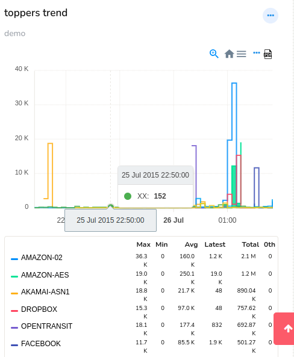

*Figure: Toppers Trend Module*

### Parameters

| Parameter name | Default value | Description                |
| -------------- | ------------- | -------------------------- |
| Name           | -            | Enter a name for the module |
| Description    | -             | Provide a short description of the module  |
| Surface        | MRTG          | Select the chart surface used to display the trends.     |
| Show Table     | -             | Displays statistics such as maximum, minimum, average, and percentile values in a table. |
| Counter Group  | ASNumber      | Select the type of keys whose traffic trends you want to view.  |
| Meter          | Upload Bytes  | Select the measurement used for the trend.   |
| Top Count      | 10            | Specify how many top keys should be included in the trend chart.  |

## Current Toppers

Use Current Toppers when you want to see which keys are currently generating the most traffic.

The module displays current top traffic statistics in a table. The default view uses the latest five minutes of data.

For example, you can configure the module to show the top 10 AS Numbers by Upload Bytes.

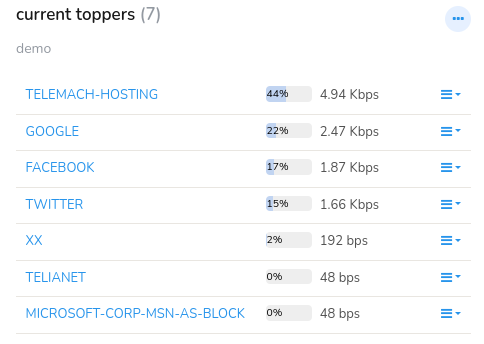

*Figure: Current Toppers Module*

### Parameters

| Parameter name     | Default value | Description                                                              |
| ------------------ | ------------- | ------------------------------------------------------------------------ |
| Name               | -            | Enter a name for the module                                              |
| Description        | -             | Provide a short description of the module                                |
| Top Count          | 10            | Enter the number of traffic data items to be displayed                   |
| Counter Group      | ASNumber      | Shows the list of Counter groups to select from                          |
| Meter              | Upload Bytes  | Shows the list of Meters to select from                                  |
| Key Filter         | -             | specify which keys should be included in the analysis of current toppers |
| Inverse Key Filter | -             | specify which keys should be excluded in the analysis of current toppers |

## Retro Toppers

Use Retro Toppers when you want to examine historical top traffic statistics.

This is useful when you want to investigate which keys were generating the most traffic during an earlier period.

The module displays historical toppers in a table. You can select More to load additional historical toppers.

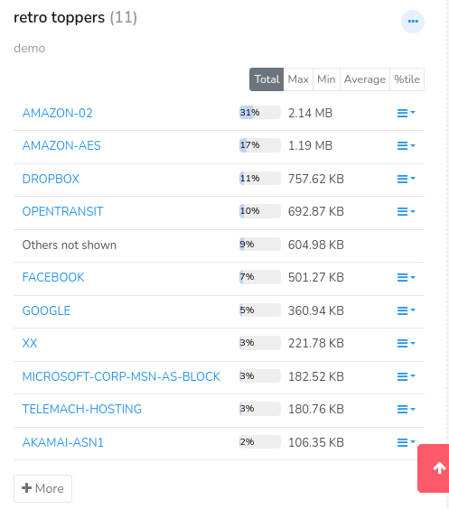

*Figure: Retro Toppers Module*

### Parameters

| Parameter name     | Default value | Description                                                              |
| ------------------ | ------------- | ------------------------------------------------------------------------ |
| Name               | -            | Enter a name for the module                                              |
| Description        | -             | Provide a short description of the module                                |
| Counter Group      | ASNumber      | Shows the list of Counter groups to select from                          |
| Top Count          | 10            | Enter the number of traffic data items to be displayed                   |
| Meter              | Upload Bytes  | Shows the list of Meters to select from                                  |
| Key Filter         | -             | specify which keys should be included in the analysis of current toppers |
| Inverse Key Filter | -             | specify which keys should be excluded in the analysis of current toppers |

## Single value

Use Single Value when you want to display one important metric as a single number.

For example, instead of displaying a complete chart, you can display a value such as total bandwidth.

The module can also show a trend chart when Show Trends is enabled.

This is an example of Single Value module which shows the total bandwidth of aggregates in a single value.

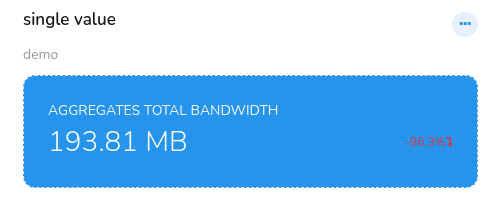

*Figure: Single Value Module*

### Parameters

| Parameter name | Default value | Description                                                               |
| -------------- | ------------- | ------------------------------------------------------------------------- |
| Name           | -            | Enter a name for the module                                                |
| Description    | -             | Provide a short description of the module                                 |
| Counter Group  | ASNumber      | Shows the list of Counter groups to select from                           |
| Meter          | Upload Bytes  | Shows the list of Meters to select from                                   |
| Key            | TOTALBW       | Provide the unique identifier that categorizes data in a network or a system according to the selected counter group                                                                      |
| Label          | Total Volume  | Enter a descriptive tag name assigned to a data point, group or category  |
| BG Color       | Blue          | Select a desirable BG Color                                               |
| Aggregation    | Total         | Aggregates multiple data points into single value like Total: Adds up all data points (e.g., total bandwidth usage), Average: Calculates the mean of all data points (e.g., average response time), etc. |
| Show Trends    | -             | When this check box is checked it shows the trends in a chart.            |
| Chart Color    | Blue          | Select a desirable chart color                                            |

## Real Time Traffic

Use Real Time Traffic when you want to display current network traffic using real-time data.

The module can display traffic for selected counter groups, meters, and keys. The data is refreshed every five minutes.

For example, the module can display inbound and outbound traffic separately.

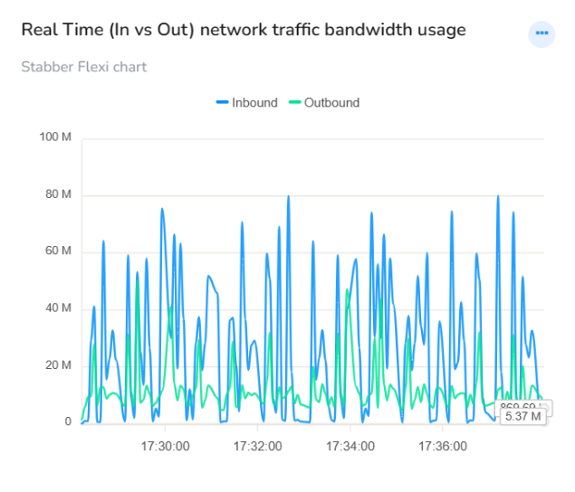

*Figure: Real Time Traffic Module*

### Parameters

| Parameter name       | Default value | Description                                                      |
| -------------------- | ------------- | ---------------------------------------------------------------- |
| Counter Group        | ASNumber      | Shows the list of Counter groups to select from                  |
| Meters               | Upload Bytes  | Shows the list of Meters to select from                          |
| Keys                 | TOTALBW       | Provide the unique identifier that categorizes data in a network or a system according to the selected counter group |
| One module per key   | Enabled       | Each key metric is displayed in its own separate module.          |
| One module per meter | -             | When enabled,Each meter is displayed in its own separate module.  |
| Surface              | LINE          | Diplays the selected chart surface                                |

## Real Time Single

Real Time Single is similar to Single Value, but displays the value using real-time data.

The data is refreshed every five minutes.

Use this template when you want a dashboard to show a single current metric rather than a historical chart.

### Parameters

| Parameter name | Default value | Description                                                  |
| -------------- | ------------- | ------------------------------------------------------------ |
| Name           | -            | Enter a name for the module                                   |
| Description    | -             | Provide a short description of the module                    |
| Counter Group  | ASNumber      | Shows the list of Counter groups to select from              |
| Meter          | Upload Bytes  | Shows the list of Meters to select from                      |
| Key            | TOTALBW       | Provide the unique identifier that categorizes data in a network or a system according to the selected counter group |
| Label          | Total Volume  | Enter a descriptive tag name assigned to a data point, group or category |
| BG Color       | Blue          | Select a desirable BG Color                                  |
| Show Gauge     | -             | When enabled, Shows a gauge meter that keeps getting scaled in real time |
| Chart Color    | Blue          | Select a desirable chart color                               |

## Real Time Toppers

Use Real Time Toppers when you want to see the current top traffic-generating keys.

It is similar to Toppers Traffic, but uses real-time data. The data is refreshed every five minutes.

For example, you can display the top 10 AS Numbers by Upload Bytes.

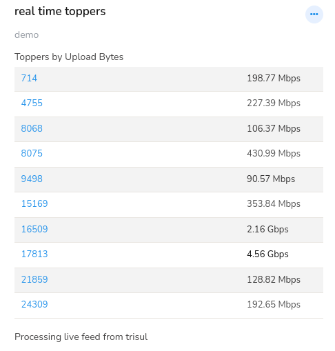

*Figure: Real Time Toppers Module*

### Parameters

| Parameter name | Default value | Description                                            |
| -------------- | ------------- | ------------------------------------------------------ |
| Name           | -            | Enter a name for the module                            |
| Description    | -             | Provide a short description of the module              |
| Counter Group  | ASNumber      | Shows the list of Counter groups to select from        |
| Meter          | Upload Bytes  | Shows the list of Meters to select from                |
| Top Count      | 10            | Enter the number of traffic data items to be displayed |

## Favorite Key Traffic

Use Favorite Key Traffic when you want to monitor specific keys that you frequently need to check.

It is similar to Key Traffic, but is intended for selecting and displaying multiple important or frequently accessed keys conveniently on a dashboard.

For example, you can select specific keys from the ASNumber counter group and display their Upload Bytes traffic.

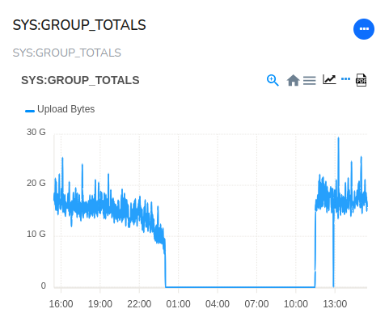

*Figure: Favorite Key Traffic module showing a module for the key SYS:GROUP_TOTALS for the countergroup ASNumbers in upload bytes.*

### Parameters

| Parameter name       | Default value | Description                                                       |
| -------------------- | ------------- | ----------------------------------------------------------------- |
| Counter Group        | ASNumber      | Shows the list of Counter groups to select from                   |
| Meters               | Upload Bytes  | Shows the list of Meters to select from                           |
| Keys                 | TOTALBW       | Provide the unique identifier that categorizes data in a network or a system according to the selected counter group |
| One module per key   | Enabled       | Each key metric is displayed in its own separate module.          |
| One module per meter | -             | When enabled,Each meter is displayed in its own separate module.  |
| Surface              | LINE          | Diplays the selected chart surface                                |

## Traffic Chart

Use Traffic Chart when you want to compare traffic for multiple selected keys.

You can either:

- Display each key in a separate module, or
- Display multiple selected keys together in one module.

For example, you can select the keys Total and Into Home Net and plot them for selected meters such as HTTP and HTTPS.

1) Separate modules for each key Total and Into Home net

2) The keys- Total and Into Home Net into a single module for http and https

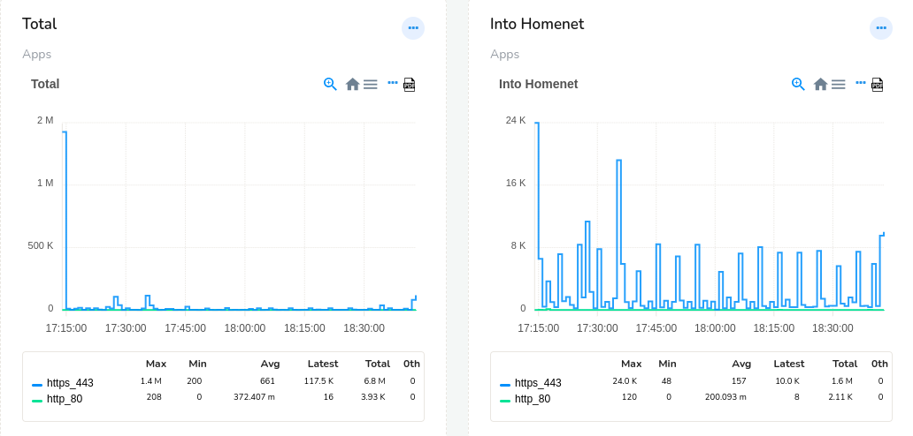

*Separate Modules for each Key Total and Into Home net*

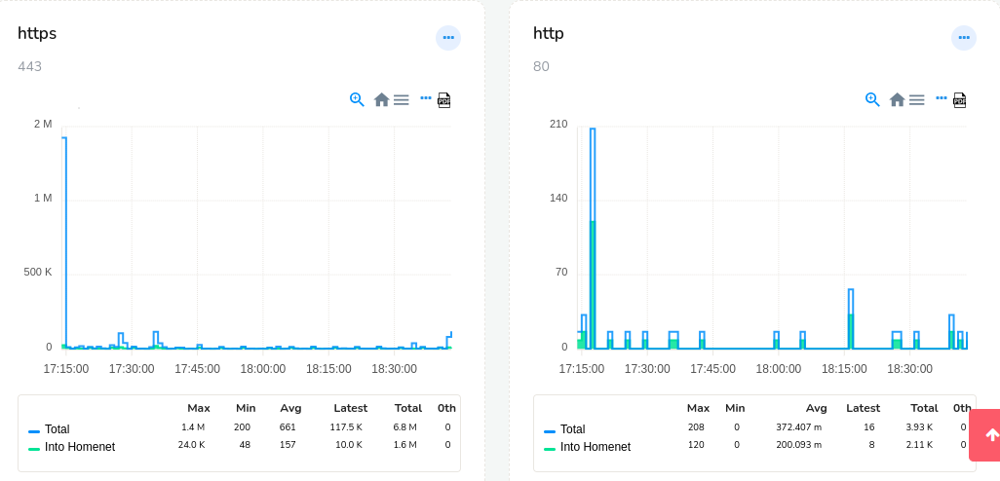

*Figure: Total and Into Home Net into a Single Module*

### Parameters

| Parameter name | Default value | Description                                             |
| -------------- | ------------- | ------------------------------------------------------- |
| Counter Group  | ASNumber      | Shows the list of Counter groups to select from         |
| Meters         | Upload Bytes  | Shows the list of Meters to select from                 |
| Multiple Keys  | -             | Check this box if you would like to have all selected keys plotted per meter in one module |
| Select Keys    | -             | From the list of keys select any number of keys to display |
| Filter         | -             | Enter a string of key name to search and filter         |

## Alert List

Use Alert List when you want to display a list of alerts that require attention.

The module provides a centralized view of alerts and can display additional information such as alert descriptions and affected endpoints.

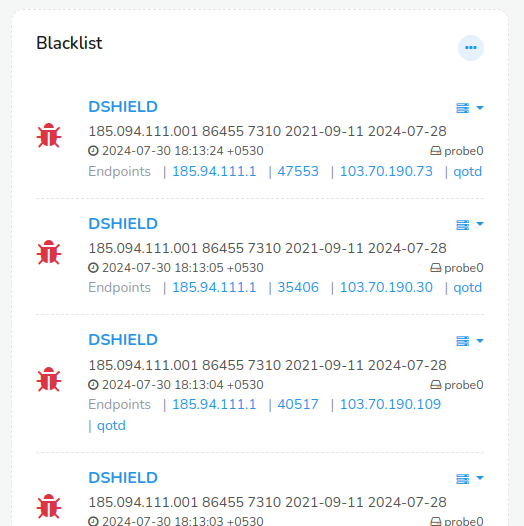

*Figure: Alert List Module*

### Parameters

| Parameter name   | Default value | Description                                        |
| ---------------- | ------------- | -------------------------------------------------- |
| Name             | -             | Enter a name for the module                         |
| Description      | -             | Provide a short description of the module          |
| Top Count        | 10            | Enter the number of traffic data items to be displayed   |
| Signature ID     | -             | Provide a Signature ID like DSHIELD   |
| Filter           | -             | Filter by signatre ID or IP addresses  |
| Show Description | Checked       | Displays a description of each alert providing a context about the issue |
| Show Endpoints   | Checked       | Displays detailed information about the endpoints (devices, systems, or applications) related to each alert. |
| Alert Group      | External IDS  | Select from the list of alert groups that you would like to display   |

## Alert Count

Use Alert Count when you want a quick numerical summary of alerts rather than a complete alert list.

For example, you can use it to place an alert count on a dashboard so that users can immediately see the current alert volume.

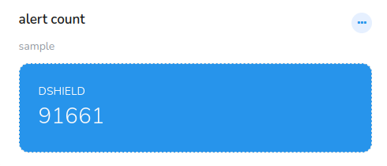

*Figure: Alert Count Module*

### Parameters

| Parameter name   | Default value | Description                                                              |
| ---------------- | ------------- | ------------------------------------------------------------------------ |
| Name             | -            | Enter a name for the module                                               |
| Description      | -             | Provide a short description of the module                                |
| Signature ID     | -             | Provide a Signature ID like DSHIELD                                      |
| Filter           | -             | Filter by signatre ID or IP addresses                                    |
| BG Color         | Blue          | Select a desirable BG Color                                              |
| Show Description | Checked       | Displays a description of each alert providing a context about the issue |
| Alert Group      | External IDS  | Select from the list of alert groups that you would like to display      |

## Existing Modules

Use Existing Modules when a module you need has already been created elsewhere in the system.

Instead of creating the module again, select it from the list and add it to the dashboard.

To add an existing module:

1) Open Existing Modules.
2) Select the module or modules you want to add.
3) Click Select.

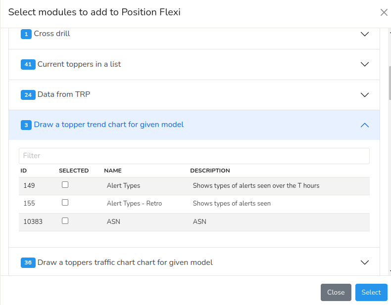

*Figure: Existing Modules to Add (From inside of Dashboard)*

## Custom URL Page

Use Custom URL Page when you want to display the contents of another page inside a dashboard module.

You provide the URL of the page, and the page is displayed within the module.

For example, you can provide the URL of the Trisul Flow Map page to display the Flow Map directly in the dashboard.

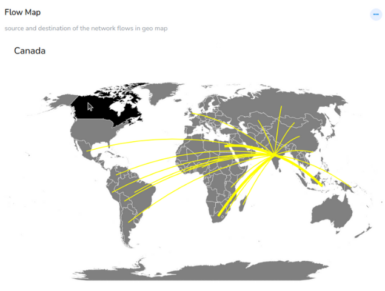

*Figure: Showing Trisul's Flow Map*

### Parameters

| Parameter name | Default value | Description                                                    |
| -------------- | ------------- | -------------------------------------------------------------- |
| Name           | -             | Enter a name for the module                                    |
| Description    | -             | Provide a short description of the module                      |
| URL            | -             | Enter the page URL you would like to display inside the module |
| JSON           | -             | Enter additional arguments if necessary in JSON format         |

## CrossKey Tree

Use Crosskey Tree when you want to explore the relationship between two or three counter groups.

Instead of looking at one counter group independently, Crosskey Tree lets you drill down from one level to the next.

There are two views:

- **Two-Level View**

Displays two levels of counter group data.

For example:

NBAR ID → Router and Interfaces

- **Three-Level View**

Displays three levels of counter group data.

For example:

NBAR ID → Router/Device → Links/Interfaces

This makes it possible to start with a high-level category and drill down into the related devices or interfaces.

### Parameters

| Parameter name     | Default value | Description                                                 |
| ------------------ | ------------- | ------------------------------------------------------------------------ |
| Name               | -             | Enter a name for the module                                              |
| Description        | -             | Provide a short description of the module                                |
| Counter Group      | -             | Shows the list of CrossKey Counter groups to select from                 |
| Top Count          | 10            | Enter the number of traffic data items to be displayed                   |
| Meter              | Upload Bytes  | Shows the list of Meters to select from                                  |
| Key Filter         | -             | Enter keywords or phrases to include in the analysis                     |
| Inverse Key Filter | -             | Enter keywords or phrases to exclude from the analysis                   |

## Crosskey Sankey

Crosskey Sankey provides a similar drilldown to Crosskey Tree, but displays the relationships as a Sankey diagram.

A Sankey diagram represents the relationship between levels using bands. The width of a band represents the relative traffic or count flowing between the levels.

This makes it easier to compare the relative size of different flows.

For example:

- **Two-Level Sankey**

NBAR ID → Routers

- **Three-Level Sankey**

NBAR ID → Routers/Devices → Interfaces

Use Crosskey Sankey when you want to understand how traffic is distributed from one level to another.

### Parameters

| Parameter name     | Default value | Description                                                                     |
| ------------------ | ------------- | ------------------------------------------------------------------------------- |
| Name               | -             | A unique name for this Sankey module instance.                                  |
| Description        | -             | Optional text describing the purpose or context of this module.                 |
| Counter Group      | APP_HOST      | The counter group to use as the basis for the drilldown (e.g., Apps, Hosts).    |
| Topcount           | 10            | The maximum number of keys to display at each level of the Sankey diagram.      |
| Meter              | Total         | The measurement unit to use (e.g., Total, Bytes, Packets, Flows).               |
| Key Filter         | -             | Include only keys matching this filter pattern                                  |
| Inverse Key Filter | -             | Exclude keys matching this filter pattern.                                      |
| Assign Equal Weight| Unchecked     | When enabled, all flows are shown with equal weight instead of proportional to traffic.     |

