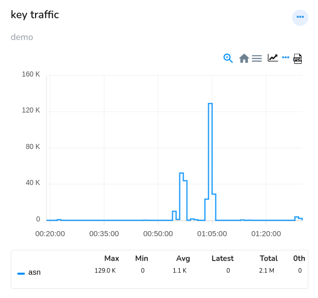
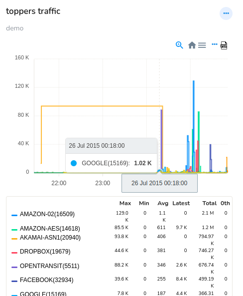

# Module Templates

Module templates in Trisul are the basic components of a module. These templates are pre-designed, reusable patterns or structures that define the functionality of a module.

Module templates typically include parameters for key elements, such as,

- Variables: parameters for data that will be used in the module. For example Name, Counter Groups, Meters, Keys.

- Functions: paramateres for reusable blocks of code that perform specific tasks. For example Aggregation, Max, Min, Avg.

- Conditionals: parameters for logical statements that control the flow of the module. For example Key Filter, Inverse Key filter.

You can create your own module by creating an instance of a module
template. Select one module template from the list and fill out the required parameters to create a module.

This is a list of all module templates supported by Trisul.

|     | Module Templates                                                          |
| --- | ------------------------------------------------------------------------- |
| 1   | [Key Traffic](/docs/ug/ui/module_templates#key-traffic)                   |
| 2   | [Toppers Traffic](/docs/ug/ui/module_templates#toppers-traffic)           |
| 3   | [Toppers Trend](/docs/ug/ui/module_templates#toppers-traffic)             |
| 4   | [Current Toppers](/docs/ug/ui/module_templates#current-toppers)           |
| 5   | [Retro Toppers](/docs/ug/ui/module_templates#retro-toppers)               |
| 6   | [Single Value](/docs/ug/ui/module_templates#single-value)                 |
| 7   | [Real Time Traffic](/docs/ug/ui/module_templates#real-time-traffic)       |
| 8   | [Real Time Single](/docs/ug/ui/module_templates#real-time-single)         |
| 9   | [Real Time Toppers](/docs/ug/ui/module_templates#real-time-toppers)       |
| 10  | [Favorite Key Traffic](/docs/ug/ui/module_templates#favorite-key-traffic) |
| 11  | [Traffic Chart](/docs/ug/ui/module_templates#traffic-chart)               |
| 12  | [Alert List](/docs/ug/ui/module_templates#alert-list)                     |
| 13  | [Alert Count](/docs/ug/ui/module_templates#alert-count)                   |
| 14  | [Existing Modules](/docs/ug/ui/module_templates#existing-modules)         |
| 15  | [Custome URL Page](/docs/ug/ui/module_templates#custom-url-page)          |

## Module Parameters

Every module has a set of parameters that controls what is displayed and
how it is displayed. Module paramaters include name, description, key, meter, surface, countergroup etc. 

Explore more on each modules and their parameters in the following.

## Key Traffic

A "Key Traffic" module in Trisul is designed to monitor and analyze network traffic based on specific keys or identifiers. Here's a breakdown of what this module template would do:

- Identify and extract specific keys or identifiers from network traffic (for example, IP addresses, ports, protocols, etc.)

- Count and measure the traffic associated with each key.

- Provide visualization and reporting on the top keys, traffic volumes, and trends.

### Parameters

| Parameter name | Default value | Description                                                                                                          |
| -------------- | ------------- | -------------------------------------------------------------------------------------------------------------------- |
| Name           | \-            | Enter a name for the module                                                                                          |
| Description    | -             | Provide a short description of the module                                                                            |
| Surface        | MRTG          | Diplays the selected chart surface                                                                                   |
| Show Table     | -             | Displays the meta data of the chart like Max,Min Average and Percentile for each items in table format               |
| Expression     | -             | Customize module using [arithmetic expression](/docs/ug/ui/modules#creating-modules-with-arithmetic-expressions)     |
| Counter Group  | ASNumber      | Shows the list of Counter groups to select from                                                                      |
| Meter          | Upload Bytes  | Shows the list of Meters to select from                                                                              |
| Key            | -             | Provide the unique identifier that categorizes data in a network or a system according to the selected counter group |
| Label          | -             | Enter a descriptive tag name assigned to a data point, group or category                                             |

## Toppers Traffic

Toppers Traffic module is a customizable template that displays top traffic statistics, such as top hosts, top flows, and top applications, and more in a graphical visualization.

This is a sample module showing the toppers traffic of top 10 ASNumbers in upload bytes in chart and table.

### Parameters

| Parameter name | Default value | Description                                                                                            |
| -------------- | ------------- | ------------------------------------------------------------------------------------------------------ |
| Name           | \-            | Enter a name for the module                                                                            |
| Description    | -             | Provide a short description of the module                                                              |
| Surface        | MRTG          | Diplays the selected chart surface                                                                     |
| Show Table     | -             | Displays the meta data of the chart like Max,Min Average and Percentile for each items in table format |
| Counter Group  | ASNumber      | Shows the list of Counter groups to select from                                                        |
| Meter          | Upload Bytes  | Shows the list of Meters to select from                                                                |
| Top Count      | 10            | Enter the number of traffic data items to be displayed                                                 |

## Toppers Trend

A pre-configured template for visualizing network traffic changes over time like to identify unusual patterns or spikes in traffic etc.

This sample module of Toppers Trend shows the Top 10 ASNumbers' trends in network traffic over time

### Parameters

| Parameter name | Default value | Description                                                                                            |
| -------------- | ------------- | ------------------------------------------------------------------------------------------------------ |
| Name           | \-            | Enter a name for the module                                                                            |
| Description    | -             | Provide a short description of the module                                                              |
| Surface        | MRTG          | Diplays the selected chart surface                                                                     |
| Show Table     | -             | Displays the meta data of the chart like Max,Min Average and Percentile for each items in table format |
| Counter Group  | ASNumber      | Shows the list of Counter groups to select from                                                        |
| Meter          | Upload Bytes  | Shows the list of Meters to select from                                                                |
| Top Count      | 10            | Enter the number of traffic data items to be displayed                                                 |

## Current Toppers

Current toppers module displays top traffic statistics in the latest five minutes in the table format, including top hosts, top flows, and top applications, and more.

The following sample of Current Toppers module shows which top 10 ASNumbers are toppers in the latest five minutes.

### Parameters

| Parameter name     | Default value | Description                                                              |
| ------------------ | ------------- | ------------------------------------------------------------------------ |
| Name               | \-            | Enter a name for the module                                              |
| Description        | -             | Provide a short description of the module                                |
| Top Count          | 10            | Enter the number of traffic data items to be displayed                   |
| Counter Group      | ASNumber      | Shows the list of Counter groups to select from                          |
| Meter              | Upload Bytes  | Shows the list of Meters to select from                                  |
| Key Filter         | -             | specify which keys should be included in the analysis of current toppers |
| Inverse Key Filter | -             | specify which keys should be excluded in the analysis of current toppers |

## Retro Toppers

A module that displays historical top traffic statistics, showing past top hosts, top flows, and top applications in the table format.

This example of retro toppers module shows the top ASNumbers of past. You can click More to load more past toppers.

### Parameters

| Parameter name     | Default value | Description                                                              |
| ------------------ | ------------- | ------------------------------------------------------------------------ |
| Name               | \-            | Enter a name for the module                                              |
| Description        | -             | Provide a short description of the module                                |
| Counter Group      | ASNumber      | Shows the list of Counter groups to select from                          |
| Top Count          | 10            | Enter the number of traffic data items to be displayed                   |
| Meter              | Upload Bytes  | Shows the list of Meters to select from                                  |
| Key Filter         | -             | specify which keys should be included in the analysis of current toppers |
| Inverse Key Filter | -             | specify which keys should be excluded in the analysis of current toppers |

## Single value

This Single value module displays a single, key performance indicator (KPI) or metric in a single value. For example "Current Network Traffic: 1.2 GB/s", "Network Uptime: 99.9%", etc.

This is an example of Single Value module which shows the total bandwidth of aggregates in a single value.

### Parameters

| Parameter name | Default value | Description                                                                                                                                                                                              |
| -------------- | ------------- | -------------------------------------------------------------------------------------------------------------------------------------------------------------------------------------------------------- |
| Name           | \-            | Enter a name for the module                                                                                                                                                                              |
| Description    | -             | Provide a short description of the module                                                                                                                                                                |
| Counter Group  | ASNumber      | Shows the list of Counter groups to select from                                                                                                                                                          |
| Meter          | Upload Bytes  | Shows the list of Meters to select from                                                                                                                                                                  |
| Key            | TOTALBW       | Provide the unique identifier that categorizes data in a network or a system according to the selected counter group                                                                                     |
| Label          | Total Volume  | Enter a descriptive tag name assigned to a data point, group or category                                                                                                                                 |
| BG Color       | Blue          | Select a desirable BG Color                                                                                                                                                                              |
| Aggregation    | Total         | Aggregates multiple data points into single value like Total: Adds up all data points (e.g., total bandwidth usage), Average: Calculates the mean of all data points (e.g., average response time), etc. |
| Show Trends    | -             | When this check box is checked it shows the trends in a chart.                                                                                                                                           |
| Chart Color    | Blue          | Select a desirable chart color                                                                                                                                                                           |

## Real Time Traffic

Real Time Traffic module displays the real-time network traffic information providing a live view of bandwidth usage, applications generating most traffic, real-time alert signatures  etc. The data is refreshed every five minutes.

This is an example of Real Time Traffic module of both Inbound vs Outbound differentiated by different colors as you can see.

### Parameters

| Parameter name       | Default value | Description                                                                                                          |
| -------------------- | ------------- | -------------------------------------------------------------------------------------------------------------------- |
| Counter Group        | ASNumber      | Shows the list of Counter groups to select from                                                                      |
| Meters               | Upload Bytes  | Shows the list of Meters to select from                                                                              |
| Keys                 | TOTALBW       | Provide the unique identifier that categorizes data in a network or a system according to the selected counter group |
| One module per key   | Enabled       | Each key metric is displayed in its own separate module.                                                             |
| One module per meter | -             | When enabled, Each meter is displayed in its own separate module.                                                    |
| Surface              | LINE          | Diplays the selected chart surface                                                                                   |

## Real Time Single

Real Time Single module is the same as Single value module except the data displayed is in real time. Real time data is refreshed every five minutes.

### Parameters

| Parameter name | Default value | Description                                                                                                          |
| -------------- | ------------- | -------------------------------------------------------------------------------------------------------------------- |
| Name           | \-            | Enter a name for the module                                                                                          |
| Description    | -             | Provide a short description of the module                                                                            |
| Counter Group  | ASNumber      | Shows the list of Counter groups to select from                                                                      |
| Meter          | Upload Bytes  | Shows the list of Meters to select from                                                                              |
| Key            | TOTALBW       | Provide the unique identifier that categorizes data in a network or a system according to the selected counter group |
| Label          | Total Volume  | Enter a descriptive tag name assigned to a data point, group or category                                             |
| BG Color       | Blue          | Select a desirable BG Color                                                                                          |
| Show Gauge     | -             | When enabled, Shows a gauge meter that keeps getting scaled in real time                                             |
| Chart Color    | Blue          | Select a desirable chart color                                                                                       |

## Real Time Toppers

Real Time Toopers module is the same  as the Toppers traffic module except the Toppers traffic is displayed in real time. The real time data are refreshed every five minutes.

The following example is the Real Time Toppers module for Top 10 ASNumbers in Upload Bytes.

### Parameters

| Parameter name | Default value | Description                                            |
| -------------- | ------------- | ------------------------------------------------------ |
| Name           | \-            | Enter a name for the module                            |
| Description    | -             | Provide a short description of the module              |
| Counter Group  | ASNumber      | Shows the list of Counter groups to select from        |
| Meter          | Upload Bytes  | Shows the list of Meters to select from                |
| Top Count      | 10            | Enter the number of traffic data items to be displayed |

## Favorite Key Traffic

The Favorite Key Traffic Module is the same as [Key Traffic](/docs/ug/ui/module_templates#key-traffic) module except this can be customized where you can select and display the traffic data for your most important keys or frequently accessed traffic metrics in a single, convenient dashboard. 

This is the Favorite Key Traffic module showing a module for the key SYS:GROUP_TOTALS for the countergroup ASNumbers in upload bytes.

### Parameters

| Parameter name       | Default value | Description                                                                                                          |
| -------------------- | ------------- | -------------------------------------------------------------------------------------------------------------------- |
| Counter Group        | ASNumber      | Shows the list of Counter groups to select from                                                                      |
| Meters               | Upload Bytes  | Shows the list of Meters to select from                                                                              |
| Keys                 | TOTALBW       | Provide the unique identifier that categorizes data in a network or a system according to the selected counter group |
| One module per key   | Enabled       | Each key metric is displayed in its own separate module.                                                             |
| One module per meter | -             | When enabled, Each meter is displayed in its own separate module.                                                    |
| Surface              | LINE          | Diplays the selected chart surface                                                                                   |

## Traffic Chart

Traffic chart module is the same as [Key traffic](/docs/ug/ui/module_templates#key-traffic) module except this module can be customized where you can select and display the traffic data for the selected keys ploted per meter in one module or in separate modules for each keys.

The following example shows 

1) Separate modules for each key Total and Home net

2) The keys- Total and Into Home Net into a single module for http and https

### Parameters

| Parameter name | Default value | Description                                                                                |
| -------------- | ------------- | ------------------------------------------------------------------------------------------ |
| Counter Group  | ASNumber      | Shows the list of Counter groups to select from                                            |
| Meters         | Upload Bytes  | Shows the list of Meters to select from                                                    |
| Multiple Keys  | -             | Check this box if you would like to have all selected keys plotted per meter in one module |
| Select Keys    | -             | From the list of keys select any number of keys to display                                 |
| Filter         | -             | Enter a string of key name to search and filter                                            |

## Alert List

The Alert List module displays a list of active alerts or notifications, providing a centralized view of network issues or events that require attention.

### Parameters

| Parameter name   | Default value | Description                                                                                                  |
| ---------------- | ------------- | ------------------------------------------------------------------------------------------------------------ |
| Name             | \-            | Enter a name for the module                                                                                  |
| Description      | -             | Provide a short description of the module                                                                    |
| Top Count        | 10            | Enter the number of traffic data items to be displayed                                                       |
| Signature ID     | -             | Provide a Signature ID like DSHIELD                                                                          |
| Filter           | -             | Filter by signatre ID or IP addresses                                                                        |
| Show Description | Checked       | Displays a description of each alert providing a context about the issue                                     |
| Show Endpoints   | Checked       | Displays detailed information about the endpoints (devices, systems, or applications) related to each alert. |
| Alert Group      | External IDS  | Select from the list of alert groups that you would like to display                                          |

## Alert Count

The Alert Count Module displays the total number of active alerts, providing a quick overview of the current alert volume.

### Parameters

| Parameter name   | Default value | Description                                                              |
| ---------------- | ------------- | ------------------------------------------------------------------------ |
| Name             | \-            | Enter a name for the module                                              |
| Description      | -             | Provide a short description of the module                                |
| Signature ID     | -             | Provide a Signature ID like DSHIELD                                      |
| Filter           | -             | Filter by signatre ID or IP addresses                                    |
| BG Color         | Blue          | Select a desirable BG Color                                              |
| Show Description | Checked       | Displays a description of each alert providing a context about the issue |
| Alert Group      | External IDS  | Select from the list of alert groups that you would like to display      |

## Existing Modules

The existing modules module provides a centralized view of all existing modules in the system, allowing you to easily select from inside the dashboard and add them to the dashboard. Select the modules you would like to add and click Select. 

## Custom URL Page

The Custom URL Page Module allows you to create a custom module by providing a page URL. This displays specific data, metrics, or information of that page into your module.

In the following example, the URL of the Trisul's flow map has been given as input and information on that page has been added as a module.

### Parameters

| Parameter name | Default value | Description                                                    |
| -------------- | ------------- | -------------------------------------------------------------- |
| Name           | \-            | Enter a name for the module                                    |
| Description    | -             | Provide a short description of the module                      |
| URL            | -             | Enter the page URL you would like to display inside the module |
| JSON           | -             | Enter additional arguments if necessary in JSON format         |
