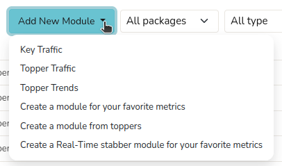
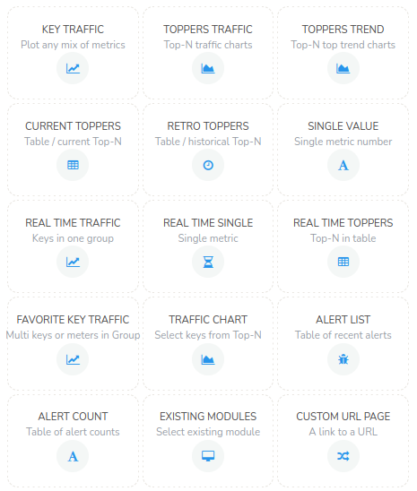
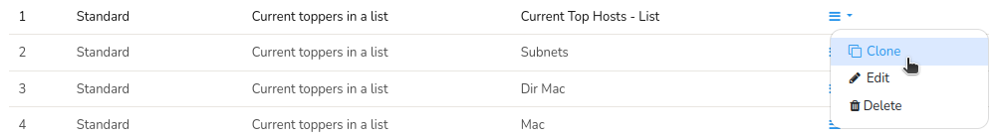
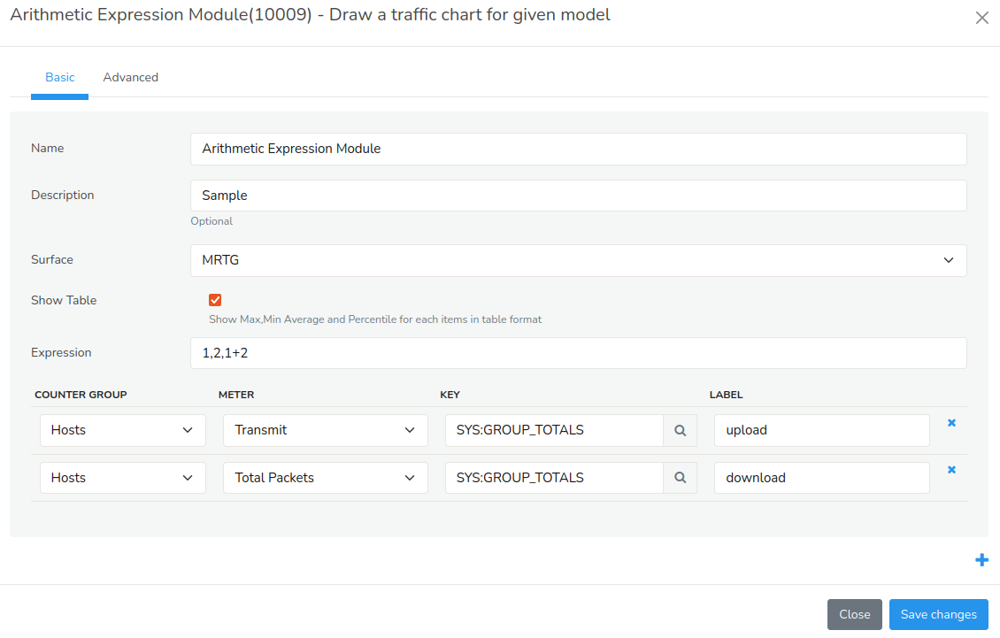
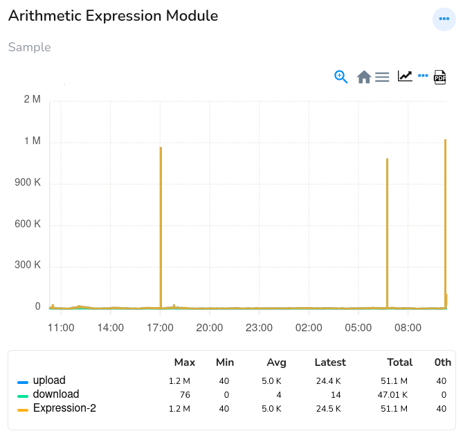

# Modules

Modules are customized metrics represented in the form of single values, visuals like charts and tables that allows you to analyze and extract insights from network traffic, traffic patterns, detect anomalies, identify threats. You can add any number of modules to your dashboard. 

Trisul has an extensive module library including prebuilt modules that has out of the box functionality that you can leverage without needing to develop custom components.

You can also create your own modules using pre existing [module templates](/docs/ug/ui/module_templates). Trisul has 40 different types of modules.

## Module Types

Modules are the building blocks of dashboards. There are different types of modules in Trisul and you can add modules to an empty dashboard or an existing dashboard.

### How to Create Modules

To create a new module,

:::note path

Select Customize-> UI-> Modules-> Add New Module

:::

*Figure: Add New Module Options*

From the list of module types select one and fill out the fields.

### Add Modules to a New/Existing Dashboard

To add modules to an empty dashboard, Create a [New Dashboard](/docs/ug/ui/create_dashboards#add-a-dashboard) by clicking New in the All dashboards page. 

:::note path

In the Module Layout-> Click on the Plus icon

:::

You can see the list of modules that you can add to the new dashboard here.

*Figure: Module Templates*

Similarly, to add modules to an existing dashboard, [customize the dashboard](/docs/ug/ui/create_dashboards#how-to-edit-a-dashboard) and follow the same steps as adding a module to new dashboard.

Alternatively you can also navigate from the list of [all dashboards](/docs/ug/ui/dashmod_intro#view-a-dashboardall-dashboards), click on the [dashboard toolbar](/docs/ug/ui/dashmod_intro#dashboard-toolbars) against the dashboard you would like to add the module to and click Customize. 

The module positions can also be rearranged in the layout view field in [dashboard customization](/docs/ug/ui/create_dashboards#how-to-edit-a-dashboard) window. You can rearrange by simply clicking and dragging the modules to the desired place.

### How to Edit a Module

There are more than one ways to edit a module from a dashboard,

**Method 1:**

:::note path

Click Customize on the [module toolbar](https://trisul.org/docs/ug/ui/dashmod_intro.html#module_toolbars) from the dashboard that contains the module.

:::

**Method 2:**

Alternatively you can also edit it from the list of [all modules](/docs/ug/ui/dashmod_intro#view-a-moduleall-modules), Click on the three lines on the right side against the module you would like to edit and click Edit.

### How to Clone/Delete a Module from the Dashboard

If you have observed a module that you would like to add as a new module, you can Clone a similar module to create new module. For that, Go to the list of [all modules](/docs/ug/ui/dashmod_intro#view-a-moduleall-modules),and from the list of available modules, Click on the three lines on the right side against the module. Now click Clone and edit the required fields.

*Figure: Toolbar Showing Options Clone/Delete a Module from the Dashboard*

Similarly to **delete a module**, click Delete.

### Creating Modules with Arithmetic Expressions

You can also create modules with the help of arithmetic 
expressions. You can combine different metrics together and show in a 
module.

Generally Models are numbered as 1,2,3,etc. Supported operators are +,_,*,%,/,()

For eg. Add two Metrics, You have to enter arithmetic expression as 
(1+2),(3-4) or Metric 1 as a percentage of 2 and 3 as 1%(2+3)

*Figure: Form to Create a Module Using Arithmetic Expression*

A custom module dashboard with arithmetic expressions will look like
this.

*Figure: Arithmetic Expression Module*
