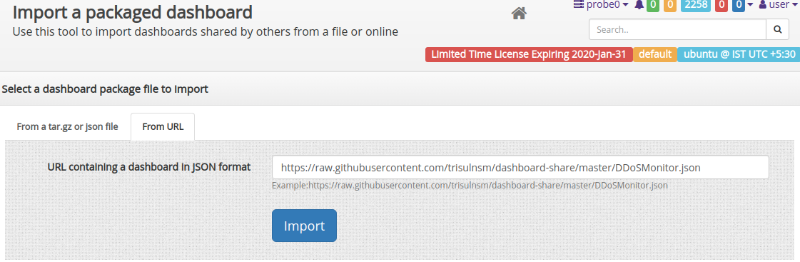

# Custom Dashboard Packages

Share dashboards and modules with others

## Create a new dashboard package

Directions to create a new dashboard package

:::note navigation

Select Customize -\> UI -\> Share Dashboards

:::

1. Click the option found at the top right side **Create a new dashboard
   package**  

2. You will be redirected to package creation page

| Field               | Description               |
| ------------------- | ------------------------- |
| Package name        | Valid package name        |
| Package description | Description about package |
| Author              |                           |
| Version             |                           |

choose the dashboards from the list you want to share

## Install dashboard package

Directions to Install dashboard package

:::note navigation

Select Customize -\> UI -\> Share Dashboards -\> Import a dashboard
package

:::

You can import a dashboard in two methods

1. From a tar.gz or json file
2. From URL

### From a tar.gz or json file

Plase upload a valid tar.gz or json file and click import button to
import a dashboard

Upload your dashboard file

### From URL

Please enter the valid json url to import a dashboard from URL.

