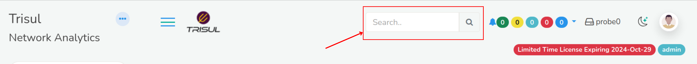

# Using search

You can use the *Search* tool to find items of interest.

> You can :

- Search by an IP address, Port number, etc.
- Search by user labels like host names, alert signature names, etc.
- Directly type in a trisul key like p-0050

> If you wish to search for resources like HTTP URLs and DNS
> names, you will be redirected to their search forms which are more
> flexible. See [URL Resources](/docs/ug/resources/url) and [DNS Resources](/docs/ug/resources/dns)

## The search box

The search box is located below the side menu bar as shown here.

Enter some search text here and press *Enter*

## Search results

The *search results* page contains all items that might match your
query.

1. Searching for amazon.com will return x.y.amazon.com.
2. Searches are case insensitive

Click on the View Details button to explore further

