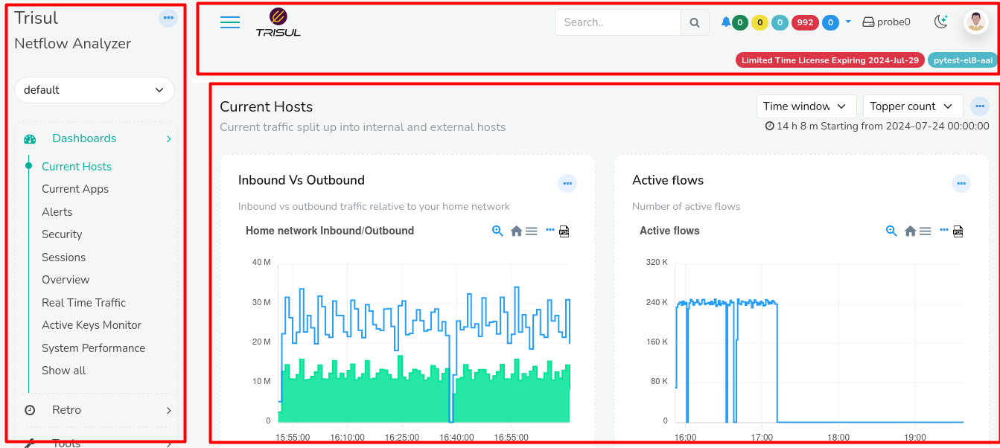
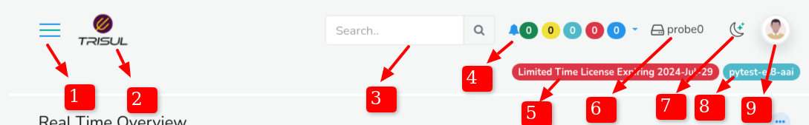
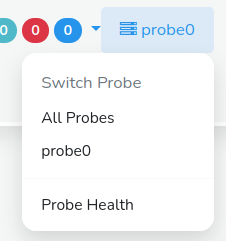
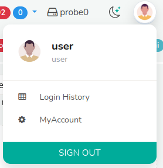
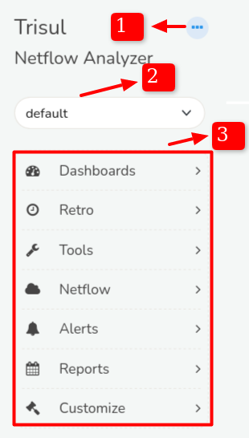
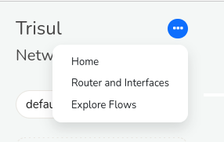
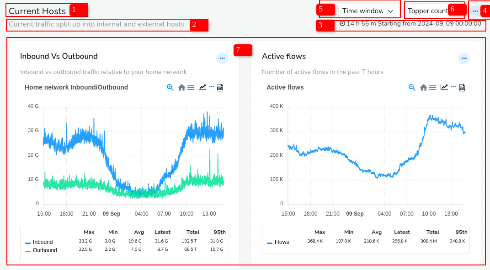

# User Layout

In this section you can easily get to know the visual arrangement or organization of elements on the website intended for user login. The Key features and functionality are explained in the later sections. So let's get familiar with the user layout design and navigation first for starters.

When you login as a "non admin" user you will see the following layout 

  

*Figure: User Layout*

Observe three sections 

- Top Panel
- Menu Panel
- Dashboard Panel 

### Top Panel Details

The top panel contains the following items

  

*Figure: Top Panel of User Layout*

1) #### Menu Toggle
   
   Click on the Menu toggle button to hide and unhide the side menu. This will provide you with extra screen space when necessary.

2) #### Trisul Logo
   
   Clicking on the logo takes you to the home page.

3) #### Customer Logo/ User Logo

   To change the Customer Logo or User Logo see: [How to change Customer Logo or User Logo logging in as admin](/docs/ag/webadmin/manageusers#create-a-new-user)

4) #### Search Bar
   
   You can use the [Search bar tool](/docs/ug/ui/elements#using-search-tool) to find items of your interest.

5) #### Alerts and Notifications

    *Figure: Alerts and Notifications in Top Panel*
    
    You can check for the alerts and notifications on External IDS, Threshold Crossing, Threshold Band Alerts, Blacklist Activity and Flow tracker here. Click the top right corner of color coded icons that represent alerts and notifications with alert count.

6) #### License Detail
   
   You can check the validity of your License here.

7) #### Probe Switch
   
   
   
   *Figure: Probe Switch in Top Panel*
   
   You can switch between probes and check on the probe health by clicking on the probe switch. By default it is set to Probe0.

8) #### Dark/Light Mode
   
      You can switch between dark and light modes to change the appearance of the screen here.

9) #### Host Name
   
   This shows the host's name. All time zones in Trisul are displayed in the host's time zone.

10) #### Account
   
    
   
   *Figure: Account Switch*
   
    Clicking on the account button you can get the account history, change password, and signout from the current account. To change the user avatar see : [How to change the user avatar logging in as admin](/docs/ag/webadmin/manageusers#create-a-new-user)

## Menus

   A fully customizable multi open collapsible menu system.

### Basic Operations

*Figure: User Layout Menu*

Clicking on menu item opens a page with all options.

Expanding a menu item opens most popular items.

Trisul remembers the expanded state of the menu per user.

1) #### Shortcut Menu
   
   
   
   *Figure: Shortcut Menu in User Layout Menu*
   
   Clicking on the shortcut menu you can quickly navigate to the home, routers and interfaces, and explore flows from any page.

2) #### Tenants
   
   Trisul can handle multiple tenants and each tenant's data are isolated from others through logical separation. You can switch between different contexts from the list of tenants.

3) #### Menu Items
   
   Click on each menu item and you can see the sub menus under each menu item expanded. Click Show all as not all sub menus would show up here.

## Dashboards

Dashboards are used to present network analysis modules by placing them
on specific locations on a web page. 

Dashboards are used to present network analysis modules by placing them
on specific locations on a web page.

*Figure: Dashboard in User Layout*

The Dash board contains the following elements

| Elements                                                             | Function                                 |
| -------------------------------------------------------------------- | ---------------------------------------- |
| 1) Dashboard Name                                                    | This is the name of the dashboard.       |
| 2)  Dashboard Description                                            | This gives you the description of the dashboard                                                                                                             |
| 3) Data Time Period                                                  | The time shown on the top right corner of the dashboard is since the time data was available till now.                                                      |
| 4) [Dashboard Toolbar](/docs/ug/ui/dashmod_intro#dashboard-toolbars) | By clicking on the three dots at the top right corner of the dashboard you can edit the dashboard including customizing it, toggle labels, set as default dashboard, expand all modules, collapse all modules, and download as PDF.                                         |
| 5) Time Window | This enables you to select from a number of time ranges like 5 mins, 15 mins, 1 hour and more custom ranges |
| 6) Topper Count | A number of topper counts can be quickly selected to display the results in the modules in the dashboard that reflects the selected time.
| 7) [Modules](/docs/ug/ui/modules)                                                           | Modules are represented in the forms of charts and tables.                                                                                                |

For more information see also:  

- [About the built in dashboards](dashboards).   

- [Dashboards and modules](dashmod_intro).
