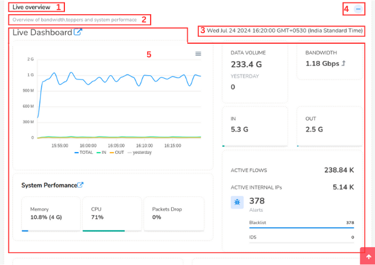

---

sidebar_position: 1
---

# User Layout

When you login as a non admin user you will see the following layout 

  

Observe three sections 

- Top Panel
- Menu Panel
- Dashboard Panel 

### Top Panel details

The top panel contains the following items

  

1) #### Menu Toggle
   
   Click on the Menu toggle button to hide and unhide the side menu. This will provide you with extra screen space when necessary.

2) #### Trisul Logo

Clicking on the logo takes you to the home page.

3) #### Search Bar

You can use the Search bar tool to find items of your interest.

4) #### Alerts and Notifications

You can check for the alerts and notifications on External IDS, Threshold Crossing, Threshold Band Alerts, Blacklist Activity and Flow tracker here.

5) #### License Detail

You can check the validity of your License here.

6) #### Probe Switch
   
   
   
   You can switch between probes and check on the probe health by clicking on the probe switch. By default it is set to Probe0.

7) #### Dark/Light Mode
   
      You can switch between dark and light modes to change the appearance of the screen here.

8) #### Host Name

This shows the host's name. All time zones in Trisul are displayed in the host's time zone.

9) #### Account
   
    
   
    Clicking on the account button you can get the account history, change password, and signout from the current account. 
   
   ## Menus

A fully customizable multi open collapsible menu system.

#### Basic operations

Clicking on menu item opens a page with all options.

Expanding a menu item opens most popular items.

Trisul remembers the expanded state of the menu per user.

1) #### Shortcut Menu
   
   
   
   Clicking on the shortcut menu you can quickly navigate to the home, routers and interfaces, and explore flows from any page.
2. ## Context Menu
   
      You can switch between different contexts from the context menu. 
3) ## Menu Items
   
   Click on each menu item and you can see the sub menus under each menu item expanded. Click Show all as not all sub menus would show up here.

## Dashboards

Dashboards are used to present network analysis modules by placing them
on specific locations on a web page. 

Dashboards are used to present network analysis modules by placing them
on specific locations on a web page.

The Dash board contains the following elements

| Elements                                                             | Function                                                                                                                                                                                                                            |
| -------------------------------------------------------------------- | ----------------------------------------------------------------------------------------------------------------------------------------------------------------------------------------------------------------------------------- |
| 1) Dashboard Name                                                    | This is the name of the dashboard.                                                                                                                                                                                                  |
| 2)  Dashboard Description                                            | This gives you the description of the dashboard                                                                                                                                                                                     |
| 3) Data Time Period                                                  | The time shown on the top right corner of the dashboard is since the time data was available till now.                                                                                                                              |
| 4) [Dashboard Toolbar](/docs/ug/ui/dashmod_intro#dashboard-toolbars) | By clicking on the three dots at the top right corner of the dashboard you can edit the dashboard including customizing it, toggle labels, set as default dashboard, expand all modules, collapse all modules, and download as PDF. |
| 5) Modules                                                           | Modules are represented in the forms of charts and tables.                                                                                                                                                                          |

For more information see also:  

- [About the built in dashboards](dashboards).   

- [Dashboards and modules](dashmod_intro).
