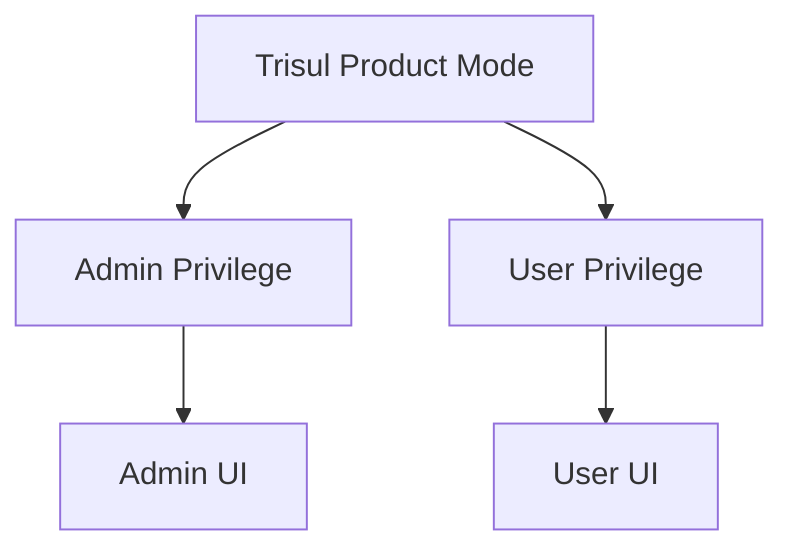
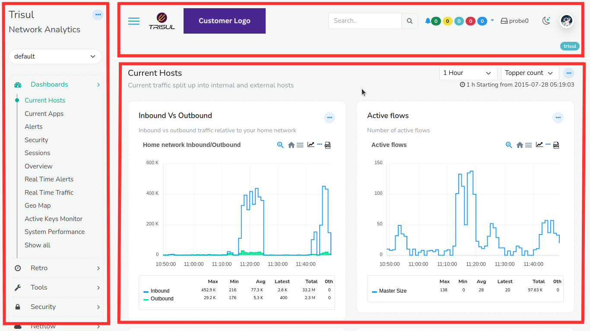
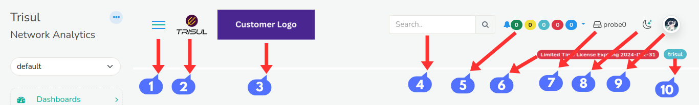
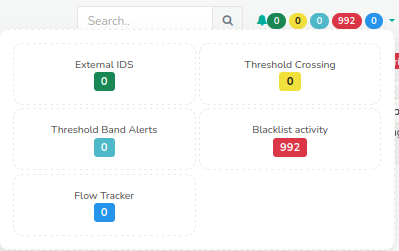
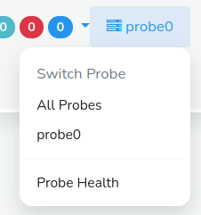
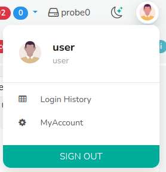
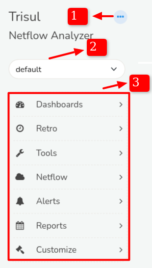
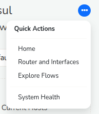
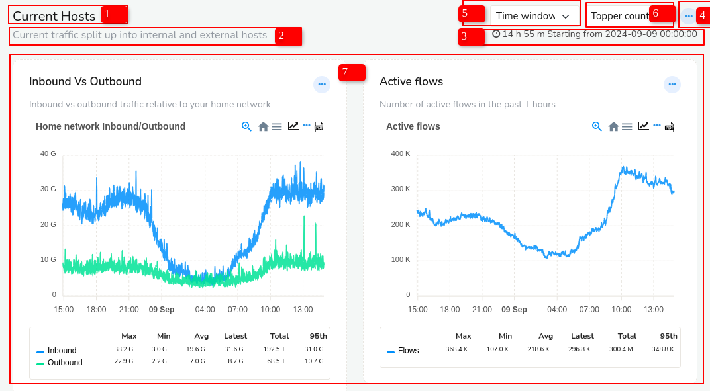

# User Interface for User Accounts

The Trisul Web UI provides different features and navigation options based on the **Product Mode** configured for the deployment and the **privileges** assigned to the logged-in account.

This page describes the common layout of the Trisul Web UI when logged in with a **User-privilege** account.

>Note: The Administrator interface is different and provides additional options for system configuration and administration. See **[Administrator UI](/docs/ag/ui/adminlayout)** for details.

The menus, dashboards, modules, and analysis features available to a User can also vary depending on the selected Product Mode and the permissions assigned to the account.

For information about the different Trisul Product Modes and the capabilities provided by each mode, see [**Product Modes**](/docs/ag/install/selectmode).

## What determines the User interface?

Two factors determine what a User can see and access:

- **Product Mode** determines which product-specific features are available.
- **User Privileges** determine which of those features the account is allowed to access.

```mermaid

flowchart TD
    A[Trisul Product Mode] --> B[Admin Privilege]
    A --> C[User Privilege]

    B --> D[Admin UI]
    C --> E[User UI]
```

## User Web UI Layout

The User Web UI is organized into three main areas:

- **Top Panel**
- **Menu Panel**
- **Dashboard Panel**

  

*Figure: User Layout*

### Top Panel Details

The Top Panel contains commonly used controls available throughout the User interface.

  

*Figure: Top Panel of User Layout*

1) #### Menu Toggle
   
   Click on the Menu toggle button to hide and unhide the side menu. This will provide you with extra screen space when necessary.

2) #### Trisul Logo
   
   Clicking on the logo takes you to the home page.

3) #### Customer Logo/ User Logo

   The configured customer or user logo is displayed in the Trisul interface.

   This is a visual customization and does not affect network analysis.

   To change the Customer Logo or User Logo see: [How to change Customer Logo or User Logo logging in as admin](/docs/ag/webadmin/manageusers#changing-avatar-logo)

4) #### Search Bar
   
   Search allows you to find supported network objects and information available to your account. You can use the [Search bar tool](/docs/ug/ui/elements#using-search-tool) when you already know what you want to investigate, such as a host, application, IP address, or another supported object.

5) #### Alerts and Notifications

   *Figure: Alerts and Notifications in Top Panel*
    
    You can view alerts and notifications related to **External IDS, Threshold Crossing, Threshold Band Alerts, Blacklist Activity, and Flow Tracker** in this section.

    Simply click the **color-coded alert icons** located at the **top-right corner** of the interface. Use Alerts to review events that require attention and investigate activity that has triggered an alert.

6) #### License Details

   Verify the validity of your license details to ensure uninterrupted access to our services.

7) #### Probe Switch
   
   
   
   *Figure: Probe Switch in Top Panel*
   
   The Probe Switch allows you to select the Trisul Probe whose data you want to view.

   A Trisul deployment can have multiple Probes, which can collect network data from different network locations or traffic sources. You can switch between probes and check on the probe health by clicking on the probe switch. By default it is set to Probe0.

   For example, if one Probe collects traffic from a data center and another collects traffic from a branch network, select the appropriate Probe before investigating traffic from that location.

   >Tip: If expected traffic is missing from a dashboard, check the selected Probe before troubleshooting the data source.

   >Note: The Probes available to a User depend on the access assigned to that account.

8) #### Dark/Light Mode
   
      You can switch between dark and light modes to change the appearance of the screen here.

9) #### Account

   The Account area provides information and options associated with the currently logged-in User.

   The available options depend on the privileges assigned to the account.
   
    
   
   *Figure: Account Switch*
   
    Clicking on the account button you can get the account history, change password, and sign out from the current account. To change the user avatar see : [How to change the user avatar logging in as admin](pathname:///docs/ag/webadmin/manageusers#ChangeUserAvatar)

10) #### Host Name
   
    The Host Name identifies the system running the Trisul Web UI.

    Trisul uses the configured time zone of the host when displaying time-related information.

    When comparing Trisul timestamps with timestamps from routers, firewalls, servers, or other systems, make sure the systems use the expected time zone.

    >Example: If Trisul shows an event at 14:00 while another system shows the same event at 08:30, check whether the systems are configured with different time zones.

## Menus

    The Menu Panel is the primary navigation area of the User interface.

    It provides access to the Trisul features available to the logged-in account.

    The menus displayed here depend on the Product Mode and the permissions assigned to the User.

    For details about the features provided by a particular Product Mode, refer to the relevant Product Mode documentation.

### Expanding and Collapsing Menu Sections

    Menu sections can be expanded or collapsed independently.

    Click the arrow next to a menu section to expand or collapse it.

    Use this to keep frequently used features visible while hiding sections you do not currently need.

### Show All

    Select Show All to display the available options under a menu section.

    Use this when the feature you need is not visible in the currently expanded menu.

### Menu State

    Trisul can retain the expanded or collapsed state of menu sections.

This allows you to keep the interface organized according to the features you use most often.

### Basic Operations

*Figure: User Layout Menu*

1) #### Shortcut Menu
   
   
   
   *Figure: Shortcut Menu in User Layout Menu*
   
   Clicking on the shortcut menu you can quickly navigate to the home, routers and interfaces,explore flows, and system health from any page.

2) #### Tenants
   
    Trisul supports **multi-tenant environments**, meaning it can manage data for multiple independent users or organizations within the same system. Each tenant's data is **logically separated**, ensuring complete isolation and privacy.

    You can easily **switch between tenants (called "contexts" in Trisul)** using the tenant selection list. This allows you to view and manage data specific to each tenant without any overlap.

3) #### Menu Items
   
   Click on any menu item to see more options below it. At first, you'll only see the most commonly used ones. To view everything available under that menu, just click **“Show All**.”

## Dashboard Panel

    The Dashboard Panel displays dashboards containing one or more analysis modules.

    A dashboard provides a view of network analytics for a selected time period.

    The dashboards and modules available to a User depend on the Product Mode and the permissions assigned to the account. For information about the dashboards and analytics available in a particular Product Mode, refer to the relevant product documentation.

*Figure: Dashboard in User Layout*

The Dash board contains the following elements

| Elements                                                             | Function                                 |
| -------------------------------------------------------------------- | ---------------------------------------- |
| 1) Dashboard Name                                                    | This is the name of the dashboard.       |
| 2)  Dashboard Description                                            | This gives you the description of the dashboard                                                                                                             |
| 3) Data Time Period                                                  | The time shown on the top right corner of the dashboard is since the time data was available till now.                                                      |
| 4) [Dashboard Toolbar](/docs/ug/ui/dashmod_intro#dashboard-menu-button) | By clicking on the ellipsis icon at the top right corner of the dashboard you can edit the dashboard including **customizing it, toggle labels, set as default dashboard, expand all modules, collapse all modules, and download as PDF**.                                         |
| 5) [Time Selector](/docs/ug/ui/elements#time-selector) | This enables you to select from a number of time ranges like 5 mins, 15 mins, 1 hour and more custom ranges |
| 6) Topper Count | A number of topper counts can be quickly selected to display the results in the modules in the dashboard that reflects the selected time.
| 7) [Modules](/docs/ug/ui/modules)                                                           | Modules are represented in the forms of charts and tables.                                                                                                |

For more information see also:  

- [About the built in dashboards](dashboards).   

- [Dashboards and modules](dashmod_intro).

## Why Can't I See a Menu or Feature?

The User interface is affected by both **Product Mode** and **User Privileges**.

If another User can see a menu or feature that you cannot, the two accounts may have different permissions. The feature may also belong to a different Product Mode.

Check the following:

- **Product Mode** - Is the feature available in the Product Mode configured for the deployment?
- **User Account** - Are you logged in with the expected account?
- **Permissions** - Does your account have access to the feature?
- **Probe or Context** - Is the required Probe or context available to your account?
- **Menu** - Have you expanded the relevant menu or selected Show All?

If the feature should be available but is still missing, contact the Trisul Administrator.

For information about Product Modes, see Product Modes.

## Common Problems

### I cannot see the traffic I expected

Check:

- **Probe** - Are you viewing the correct Probe?
- **Time Period** - Does the selected time range include the expected traffic?
- **Dashboard** - Are you using the correct dashboard?
- **Module** - Does the module display the metric you are looking for?
- **Permissions** - Does your account have access to the required data?

#### The dashboard shows no data

Check:

- Whether the selected Probe is receiving data.
- Whether the selected time period contains traffic.
- Whether you are using the correct dashboard and module.
- Whether your account has access to the relevant data.

#### The timestamps do not match another system

Check the time zone configured on the Trisul host and compare it with the time zone used by the other system.

When investigating an event across multiple systems, use a consistent time reference.

#### I cannot find a menu option

First:

1. Expand the relevant menu section.
2. Select Show All.
3. Check whether the feature is available in the current Product Mode.
4. Check whether your account has the required permission.

If the option is still missing, contact the Trisul Administrator.

## User Interface vs Administrator Interface

User Interface describes the interface available to **User** privilege accounts.

**Administrator** accounts have administrative options for configuring and managing the Trisul system, so the Administrator interface may contain menus and controls that are not visible to Users.

The interface can also vary between Product Modes.

When following a procedure in the Trisul documentation, check both:

- Account privilege - User or Administrator
- Product Mode - The Product Mode for which the procedure applies

This ensures that the screenshots, menus, and options in the procedure match your Trisul environment.
