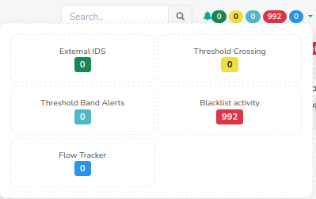

# User Layout

This section introduces the visual layout and organization of elements within the Web Trisul interface for regular (non-admin) users. Before diving into specific features and functionalities—which are covered in later sections—it's helpful to first understand the basic design and navigation flow.

When you log in as a non-admin user, you’ll see the following layout:

  

*Figure: User Layout*

Observe the three sections 

- Top Panel
- Menu Panel
- Dashboard Panel 

### Top Panel Details

The top panel contains the following items

  

*Figure: Top Panel of User Layout*

1) #### Menu Toggle
   
   Click on the Menu toggle button to hide and unhide the side menu. This will provide you with extra screen space when necessary.

2) #### Trisul Logo
   
   Clicking on the logo takes you to the home page.

3) #### Customer Logo/ User Logo

   To change the Customer Logo or User Logo see: [How to change Customer Logo or User Logo logging in as admin](/docs/ag/webadmin/manageusers#changing-avatar-logo)

4) #### Search Bar
   
   You can use the [Search bar tool](/docs/ug/ui/elements#using-search-tool) to find items of your interest.

5) #### Alerts and Notifications

   *Figure: Alerts and Notifications in Top Panel*
    
    You can view alerts and notifications related to **External IDS, Threshold Crossing, Threshold Band Alerts, Blacklist Activity, and Flow Tracker** in this section.

    Simply click the **color-coded alert icons** located at the **top-right corner** of the interface. These icons display the number of active alerts and provide quick access to detailed information.

6) #### License Details

   Verify the validity of your license details to ensure uninterrupted access to our services.

7) #### Probe Switch
   
   
   
   *Figure: Probe Switch in Top Panel*
   
   You can switch between probes and check on the probe health by clicking on the probe switch. By default it is set to Probe0.

8) #### Dark/Light Mode
   
      You can switch between dark and light modes to change the appearance of the screen here.

9) #### Account
   
    
   
   *Figure: Account Switch*
   
    Clicking on the account button you can get the account history, change password, and sign out from the current account. To change the user avatar see : [How to change the user avatar logging in as admin](pathname:///docs/ag/webadmin/manageusers#ChangeUserAvatar)

10) #### Host Name
   
    This shows the host's name. All time zones in Trisul are displayed in the host's time zone. 

## Menus

    This is a fully customizable menu system where multiple sections can be expanded or collapsed independently. It helps you quickly access different parts of the interface without closing other open sections.

### Basic Operations

*Figure: User Layout Menu*

- Clicking on a menu item (such as **Dashboards, Retro, Tools**, etc.) opens the full page with all related options.
- Alternatively, clicking the **arrow icon** next to the menu item expands a quick view showing the most frequently used options.
- Trisul automatically remembers your expanded menu state, so your preferred layout is restored the next time you log in.

1) #### Shortcut Menu
   
   
   
   *Figure: Shortcut Menu in User Layout Menu*
   
   Clicking on the shortcut menu you can quickly navigate to the home, routers and interfaces,explore flows, and system health from any page.

2) #### Tenants
   
    Trisul supports **multi-tenant environments**, meaning it can manage data for multiple independent users or organizations within the same system. Each tenant's data is **logically separated**, ensuring complete isolation and privacy.

    You can easily **switch between tenants (called "contexts" in Trisul)** using the tenant selection list. This allows you to view and manage data specific to each tenant without any overlap.

3) #### Menu Items
   
   Click on any menu item to see more options below it. At first, you'll only see the most commonly used ones. To view everything available under that menu, just click **“Show All**.”

## Dashboards

Dashboards are used to present network analysis modules by placing them
on specific locations on a web page. 

Dashboards are used to present network analysis modules by placing them
on specific locations on a web page.

*Figure: Dashboard in User Layout*

The Dash board contains the following elements

| Elements                                                             | Function                                 |
| -------------------------------------------------------------------- | ---------------------------------------- |
| 1) Dashboard Name                                                    | This is the name of the dashboard.       |
| 2)  Dashboard Description                                            | This gives you the description of the dashboard                                                                                                             |
| 3) Data Time Period                                                  | The time shown on the top right corner of the dashboard is since the time data was available till now.                                                      |
| 4) [Dashboard Toolbar](/docs/ug/ui/dashmod_intro#dashboard-menu-button) | By clicking on the ellipsis icon at the top right corner of the dashboard you can edit the dashboard including **customizing it, toggle labels, set as default dashboard, expand all modules, collapse all modules, and download as PDF**.                                         |
| 5) [Time Selector](/docs/ug/ui/elements#time-selector) | This enables you to select from a number of time ranges like 5 mins, 15 mins, 1 hour and more custom ranges |
| 6) Topper Count | A number of topper counts can be quickly selected to display the results in the modules in the dashboard that reflects the selected time.
| 7) [Modules](/docs/ug/ui/modules)                                                           | Modules are represented in the forms of charts and tables.                                                                                                |

For more information see also:  

- [About the built in dashboards](dashboards).   

- [Dashboards and modules](dashmod_intro).
