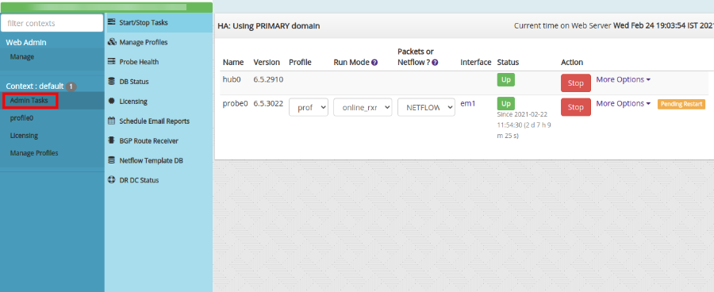
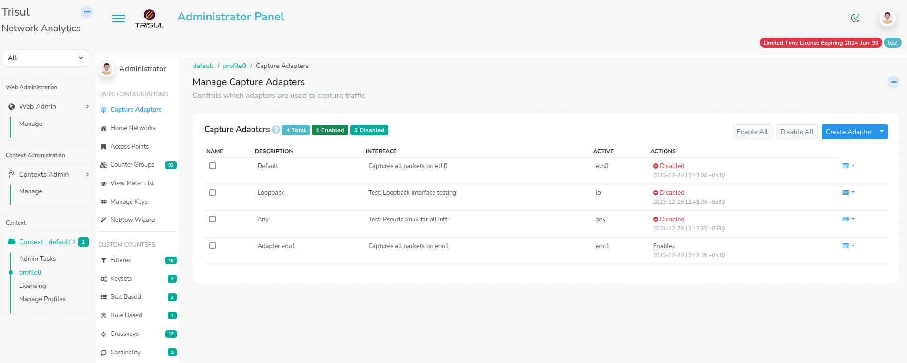

# Context Menus

A Trisul context is a separate instance of Trisul with its own isolated
database, configuration, and processes. To know more about contexts,
Refer to [Working with Contexts](/docs/ug/domain/contexts)

## Admin Tasks

All the administrative functions are being done here right from
starting/stopping Hub and Probe nodes to monitoring Netflow and BGP in
Trisul.

### Start/Stop Tasks

This Menu is generally used to start/stop Hub and Probe nodes associated
with each context. Each context will have separate Hub and Probe nodes.
You can directly start and stop the nodes from Web Interface through
this menu.

### Manage Profiles

This menu provides a list of available profiles used by multiple probes.
Profile assigned to probes cannot be deleted. If multiple probes are
setup, Multiple profiles will be created automatically and listed here.

> To create a new profile, select **Create Profile** option.

You are shown the form with following fields

| Field Name          | Description                                                                                   |
| ------------------- | --------------------------------------------------------------------------------------------- |
| Profile Name        | Name for the profile. Name should be alpha numeric and length should not exceed 10 characters |
| Profile Description | Describes the function of the profile created                                                 |
| Clone from Context  | You can choose between multiple context to clone profile                                      |
| Clone from Profile  | You can also clone an entire profile from a list of profiles                                  |

### Probe Health

This menu is nothing but a Probe Health Monitor. It shows the
reachability, current traffic, and latency of Trisul Probes in this
particulat context.

It shows the count for Total No.of Probes, No.of Unreachable Probes,
No.of Probes Up/Down. Also provides the Latest Bandwidth in Gbps for
each probe.

### DB Status

This menu shows up the Trisul Data Store Statistics. It provides
detailed information on Session Flows, Resources, Alerts,
FTS (Full Text Search) objects.

Trisul Database is generally divided into three segments based on the
how many days Trisul has to store data.

- Oper is where the Latest data gets stored.
- Reference is the next level where data is pushed based on the days
  specified for storage.
- Archive is responsible for storing very old data.

You can view how much volume of data is being stored per day in each
slice and you can calculate accordingly as to how much days data can be
stored depending on the size of the disk.

> To configure the DB storage retention policy refer to [Configuring disk
> storage](/docs/ug/install/configure_storage)

You can also view the disk occupied by each counter-group in a SLICE
every-day. This is helpful in tuning the system.

### Licensing

This menu gets you through the license policy of Trisul.

Trisul Network Analytics licenses are :

1. Perpetual
2. Need one license per physical node
3. Tied to a machine ID

License types are :

1. Free 3-Day License : this is the default license that does not
   expire but only gives you a 3-day window of history
2. Production License : depends on the number of active internal
   endpoints in your Home Network space
   1. Small Business : 500 simultaneously active Internal IPs
   2. Medium : 3000 simultaneously active Internal IPs
   3. Unlimited : As many as your hardware can support

To Install a new License, Refer to the [Installing Trisul
License](/docs/ug/install/license) for instructions

### Schedule Email Reports

You can Schedule Automatic Reports from Trisul like PDF Reports, Alert
based Reports etc.

You may dispatch by email any of the supported report types at these
intervals.

1. Hourly
2. Daily
3. Weekly
4. Monthly

To know more about how to schedule Reports, Refer to [Schedule
Reports](/docs/ug/reports/schedreports)

### BGP Route Reciever

This menu is all about the status of BGP Route Reciever. It shows the
BGP Status on all probes.

> To start the BGP Receiver you need root privileges on the probe, then
> type **systemctl start trisul-bgp**

To know more on Trisul-BGP concept, See [Trisul-BGP](/docs/ug/isp/bgp)

### Netflow Template DB

Netflow v9, IPFIX, JFlow, Netstream are technologies that use a concept
of Template records. These are special records sent by the router which
describe the metrics contained in normal data flow records. Viewing
these template records are a great way to troubleshoot Netflow.

This Menu provides Netflow/IPFIX template database received by all
probes.

You can see the template database on each probe. This is updated every
10 minutes or when a new template is received.

### DR DC Status

Trisul supports Diaster Recovery when the Primary Site crashes.

The Primary Site is the Data Centre where Traffic is pushed. With the DR
Setup, Trisul also creates a backup of all the traffic in the DR site
and once the Primary site is down, the DR site is up.

We can configure the Primary site in such a way that we can check if the
DR site is running.

:::note navigation

Login as User. Select Manage -\> App Settings -\> DR Settings.

:::

Enter the IP and TCP Port number of the DR Site.

By Configuring the DR Settings,you can view the Traffic Chart and DB
Status of the DR Site from the primary site.

Refer [Disaster Recovery](/docs/ug/ha/dr)

## Profile Menu

The Profile Menu has all the basic configuration related traffic
monitoring, flows, custom counters, Alerts, Resources and Advanced Tools
that can be modified as and when it is needed. The default profile is
called **profile0** you can click on that item to access the profile
menu.

### Capture Adapters

Trisul has the capability to listen to the netflow traffic from the
network interface or adapters that we specify.

This menu helps you to configure the adapter to which you want Trisul to
listen to.

For more about [selecting a capture adapter or interface](/docs/ug/webadmin/profiles)

### Home Networks

Home networks are used to differentiate internal and external traffic.
If you need to monitor a range of internal IPs within your organisation
you can type the IP along with the subnets.

> To create a home network, Go to Home networks-> Select **Add**

You are shown the form with following fields

| Field Name     | Description                                                                                                 |
| -------------- | ----------------------------------------------------------------------------------------------------------- |
| Network Number | Enter a network number : Example 19.28.182.0 or Enter a newtork number with CIDR : Example 192.168.182.0/24 |
| Network Mask   | Enter a subnet mask : Example 255.255.255.0                                                                 |

Refer to [Home Networks](/docs/ug/webadmin/home_networks)

> Click on **Create** to add a new home network

### Access Points

They Control how protocols are mapped to ports and other entities.
Access points map protocols to ports. For example if you want to decode
UDP port 5556 as Netflow you can edit UDP then map Port 5556 to the
Netflow protocol.

Refer to [Access Points](/docs/ug/webadmin/access_points)

### Counter Groups

Trisul ships with 40-50 counter groups. Often users want some special
type of metering for their environment. Trisul lets you build your own
advanced traffic metering on top of the existing counter groups.

This menu controls how various counter groups are processed by Trisul.
It provides a list of available counter groups with Name,Description,Type, Bucketsize, HiWater, etc.

> You can manually edit the parameters in counter groups by selecting
> **edit** option.

Refer to [Trisul Counter Groups](/docs/ug/cg/settings)

### View Meters

This menu describes all the meters available out of the box in Trisul.
Installing additional plugins will usually give you even more meters which will be described in detail by the documentation accompanying each plugin.

It provides the Detailed metrics of each counter group like Total, In,
Out, BucketSize, TopperBucketsize, GUID, etc

Refer to [Trisul Traffic Meters](/docs/ref/meters)

### Netflow Wizard

This menu allows you to configure Netflow.

1. You can mention the ports you want trisul to listen on Netflow.
2. You can Select the network adapter on which netflow traffic occurs.
3. You can Select the counter groups typically used in Netflow
   Environments.
4. You set the Netflow ports i.e the access points for netflow traffic.
5. You can configure your routers and interfaces and also resolve your
   IPs from here.

Refer to [Netflow Wizard](/docs/ug/netflow/netflow_wizard)

### Filtered Counter

It is a cross-product counter group.

Meter a subset of a group that matches a set of keys from another group.

Filtered counter group are invaluable in setting up cross-group
counters.

Refer to [Filtered Counter](/docs/ug/cg/custom#filtered-counter-groups)

### Keysets

A new counter group that aggregates sets of keys from a host counter
group. Essentially monitors a “group of keys” as a single key.

To create a Keyset counter group, Refer to [Keyset Counter](/docs/ug/cg/custom#keyset-counter-groups)

### Stat Based

A new counter group consisting of items based on an observed meter
value.

Creates a subset of a parent group consisting only of items who meet a
certain meter criteria.

Refer to [Stat Based Counter](/docs/ug/cg/custom#stat-based-counter-groups)

### Rule Based

A rule based counter group allows you the maximum flexibility to
custom-meter your network traffic.

It works like this :

\# Derive from a parent group such as hosts / applications / macs  
\# Specify a chain of rules in [Trisul Filter Format](/docs/ref/trisul_filter_format)  
\# The first rule that matches determines the meter key  
\# If no rule matches the key falls through to the parent counter group

Refer to [Rule Based Counter](/docs/ug/cg/custom#rule-based-counter-groups)

### Crosskeys

This lets you monitor a cross product of two or three counter groups. By
crossing the *Applications X Hosts* counter group you setup a new
counter group with *Hosts-App* keys this lets you monitor traffic
statistics for Hosts-App flows.

Refer to [Crosskey Counter](/docs/ug/cg/custom#cross-key-counter-groups)

### Cardinality

Cardinality counters allow you to measure unique hits for keys within a
counter group. For example, we can track how many unique IPs did each
country see.

You may add your own cardinality counters to any counter group with the
following restriction :

- A maximum of 2 cardinality counters are allowed per counter group.

Refer to [Cardinality Counter](/docs/ug/cg/custom#cardinality-counting)

### Session Groups

Flows such as TCP/UDP connections are known as sessions. This menu shows
information about Session groups like Name, Description, TimeOutSecs,
Volume bytes Cut off, Active Tracking, Status

### Flow Trackers

A flow tracker is used to capture and save snapshots of top flows
matching a range of criteria.

The Trisul database can potentially end up with hundreds of millions of
flows every day. Using flow trackers you can perform quick topper
analysis of the flow database over large timeframes.

A common use case of Flow Trackers is to track the so called ‘Elephant
flows’. Those are flows transferring a huge volume of data. But as you
shall see below this is not the only type of tracker. Flow trackers are
also necessary for you to use flow tracker alerts.

Refer to [Flow Tracker](/docs/ug/flow/tracker)

### Flow Tagger

Flow Taggers assign one or more text labels to flows in real time. These
labels are created by rules you specify. You can then search for flows
containing these text tags.

Some examples

1. Mark flows that generated an alert with the tag `"ALRT"`
2. Mark flows to China or Ukraine as `"CHUKR"`
3. Mark all non-HTTP flows to your subnet 10.18.10.0/24 as `"SUSPECT"`

Refer to [Flow Tagger](/docs/ug/flow/tagger)

### Alert Groups

An “Alert Group” represents a type of alert. Trisul ships with 6 Alert
groups

1. Threshold Crossing Alerts : Based on a meter value exceeding fixed
   Hi and Lo water marks for a certain time
2. Flow Tracking Alerts : Anomalous flow behaviour you define
3. IDS Alerts : When interfacing with external IDS systems like
   Suricata
4. Blacklist : When triggered by blacklisted indicators
5. Threshold Band Alerts : When a meter value drifts outside a
   “trained” band of normal values
6. System Alerts : From Trisul self monitoring, packet drops, memory
   pressure etc.

You can create your own alert types using the [alertgroup LUA
API](/docs/lua/alert_group) Alert groups you create using the LUA API will also show up in Trisul and be managed along with the built in alert groups.

Refer [All Alert Groups](/docs/ug/alerts/manage)

### Flow Tracker Alert

Trisul provides a powerful way to generate an alert when certain types
of flow activity occurs. Also see [Flow Trackers](/docs/ug/flow/tracker) for instructions on using Flow
Trackers which is a pre-requisite to creating Flow Tracker Alerts (this
section).

The alerts

1. show up on the Web Interface alert tracker (top right)
2. can be sent in near real time (1-5 sec) via email or Text Message
   (SMS)

Refer [Flow Tracker Alert](/docs/ug/alerts/ft) for Instructions.

### Threshold Crossing

You can assign thresholds to any meter value. Trisul continuously
monitors the value of the traffic meter against the configured
thresholds and generates a “Threshold Crossing Alert” if the value
crosses the thresholds.

Refer to [Threshold Crossing Alert](/docs/ug/alerts/tca)

### Threshold Band

Trisul can look at long term history of any metric and compute a band
within with the metric is usually found.

The band

1. is computed for every 5 minute interval
2. day of week based so weekends are tracked separately
3. can handle holidays and spikey days

Refer to [Threshold Band Crossing Alerts](/docs/ug/alerts/tband)

### Setup Email Alerts

This menu describes how you can configure Trisul to send you an email
when any alert fires.

The way the alerting pipeline works is the following.

- Alerts are first sent to syslog
- The email alert service watches syslog for alerts and dispatches them

**Using the Email Alerts Wizard**

Trisul has a new Email Alert Wizard that lets you configure everything
from one place.

To access that

:::note navigation

Login as Admin -\> Select Context and profile -\> Under Alerts -\> Email
Alerts Wizard

:::

You can just follow the steps in the wizard

### All Resources

Resources are objects linked to intrusion or forensic indicators. They
are transferred over the network. Trisul pulls them out, stores, and
indexes them separately.

This Menu is used to provide a list of all resource groups available in
Trisul

Refer [Resource Groups](/docs/ug/resources/oveview)

### All FTS Groups

Some resources extracted by Trisul are unstructured but are critical to
look up fast. These types of resources are stored in a Full Text Search
(FTS) index.

Currently the following FTS resources are supported.

1. **[SSL Certificate Chains](/docs/ug/resources/ftsssl)** - the full printed form with all extensions and attributes
2. **[HTTP Headers](/docs/ug/resources/ftshttp)** - all HTTP request and response headers

Refer to [FTS Groups](/docs/ug/resources/fts)

### Trisul Protocols

Various protocols that are mapped on Trisul are listed here. For every
protocol a new GUID will be assigned.

> To add a new protocol,Select **Add New Protocol** option.

| Field Name | Description                           |
| ---------- | ------------------------------------- |
| Enter Name | Name of Protocol                      |
| Enter GUID | GUID for the Protocol(Auto-Generated) |

### Trisul Plugins

This menu provides a list of all the Trisul Plugin Classes,their
configuration files and when their data was refreshed.

Refer to [Trisul Plugins](/docs/ref/plugin_configuration)

### Bulk Ping Groups

PING groups are used to group IPs for management reasons or to apply
different parameters for timeout, TTL, etc.

This menu is used to group a set of IPs and provides us information
about the IP reachability, Latency, Status of the IP, packetloss, etc of
every individual IP in the range.

### SNMP Agent

This menu helps to resolve several Router IPs with their respective SNMP
Read community. A multiple number of Router IPs can be added.

> To add a new SNMP agent, Select **Add New SNMP Agent** option

| Field Name          | Description                                                                                              |
| ------------------- | -------------------------------------------------------------------------------------------------------- |
| IP Address          | IP address of snmp device. You can add multiple devices at once. Specify multiple IPs separated by comma |
| SNMP Version        | SNMP version v1 or v2c or v3. Select V3 to show SNMPv3 parameters                                        |
| SNMP Read Community | SNMP read community string                                                                               |
