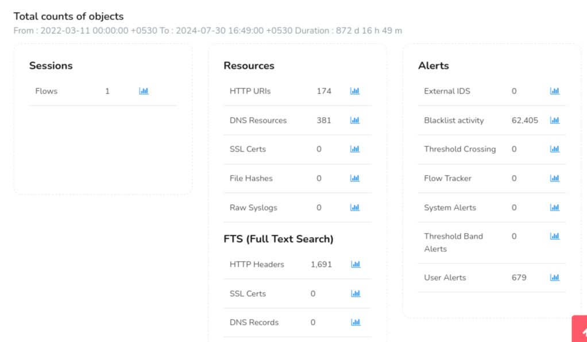
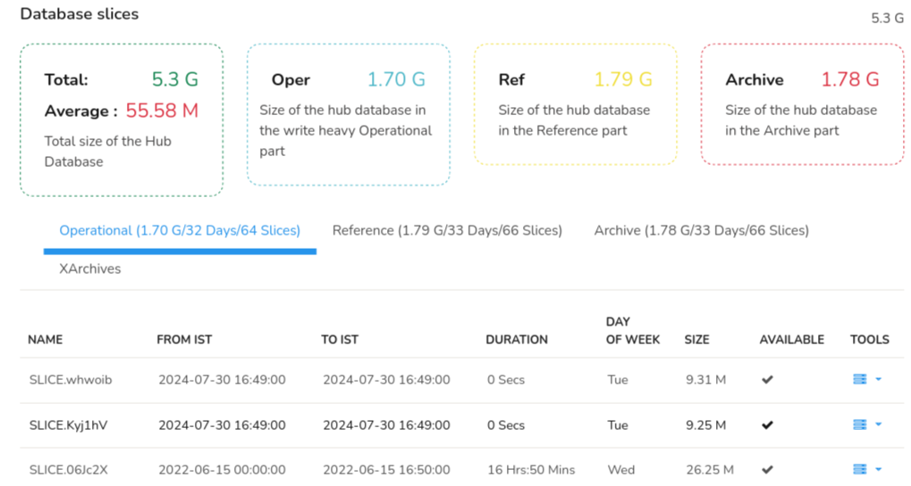
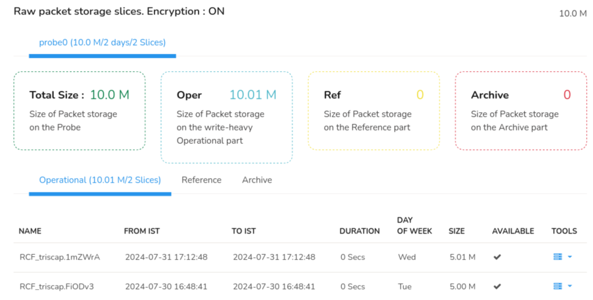

# DB Status

In Trisul, the **DB Status** dashboard provides a comprehensive overview of the Trisul database, including various metrics and statistics. 

> Click on the little graph button against each object to view the DB Status trend for that particulat object. You can also customize the number of days for which you want to view the trends.

*Figure: DB Status Dashboard showing total count of objects*

The DB Status dashboard contains several sections, which can be broken down in to:

1. **Sessions**: 
   
   The number of active network flows being tracked by Trisul in real-time. This indicates the current workload and activity level of the network.
2) **Resources**:
- *HTTP URIs*: The number of unique HTTP URIs (Uniform Resource Identifiers) tracked by Trisul. This includes URLs, query strings, and other HTTP request metadata.

- *DNS Resources*: The number of unique DNS (Domain Name System) resources tracked by Trisul, such as domain names, IP addresses, and DNS query metadata.

- *SSL Certs*: The number of unique SSL/TLS certificates tracked by Trisul, including certificate metadata like subject, header etc.

- *File Hashes*: The number of unique file hashes tracked by Trisul, which helps identify files and detect potential malware or unauthorized data transfer.
3) **Alerts**:
- *External IDS*: The number of alerts generated by external Intrusion Detection Systems (IDS) integrated with Trisul.

- *Blacklist Activity*: The number of alerts triggered by activity related to blacklisted IPs, domains, or URLs.

- *Threshold Crossing*: The number of alerts generated when predefined thresholds (example, traffic volume, flow rates) are exceeded.

- *Flow Tracker*: The number of alerts related to specific flow tracking rules or conditions.

- *System Alerts*: The number of alerts generated by Trisul's system monitoring, such as system errors, configuration changes, or resource issues.

- *Threshold Band Alerts*: The number of alerts triggered when traffic or flow rates enter a predefined threshold band (example, warning, critical).

- *User Alerts*: The number of custom alerts defined by users, such as alerts for specific applications, hosts, or network segments.
4) **FTS (Full Text Search)**:
- *HTTP Headers*: The number of HTTP headers indexed for full-text search, enabling quick searches for specific header values.

- *SSL Certs*: The number of SSL/TLS certificates indexed for full-text search, allowing searches by certificate metadata.

- *DNS Records*: The number of DNS records indexed for full-text search, enabling searches by domain, IP, or other DNS metadata.

## Database Slices

The Database Slices Dashboard is similar to the one in Storage Status which shows you the overview of the size of all the storage pools used and the total size of the database.

*Figure: DB Status dashboard showing Database Slices*

## Raw Packet Storage Slices

Raw Packet Storage Slices dashboard shows the amount of disk space used to store raw network traffic data in sliced format. Unlike NetFlow, all the raw PCAP slices are stored in Trisul probe.

*Figure: DB Status dashboard showing raw packet storage slices*

It displays the following,

| Information | Description                                      |
| ----------- | ------------------------------------------------ |
| Total Size  | The total size of packet storage on the probe    |
| Oper        | Size of packet storage on the Operational part   |
| Ref         | Size of the packet storage on the reference part |
| Archive     | Size of the packet storage on the archive part   |

The PCAP [tabular data ](/docs/ug/webadmin/storage_status#storage-status-tabular-data)below similar to the Storage Status tabular data which shows the PCAP information in each storage pools: oper, ref, and archive.
