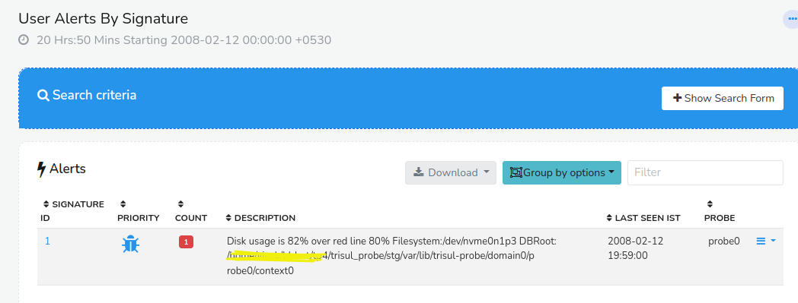

# Disk usage alerts

This page describes how to get email alerts when disk usage exceeds a
certain threshold.

> By default disk usage alerting is not enabled.

## Pre-requisites

Before you enable disk usage alerts you need to do two things.

**Setup Email**

Specify outgoing email server credentials. see [Setup Email](/docs/ug/reports/emailsettings.html)

**Enable email alert delivery**

Allow alert delivery via email see [Email alert delivery](/docs/ug/alerts/email_settings.html#basic_steps_to_enable_email_alerts)

## Edit configuration files

To enable disk alert threshold, you need to edit the hub and probe configuration files.

### Setup disk usage thresholds on Hub node

Edit the [trisulHubConfig.xml](/docs/ref/trisulhubconfig.html) file and set the following parameters under SlicePolicy.

***UsageRedMark*** 

Represents the percent usage threshold of disk. Here it is shown to be
90.

Similarly set threshold values for all three storage areas, oper/ref/archive. You can set them all to the same value if they are mounted on the same storage volume.

```language-xml
   <SlicePolicy>
        <SliceWindow>DAILY</SliceWindow>

        <Operational>
            <SliceCount>32</SliceCount>
            <UsageRedMark>90</UsageRedMark>
        </Operational>
```

### Setup disk usage thresholds on Probe node

Edit the [trisulProbeConfig.xml](/docs/ref/trisulconfig.html) file and set the following value.

***UsageRedMark***
the disk percent threshold value for the probe node

```language-xml
    <UsageRedMark>90</UsageRedMark>
```

## Viewing alerts

When disk usage crosses the thresholds set an “User Alert” will be
generated.

> Select *Alerts \> All Alerts -\> User Alerts*

These alerts are also delivered instantly via E-mail.

A sample alert shows the current usage, the partition, the threshold
usage and the directory root.


