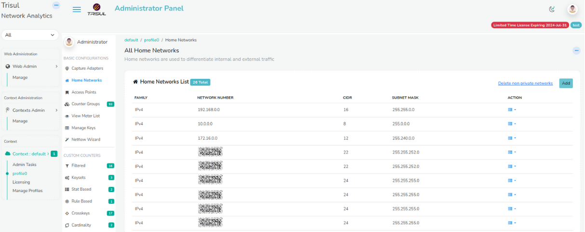
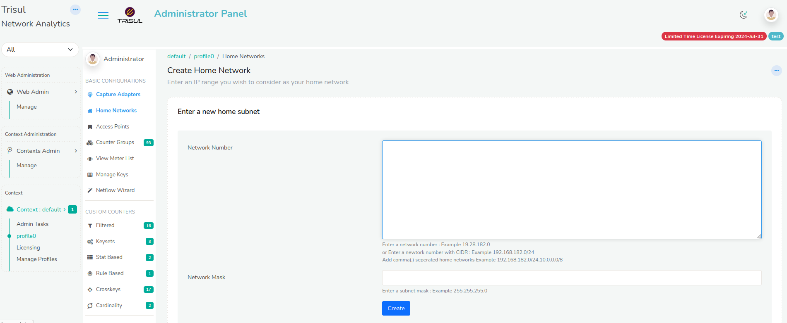
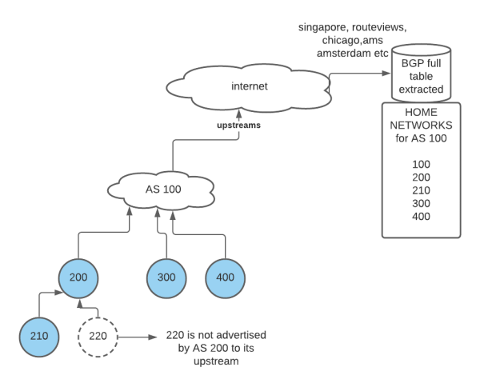
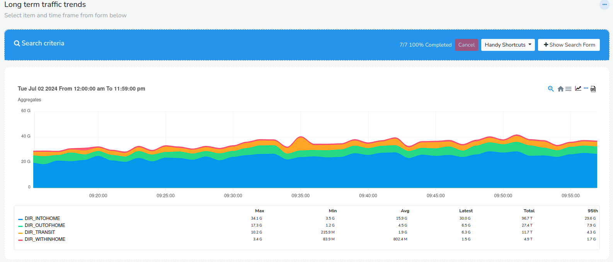
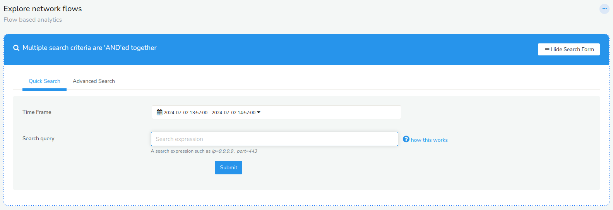

# Home Networks

Several features of Trisul depend on being able to tell which IPs belong
to your home network and which are to be treated as external. The rough
idea is that hosts in your home network are thought to be under your
administrative domain. For these features to work accurately you need to
tell Trisul which IPs constitute your “Home Network”

:::note **Default private IP ranges**  
Trisul by default considers the RFC1918 private IP ranges *10.0.0.0/8,
192.168.0.0/16, 172.16.0.0/12* to be home networks. For most users who
deployed NAT this should be sufficient. There is nothing more to do
here.

:::

## Terminology

Here is a quick description of terminology related to the concept of
home networks.

**Outgoing Traffic** 

Source IP is in your home network, but Dest IP is not

**Incoming Traffic**  

Source IP is not in your home network, but Dest IP is

**Internal Traffic**  

Both Source IP and Dest IP are in your home network

**Transit Traffic**  

Both Source IP and Dest IP are not in your home network.

> Note For ISPs, the AS numbers constituting the Home Network are all the AS whose routes are announced by the home AS. See [Home Networks for ISP](/docs/ug/webadmin/home_networks#home-networks-in-isp-solution) section

## Add a new home network

It pays to be accurate about your home network as it can impact several
reports and views. If you want to add a new subnet to your home network
or edit an existing entry, follow these steps.

:::note navigation

(login as admin) Select *Context : default \> profile0 -\> Home
Networks*

:::

You are shown the following screen

*Showing a list of configured Home Network subnets*

- Click on **Add a network**  

- Enter an IP and a subnetmask (eg, 59.92.0.0 and 255.255.0.0) that
  represents your home network  

- Click **Create** button to add a new home network

### Adding home networks in bulk

When you click on “Add” in the Home Networks screen you can see the Add
form below

*Fig: The add subnetworks screen*

Here you can

1. Add one by one : a single network number in "Network Number" and subnet mask in "Network Mask"
2. Add in bulk : Simply copy paste a series of **comma separated** or
   **one-per-line** networks in CIDR format in "Network Number". When using the CIDR format you can leave the "Network Mask" field blank.

### Deleting

1. Delete any single home network by pressing the “Delete” link next to
   it.
2. You can press the “Delete non private networks” to delete all the
   elements in bulk except the three built-in private ranges. Use this
   option if you want to late add the home networks in bulk later.

## Home networks in ISP solution

The following rule is used when deploying Trisul in ISP configuration.
First the Home AS Number is configured into the Netflow and Geo
configuration files. This represents the AS Number of the network where
Trisul is deployed.

The following definition:

> **Definition:** All the autonomous systems (AS) whose prefixes are
> advertised by the network being monitored by Trisul are considered
> Home Networks.

### Collecting Home Network information through external route receivers

Trisul Network Analytics automatically collects route information from
public and private BGP peering in places like Amsterdam, Singapore, and
Chicago. From these places Trisul uses our powerful BGP analytics tool
[jacktheribber](https://github.com/trisulnsm/jacktheribber) to compute a list of AS advertised as downstream a Trisul customer. This information is automatically fed into the processing.

  
*Figure: Computing home network AS using BGP*

Lets walk through the above example.

1. Our AS number is 100
2. AS 100 peers with downstream 200,300,400
3. AS 200 further peers with 210 and 220
4. However AS 200 does not advertise 220 route to AS100 , perhaps it
   advertises to some other peer.
5. Trisul observes global BGP tables from locations such as Singapore
   and Chicago. From the global AS Path information we calculate the
   Home AS networks as all those advertised by AS100 - which is to say
   AS100 is present in the AS PATH attribute.
6. We then compute the final Home Networks as {100,200,210,300,400}

This final set is used by Trisul in the [Netflow configuration file in the [HomeASNumbers](/docs/ref/netflow-config#HomeASNumbers) parameter using a periodic update mechanism.

Some points to be noted.

1. When Trisul collects Netflow based information from BGP router,
   it has Source-AS and Destination-AS information in it.
2. If Source and Destination AS are external that is reported as
   *Transit*. In the above example even though AS220 is downstream it
   is not advertised. Hence the traffic seen will be outgoing traffic
   from AS220 as per the policies of its peer AS200.

#### Default route and AS-0 handling

1. If default routes are used in BGP routes, it may result in AS-0 in
   Trisul. For traffic direction purposes the following formula is used
   when we see a AS-0 (default route) in the Netflow data.
   1. If source-AS is 0 and dest-AS is homenetwork, source-AS is
      assumed to be external. hence direction is marked as incoming.
   2. If source-AS is homenetwork and dest-AS is 0, direction is
      marked as outgoing.
   3. This may or may not suit your specific network routing. Keep
      that in mind while interpreting the “transit” and “internal”
      directions.

### Collecting Home Network information through BGP

In ISP setting, Trisul includes a built in BGP route receiver. This is
added as a I-BGP peer to the customer router or a BGP Route Reflector.
For more see “Configuring BGP”. This information is combined with
downstream peering information to obtain a list of Home AS.

## Viewing traffic direction

The Home Network is a crucial part of Trisul reports. Apart from the
“Internal Hosts”, “External Hosts” classification - you can see the
following data.

### Metrics in the Aggregates Counter Group.

:::note navigation

Select *Tools \> Long Term Traffic*

:::

1. Counter group = Aggregates
2. Meter = Total
3. Keys to the Item = DIR_INTOHOME,DIR_OUTOFHOME,DIR_TRANSIT,DIR_WITHINHOME

The following chart gives you the traffic details in each direction.

*Figure: Directional chart determined by the Home Network settings*

### Flows

Trisul has the ability to use Flow Taggers to tag each flow with a direction hint based on the endpoint Home Addresses.

1. Enable the [TagFlowsWithDirection](/docs/ref/netflow-config#TagFlowsWithDirection) setting in the Netflow configuration file
2. You can then go to Tools \> Explore Flows to search for flows with
   the appropriate tag.
3. For example to see all *Transit* flows , enter `tag=[dir]transit` in
   the tool's search query.

*Figure: search for directional flows using a custom flow tagger*

Also see user guide sections: [Flow Taggers](/docs/ug/flow/tagger), [Explore Flows](/docs/ug/tools/explore_flows)
