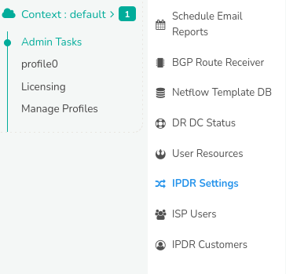
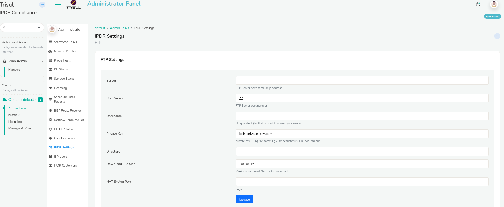

# IPDR Settings

Internet Protocol Data Records storage is a ISP compliance feature that
is supported by Trisul Network Analytics. With this feature ISP can use
Trisul to index and store at very high speeds every single flow in their
network.

This page describes the configuration settings for

1. FTP - credentials to automatically ship the queries to a remote
   server
2. NAT SysLog - Port where NAT syslog messages are sent

## Settings form

:::note navigation

Login as admin and select *Context:default \> Admin Tasks \> IPDR
Settings*

:::



Press Edit to access the form as shown below.



### Form fields

| Field              | Default | Description                                                                                                                                                                                                                       |
| ------------------ | ------- | --------------------------------------------------------------------------------------------------------------------------------------------------------------------------------------------------------------------------------- |
| Server             |         | The SFTP server IP address or host name                                                                                                                                                                                           |
| Port Number        | 22      | The SFTP server port if not running on the default port 22                                                                                                                                                                        |
| Username           |         | SFTP user name                                                                                                                                                                                                                    |
| Private Key        |         | SFTP user private key file path. Use the full file path including the directory name. We recommend you put the private key file in `/usr/local/etc/trisul-hub/ipdrpv.key` Ensure the file is readable by the user `trisul.trisul` |
| Directory          |         | The remote directory where the results file are uploaded                                                                                                                                                                          |
| Download File Size | 100M    | Results file less than this number will be available for download on the “Export flows” page itself                                                                                                                               |
| NAT Syslog Port    | 514     | Port number where NAT translation syslog as well as AAA logs will be sent                                                                                                                                                         |

Upon changing these parameters. Restart the trisul_ipdrd service.

```language-bash
systemctl restart trisul-ipdr
```

## Configuring FTP

### Create key pair on Trisul IPDR Hub node

On the Trisul-Hub server create a key pair like so into a file that is
used for Trisul IPDR only. Use a file name `id_trisul_ipdr`

You can do these steps in the `/usr/local/etc/trisul-hub` directory

```language-bash
cd /usr/local/etc/trisul-hub 
ssh-keygen -t rsa -b 4096
Enter file in which to save the key (/root/.ssh/id_rsa):  id_trisul_ipdr
# do not give passwords 
```

Now you will have the key pair saved in the current directory

```language-bash
id_trisul_ipdr.pub      # the public key  (to be send to the target FTP server)
id_trisul_ipd           # the private key (never to be shared, stored on Trisul-Hub)
```

### Save the public key on the target server

Now put the `id_trisul_ipdr.pub` on to the target server with the
`Username` in the IPDR FTP Settings.

```language-bash
# on the target server append to authorized_keys

cat id_trisul_ipdr.pub >> .ssh/authorized_keys 
```

#### Test it out

On the Trisul-Hub node check if the server works. You can use the ssh
command to test.

```language-bash
# ensure username@ip matches the FTP settings 

ssh -i /usr/local/etc/trisul-hub/id_trisul_ipdr  dotuser@10.179.210.1 

# if it logs in we are set 
```
