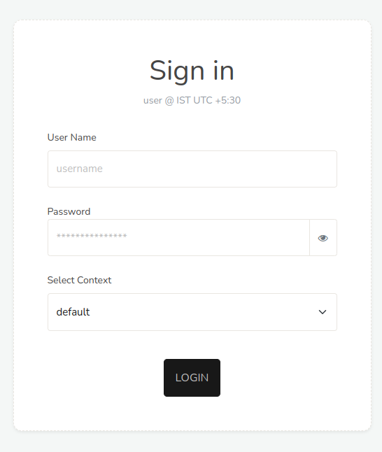

# Logging in

> You need to use a **SVG capable browser** like Firefox,
> Chrome, Opera, Safari to work with Trisul.  
> For best results use **Firefox or Chrome**

Trisul can be accessed by pointing your browser to :  

- via HTTP on port *3000*. [Instructions to change this to another port](/docs/howto/index.html) 

- via HTTPS

## First login

If this is the first time you are logging in , use the built-in `admin`
user or `user` user.

#### To configure

username = `admin`  
password = `admin`

#### To view stats

user name = `user`  
password = `user`

Once logged in please change the password.

## Contexts

[Contexts](/docs/ug/domain/index.html#contexts) are multiple analysis domains in Trisul. At login time you must select the context you wish to analyze. Hover your mouse over each context name to get a description of what the context contains.

If you only have one context, which is the most common case, the choice
is not shown.

## Logout

You can logout by clicking the **logout** at the top left.

## Inactivity security timeout

Due to the sensitive nature of the data presented by Trisul, there is an
inactivity timeout associated with each user. If no user interaction is
seen by Webtrisul server for a certain period of time, the user is
automatically logged out. They will then have to present their
login/password again to re-enter the system.

You can increase inactivity timeout

:::note navigation

To access, Login as **Admin**. Select Manage -\> App settings -\> Web
Server -\> Idle Timeout

:::

If you want to disable it - set it to some **huge value** (1000000
seconds)

## Login rules

- If you login from a second location, Trisul will kick the first
  session out. (like yahoo/gmail/etc)  

- The superadmin (ie the user with username `admin` ) can login from
  any number of places.  

- All other users can have only one active session. For example : if a
  user logs in from home and forgets to logout and comes to work. When he logs in from his work machine, his home session is automatically logged out. 

- The admin user can ***Force Logout*** any user with a **stuck**
  session. 

- *Remember me** functionality is not available 

- The same inactivity timeout applies to all users including admin

- All login activity including inactivity timeout is logged (See *Admin
  -\> Tasks -\> User Auth Log*)

> You can allow specific users to also login from multiple locations at
