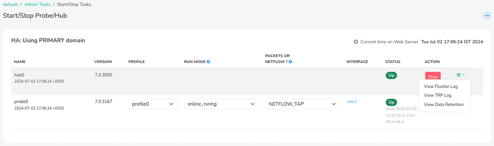

# View logs

For troubleshooting you can view various logs from the web interface
itself.

## Viewing web server logs

:::note navigation

Login as admin and select *Web Admin \> Manage \> Web Server Logs*

:::

Then you can select to view any of the following types of logs

***Web server log***
Logs for the Trisul web server.

***Background tasks log***

Logs on scheduled tasks like report mailers, blacklist downloaders etc.
Use this to check status of automatic downloads of threat intel, geo,
and various other lists.

***Web sockets log***

Errors related to the real time stabbers

***Auth Log***

View user login including failed attempts

***Email Logs***
View email log sent by trisul

***SNMP Dump Logs***

Download SNMP command and dumps for debugging purposes

## Viewing probe and hub logs

Hub and Probe logs represent the actual Trisul processes running
processing network traffic. They are linked to a particular context. To
view Hub and Probe logs

:::note navigation

Login as admin and select *Context: default \> Admin Tasks \> Start/Stop
Tasks*

:::

This shows the list of hubs and probes. To view Hub and Probe logs click
on the *More Options* link and select the view options link as shown
below.

## Log directory

If you want the raw webserver log it can be found on the Trisul Hub
server at `/usr/local/var/log/trisul-hub/webtrisul`  
The files are named production.log or productionssl.log (if you are
running webtrisul on HTTPS)

Also see `trisbashrc:“/docs/ref/trisbashrc.html` which contains helper
aliases to locate various log files on the probe and hub server systems.
