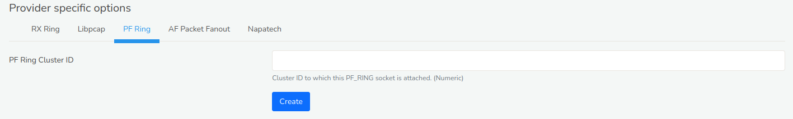
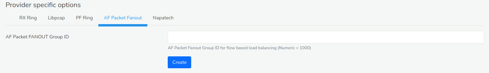
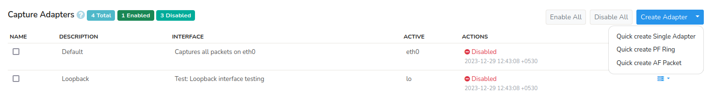

# Packet capture settings

A single instance of Trisul can listen on one or more network
interfaces. This page describes how you can add or edit packet capture
parameters for any profile.

## View list of capture profiles

:::note navigation

Login as admin and Select *Context : default \> profile0 -\> Capture
Adapters*

:::

By default, only **eth0** is enabled. There are some other disabled
entries for debugging purposes. If you want to listen on, say eth1 you
can create a new profile and enable that one.

## Create a new capture profile

Say you want to create a new network adapter for profile0 in context0.

:::note navigation

Select *Context : default \> profile0 -\> Capture Adapters*  
Click **Create Adapter**

:::

A form with the following fields are displayed

| Field              | Description                                                                                                                                                           |
| ------------------ | --------------------------------------------------------------------------------------------------------------------------------------------------------------------- |
| Name               | A unique name for this profile                                                                                                                                        |
| Network Interface  | The linux network interface name - such as *eth0*, *eth1*, *wlan0*                                                                                                    |
| BPF Filter         | A BPF (libpcap/tcpdump) filter expression (see [notes below](#specifying_a_bpf_filter_for_afpacket_and_rxring) on how to generate this for rxring mode - the default) |
| ERSPAN Interface   | Decapsulate all ERSPAN packets on this interface. If this option is disabled, ERSPAN is counted as a single IP+GRE tunnel.                                            |
| Add Ethernet FCS   | Add 4 byte FCS to packet length. Use to option to reconcile with SNMP based counters.                                                                                 |
| Force Netflow Mode | Force this adapter into Netflow Mode - use this option if you want to use a mix of Netflow and Packet capture on a per-adapter basis.                                 |
| Description        | A short description of the profile                                                                                                                                    |

### Provider specific options

Trisul can capture packets in two “five modes”, *Linux RX Ring* ,
*Libpcap* , *PF Ring* ,*AF Packet*,*Napatech* . You dont control the run
mode here, but at the command line or by changing the application
settings. The capture profiles work for all run modes, with one
exception.

#### RX Ring

***Number of blocks (2^N)*** 
Number of slots in the ring. Increase only if you need to

#### Libpcap

***Promiscuous Mode***  
Usually set to true

***Snap length***  
How many bytes of each packet to capture

#### PF Ring

***PF Ring Cluster ID***  
Cluster ID to which this PF_RING socket is attached. (Numeric)

#### AF Packet

***AF Packet FANOUT Group ID***  
AF Packet Fanout Group ID for flow based load balancing (Numeric \<
1000)

#### Napatech

***Stream ID***  
Numeric number

***Hashing mode***  
how packets are distributed across streams

***Stream config***  
Full NTPL command.

## Specifying a BPF Filter for AFPACKET and RXRING

:::note navigation

Select the active Interface and Click Create Adapter

:::

In the "BPF Filter" enter the expression such as `host 192.168.2.11 or host 10.29.1.1` or bytecode output of `tcpdump -ddd`

## Express adapter creation wizard

Click on “Create Adapter” on the top right to quickly create capture
profiles for flow based load balancing.

### Quick create Single Adapter

Select *Quick create single Adapter* to create a single adapter using an
interface name

| Field Name   | Description                              |
| ------------ | ---------------------------------------- |
| Adapter name | Enter the network adapter name (eg eth0) |

### Quick create PF Ring

Select *Quick create RF Ring* to create a PF Ring capture profile with
multiple streams for flow based load balancing

| Field Name        | Description                                                   |
| ----------------- | ------------------------------------------------------------- |
| Adapter name      | Enter the network adapter name (eg eth0)                      |
| Number of streams | Number of flow balanced streams (eg 2, 4, etc)                |
| Cluster ID        | PF Ring Cluster ID you wish to assign to the streams (eg 999) |

### Quick create AF Packet

Select *Quick create AF Packet* to create AF Packet FANOUT based streams
for flow based load balancing.

| Field Name        | Description                                                             |
| ----------------- | ----------------------------------------------------------------------- |
| Adapter name      | Enter the network adapter name (eg eth0)                                |
| Number of streams | Number of AF FANOUT streams for flow based load balancing (eg, 2,4,etc) |
| Fanout Group ID   | AF Packet Fanout Group ID for flow based load balancing (Example 999)   |

## Enable or Disable the profile

- Click **Enable** or **Disable** in the Profile list

- To disable all adapters, click on the “Disable All” button

## Edit the profile

- Click **Edit** in the Profile list  

- Edit the fields as shown in “Add..”

## Delete the profile

- Click **Delete** in the profile list.
