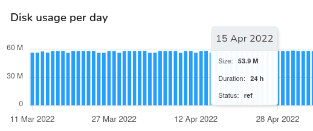
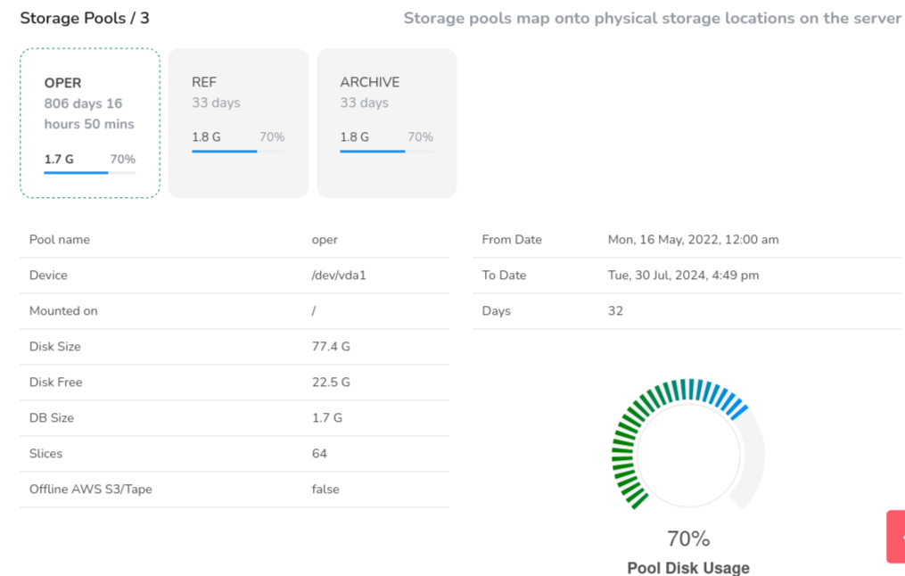
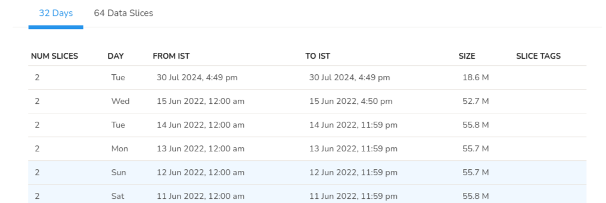

# Storage Status

Storage status is a dashboard for your Trisul storage, providing insights to help you optimize and maintain your storage infrastructure. You can check Trisul's health and availability of the storage subsystem, which includes disk space, storage devices, and file systems. It indicates whether the storage is:

- Online/Available

- Offline/Unavailable

- Low disk space

You can View database storage in depth, tag slices with labels and tags. To view the storage status,

:::info Navigation

Login as Admin &rarr; Context:default &rarr; Admin Tasks &rarr; Storage Status

:::

The Storage status consists of the following information and their status details.

| Information   | Description                                                         |
| ------------- | ------------------------------------------------------------------- |
| Days          | Represents the number of days since the data started getting stored |
| From Date     | Data available from this date                                       |
| To Date       | Data available until this date                                      |
| DB Size       | Total amount of disk space used by Trisul database files            |
| Per Day       | The amount of disk space used by Trisul on daily basis              |
| Storage Pools | The number of storage pools added in Trisul                         |

### Disk Usage Per Day

Disk Usage Per day is a graphical representation of the disk usage per day in bar chart. You can hover over any bar to view the storage data including dat, size, duration and status.

| Storage Data | Description                                                   |
| ------------ | ------------------------------------------------------------- |
| Date         | The date of the storage data you have hovered on              |
| Size         | The size of storage space in that particular date             |
| Duration     | The duration for which the data has been stored for that date |
| Status       | The storage pool where the data is stored on that day         |

## Storage Pools

In [Storage Pools ](/docs/ug/caps/fullcontent#sliding-slices) you can view each of the storage pool's status information including the number of days since the data has started getting stored in the storage pool, the disk space used by the storage pool, and pool disk usage percentage. The Gauge meter on the lower right represents the disk usage percentage.

| Information         | Description                                                                                                                 |
| ------------------- | --------------------------------------------------------------------------------------------------------------------------- |
| Pool Name           | Pool name like oper/ref/archive                                                                                             |
| Device              | Name of your storage disk where the data gets stored                                                                        |
| Mounted on          | The location name where the disk is mounted                                                                                 |
| Disk Size           | The capacity of the storage device                                                                                          |
| Disk Free           | Amount of available(free) storage space on the device                                                                       |
| DB Size             | Total size of the Trisul Database files                                                                                     |
| Slices              | The number of slices Trisul Database is divided into                                                                        |
| Offline AWS S3/Tape | Indicates whether Trisul is configured to use Amazon Web Services (AWS) S3 or Tape storage for archiving or backup purposes |
| From Date           | The time range from which the data started getting stored                                                                   |
| To Date             | The time range until which the data is store                                                                                |
| Days                | The total number of days the data has been stored in Trisul.                                                                |

Number of days: The actual number of days the data would get stored    

The number of data slices: The number of data slices the Trisul stores in.

