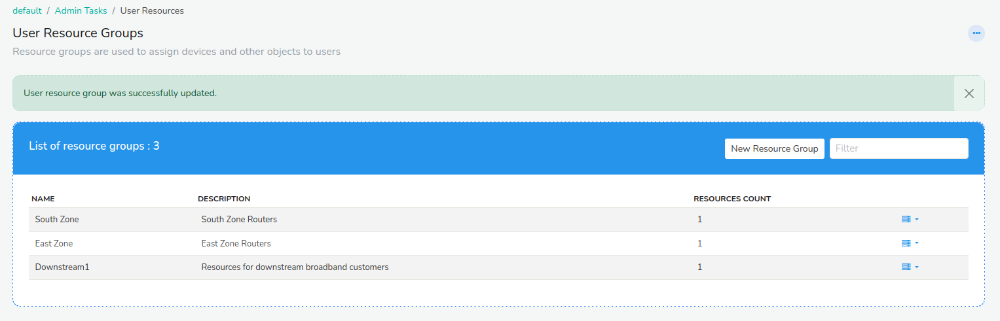
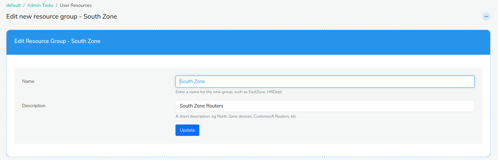
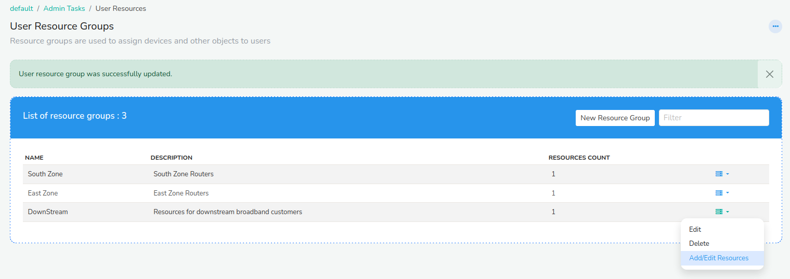
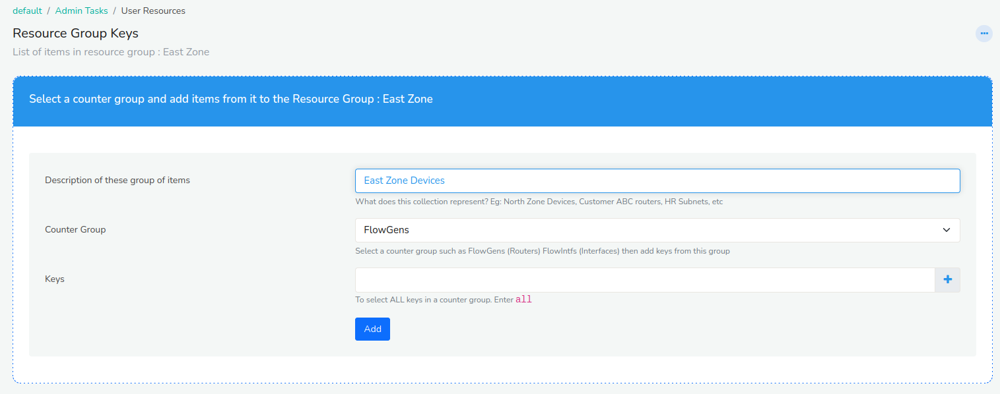
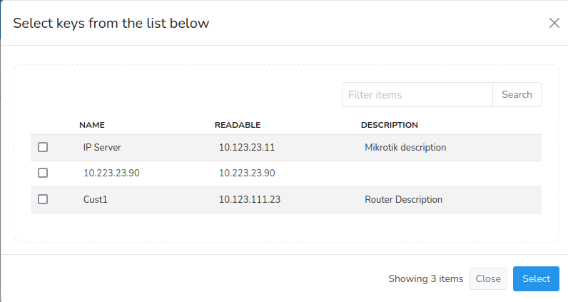
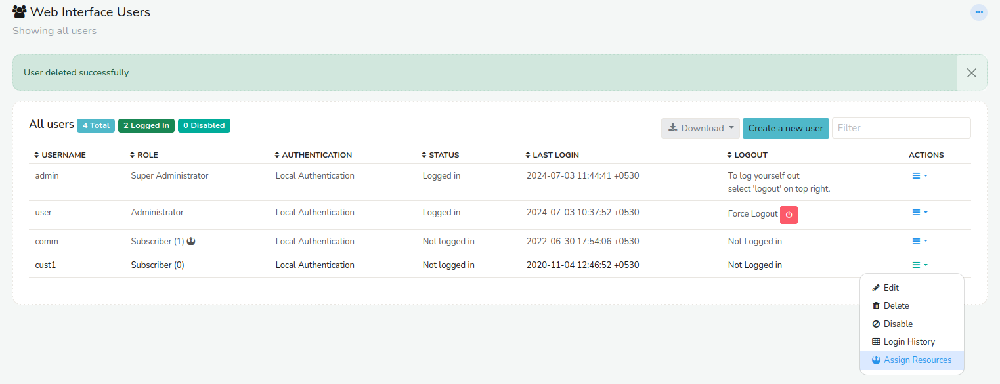

# User Resources

User resources allow you to assign network devices, interfaces, IP
addresses, IP subnets or any other network entity to named groups. These
groups can then be assigned to users. Users will then only be allowed to
see those resource entities.

### Use Case - User Device Permissions

A Trisul netflow customer desires to create *cust1* who can only view
*routers A,B,C* metrics and another user *cust2* who can only see
*routers X,Y*

1. Create a resource group called *custgroup1* and select routers A,B,C
2. Create a resource group called *custgroup2* and select routers X,Y
3. Edit user *cust1* and assign *custgroup1* to it
4. Edit user *cust2* and assign *custgroup2* to it

Now when *cust1* logs in he/she can only see the two routers assigned to
him/her.

## Creating a Resource Group

The first step is to create a group and select and put resources into
the group.

#### Terminology for Netflow

Before creating a group some terminology to help you select the correct
counter group

I want to assign routers to users  
Select the *FlowGens* counter group. FlowGen = Netflow generator
represents a router or a netflow capable device

I want to assign specific router interfaces to users  
Select the *FlowIntfs* counter groups. FlowIntfs = Flow Interfaces
represents a netflow capable interface flow interfaces 

:::note navigation

Login as admin and select *Context: default \> Admin Tasks \> User
Resources*

:::

*Figure: Showing all user resource groups with button on top right to create a
new resource group*

    You are shown a list of already configured resource groups.

Select “New Resource Group” from the top right.

### Create a Resource Group

This step is very simple. Just create an empty resource group with a
name and description. The name can be short such as “East Zone Devices”
and a longer description.

*Figure: Create an empty Resource Group with a name, you will add keys later*

Next you have to add resources to this group.

### Add Resources to the Group

Select the *Add/Edit Resources* button against the newly created
resource group.

*Figure: Click to add or edit resources to the new group*

Give a name for this particular collection of items ; such as *East Zone
Routers*

Select a counter group from which you will select items. See the
Terminology section above. If you want to select Routers then select
*FlowGens* as the counter group.

*Figure: Select a counter group. Here we select FlowGens to create a group of
routers*

Next you have to select *Keys* these are items from the group that have
already been discovered and monitored. For example : If you have
selected FlowGens (Routers) you will be selecting the routers to add to
this group.

*Figure: Select routers to add to this group*

After you select the keys the resource group has been created. You can
then follow the similar process to add or edit keys at a later time. You
can add any number of keys to a counter group and you can add different
counter groups in this manner. A common error is to select a counter
group twice and trying add keys to both. That will result in an error.
The correct way is to create two level counter groups say “East” and
“West” and add keys “Routers” to each of them.

> You can only add a counter group once to a single group. If you want to create two groups of routers say *East* and *West* routers then create a new Resource Group as many times as you want

## Assigning Resource Groups to Users

This section describes how you can assign a resource group to a user.
That restricts that users view to only items in that group.

:::note navigation

Login as admin and select *WebAdmin: Manage \> Users*

:::

Then against the user select the *Options \> Assign Resources*

*Figure: Assign resource groups to a user*

Then select the resource groups to assign to this user.

## Troubleshooting

#### Cannot see user groups when I select “Assign Resources”

Ensure that the user is allowed to access the Trisul context. Go to Edit
User and ensure that there is atleast one context selected in “Allowed
Contexts”

#### When Assigning Keys to Resource Group I am Getting: A List of Keys Already Exists for This Counter Group

You are trying to re-use a counter group for which keys are already
assigned. In this screen you can assign keys for different groups - eg
Routers, Hosts, Interfaces etc. If you want to select the same counter
group, then create a new top level resource group.
