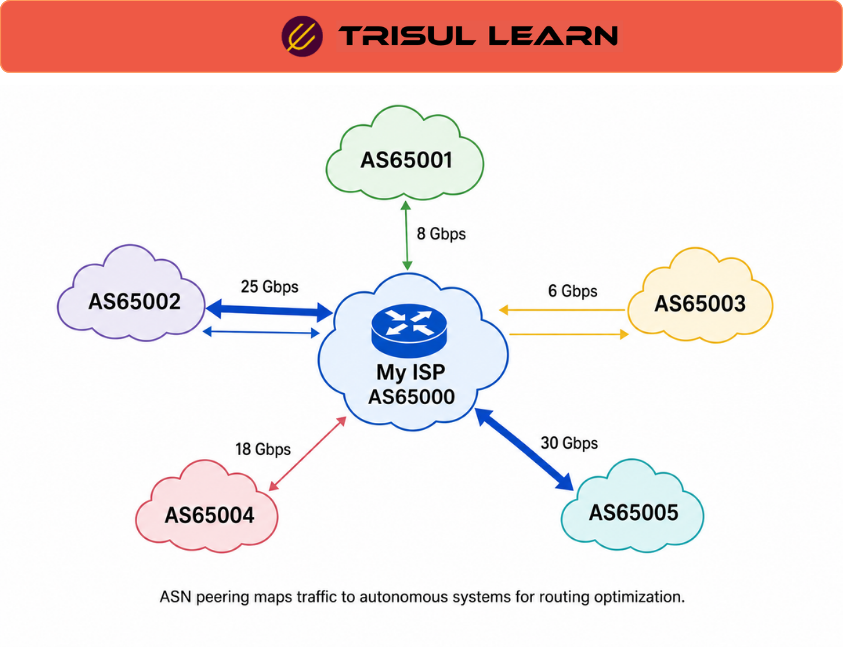

export const jsonLd = {
  "@context": "https://schema.org",
  "@type": "FAQPage",
  "mainEntity": [
    {
      "@type": "Question",
      "name": "What are the requirements for ASN peering?",
      "acceptedAnswer": {
        "@type": "Answer",
        "text": "Peering requirements include: a publicly routable ASN, dual-stack IPv4 and IPv6 support, at least one publicly routable /24 prefix, registration in a public Internet Routing Registry (IRR), a complete current peeringdbl.com profile, and 24x7x365 operational contact with escalation matrix. Interconnection must have sufficient capacity to exchange traffic without congestion."
      }
    },
    {
      "@type": "Question",
      "name": "What is the difference between settlement-free and paid peering?",
      "acceptedAnswer": {
        "@type": "Answer",
        "text": "Settlement-free peering exchanges traffic between ASes without payment, typically when traffic ratios are roughly balanced. Paid peering involves one party paying the other, typically when traffic is asymmetric. Peering is generally settlement-free when both parties benefit from direct traffic exchange."
      }
    },
    {
      "@type": "Question",
      "name": "What is public vs private peering?",
      "acceptedAnswer": {
        "@type": "Answer",
        "text": "Public peering occurs at Internet Exchange Points (IXPs) where multiple networks connect to a shared switch and exchange routes via route servers. Private peering is a direct connection between two networks, typically at a colocation facility. Private peering offers more control but requires dedicated infrastructure."
      }
    },
    {
      "@type": "Question",
      "name": "How does ASN peering improve performance?",
      "acceptedAnswer": {
        "@type": "Answer",
        "text": "ASN peering improves performance by reducing the number of hops traffic must traverse, eliminating intermediary transit providers. Direct BGP peering reduces latency, improves throughput, and avoids congestion on transit links. Traffic stays on the direct path between the two ASes."
      }
    }
  ]
};

# What is ASN peering?

ASN peering is the practice of establishing BGP peering relationships between two Autonomous Systems (ASes) to exchange routing information and traffic directly. It reduces transit costs, lowers latency, and improves performance by avoiding intermediary transit providers. ASNs must be publicly routable and registered in a public Internet Routing Registry (IRR).

---

## How it works
Peering requires a publicly routable ASN, dual‑stack IPv4 and IPv6 support, and at least one publicly routable /24 prefix. The two ASes set up an external BGP (eBGP) session, then exchange routes by announcing their own prefixes to the peer. Traffic flows directly between the two networks based on the advertised routes, rather than traversing additional transit hops.

---

## In network operations
- **NOC:** Monitor BGP peering session status, route count, and prefix reachability to detect peering failures or route flaps.  
- **ISP:** Use settlement‑free peering to reduce transit costs when traffic ratios are roughly balanced between ASes.  
- **Traffic Engineering:** Optimize exit selection and routing policies by analyzing traffic flows to specific peer ASes and prefixes.

---

## Peering types
| Type                 | Description | Best for |
|----------------------|-----------|----------|
| Settlement‑free peering | No payment; traffic is roughly symmetric between ASes | Equal‑sized networks with balanced traffic |
| Paid peering         | One party pays the other to handle traffic; traffic is usually asymmetric | Networks with very different traffic volumes |
| Public peering       | Occurs at an Internet Exchange (IX) via a shared switch and route servers | Connecting to many peers efficiently |
| Private peering      | Direct physical link between two networks, often in a colocation facility | Two specific peers wanting maximum control and performance |

---

## In Trisul
Trisul provides ASN peering analytics by enriching flow records with source and destination ASN information derived from BGP data.  
Peering‑oriented dashboards can show traffic per peer AS, per prefix, and per peering interface, while BGP peering‑monitoring features support real‑time visibility into active route topology and peering behavior. This helps operators understand how traffic moves across directly‑peered paths and how peering choices affect performance and costs.

---

## Related terms
- [ASN peering](/glossary/asn-peering)
- BGP
- ASN
- [BGP peering analytics](/glossary/bgp-peering-analytics)
- [Internet exchange](/glossary/internet-exchange)
- Transit provider
- Peering policy

---

## Frequently asked questions
### What are the requirements for ASN peering?

Peering requirements include: a publicly routable ASN, dual‑stack IPv4 and IPv6 support, at least one publicly routable /24 prefix, registration in a public Internet Routing Registry (IRR), a complete and up‑to‑date peeringdb.com profile, and 24x7x365 operational contact with an escalation matrix. The interconnection must also have sufficient capacity to exchange traffic without congestion.

### What is the difference between settlement-free and paid peering?

Settlement‑free peering exchanges traffic between ASes without payment, typically when traffic ratios are roughly balanced. Paid peering involves one party paying the other, typically when traffic is asymmetric. Peering is generally settlement‑free when both parties benefit from direct traffic exchange.

### What is public vs private peering?

Public peering occurs at Internet Exchange Points (IXPs) where multiple networks connect to a shared switch and exchange routes via route servers. Private peering is a direct connection between two networks, typically at a colocation facility. Private peering offers more control but requires dedicated infrastructure.

### How does ASN peering improve performance?

ASN peering improves performance by reducing the number of hops traffic must traverse, eliminating intermediary transit providers. Direct BGP peering reduces latency, improves throughput, and avoids congestion on transit links. Traffic stays on the direct path between the two ASes.