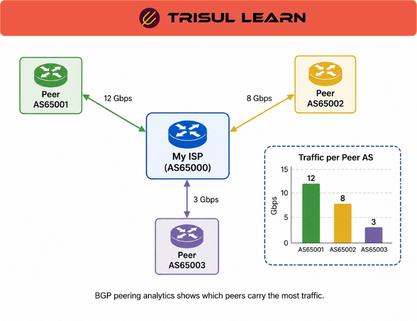

export const jsonLd = {
  "@context": "https://schema.org",
  "@type": "FAQPage",
  "mainEntity": [
    {
      "@type": "Question",
      "name": "What does BGP peering analytics measure?",
      "acceptedAnswer": {
        "@type": "Answer",
        "text": "BGP peering analytics measures traffic volume flows per Autonomous System number, cleanly split into upstream, downstream, peer, and origin AS. It also tracks traffic per prefix, per gateway device, and per peering interface. Popular content providers like Google, Amazon, and Facebook are tracked separately."
      }
    },
    {
      "@type": "Question",
      "name": "How does BGP peering analytics help ISPs?",
      "acceptedAnswer": {
        "@type": "Answer",
        "text": "BGP peering analytics helps ISPs negotiate with content providers and upstream peers, optimize costs, and select new peering policies. It provides visibility into which ASes and prefixes are driving traffic, which peering links are congested, and where traffic engineering changes would improve performance."
      }
    },
    {
      "@type": "Question",
      "name": "What data sources does BGP peering analytics use?",
      "acceptedAnswer": {
        "@type": "Answer",
        "text": "BGP peering analytics combines flow data from NetFlow, J-Flow, sFlow, and IPFIX with BGP routing information from route collectors or internal BGP viewpoints. The BGP data is automatically in sync with traffic tables, enabling drilldown from AS to prefix to peering interface."
      }
    },
    {
      "@type": "Question",
      "name": "What visualizations are available in BGP peering analytics?",
      "acceptedAnswer": {
        "@type": "Answer",
        "text": "Visualizations include nested tables showing hierarchical traffic by AS, prefix, and gateway, as well as Sankey views showing traffic flows between ASes. Full M:N degree drilldowns let operators pivot from any angle to any other angle without writing queries."
      }
    }
  ]
};

# What is BGP peering analytics?

BGP peering analytics monitors traffic flows across BGP peerings by combining flow data with BGP routing information. It analyzes traffic per autonomous system, prefix, and peering interface in real time. ISPs use this capability to negotiate with peers, optimize costs, and select new peering policies based on clear traffic‑by‑AS visibility.

---

## How it works
BGP peering analytics combines flow data from NetFlow, J‑Flow, sFlow, and IPFIX with BGP routing information from route collectors or internal BGP viewpoints. The BGP data is kept in sync with traffic tables so that every flow can be mapped to an AS number, prefix, gateway, next hop, and peering interface. This mapping supports both real‑time and historical trending at the AS, prefix, and interface level.

---

## In network operations
- **NOC:** Monitor which peering links are congested and which ASes are driving the highest traffic volumes.  
- **ISP:** Use AS and prefix traffic analysis to negotiate settlement‑free peering, paid peering, and new routing‑policy decisions.  
- **Traffic Engineering:** Optimize exit selection and routing policies by analyzing geo‑based traffic flows and active route topology.

---

## AS traffic mapping
| Category        | Description |
|-----------------|-------------|
| Upstream AS     | Traffic sent to upstream providers via transit links |
| Downstream AS   | Traffic received from downstream customers |
| Peer AS         | Traffic exchanged with settlement‑free peers |
| Origin AS       | Traffic to and from the network’s own AS |

---

## In Trisul
Trisul provides ISP‑oriented BGP peering analytics with real‑time monitoring of active route topology, nested tables, and Sankey‑style visualizations of traffic flow between ASes.  
An inbuilt BGP route receiver keeps routing information automatically in sync with traffic tables, enabling drilldown from AS to prefix to peering interface. A set of dashboards show AS peerings, prefix analysis, route analytics, and content‑to‑subscriber traffic maps, all without requiring external database queries.

---

## Related terms
- [BGP peering analytics](/glossary/bgp-peering-analytics)
- BGP
- ASN
- Flow monitoring
- [Peering](/glossary/peering)
- Transit provider
- Route analytics

---

## Frequently asked questions
### What does BGP peering analytics measure?

BGP peering analytics measures traffic volume flows per Autonomous System number, cleanly split into upstream, downstream, peer, and origin AS. It also tracks traffic per prefix, per gateway device, and per peering interface. Popular content providers like Google, Amazon, and Facebook are tracked separately.

### How does BGP peering analytics help ISPs?

BGP peering analytics helps ISPs negotiate with content providers and upstream peers, optimize costs, and select new peering policies. It provides visibility into which ASes and prefixes are driving traffic, which peering links are congested, and where traffic‑engineering changes would improve performance.

### What data sources does BGP peering analytics use?

BGP peering analytics combines flow data from NetFlow, J‑Flow, sFlow, and IPFIX with BGP routing information from route collectors or internal BGP viewpoints. The BGP data is automatically in sync with traffic tables, enabling drilldown from AS to prefix to peering interface.

### What visualizations are available in BGP peering analytics?

Visualizations include nested tables showing hierarchical traffic by AS, prefix, and gateway, as well as Sankey views showing traffic flows between ASes. Full M:N degree drilldowns let operators pivot from any angle to any other angle without writing queries.