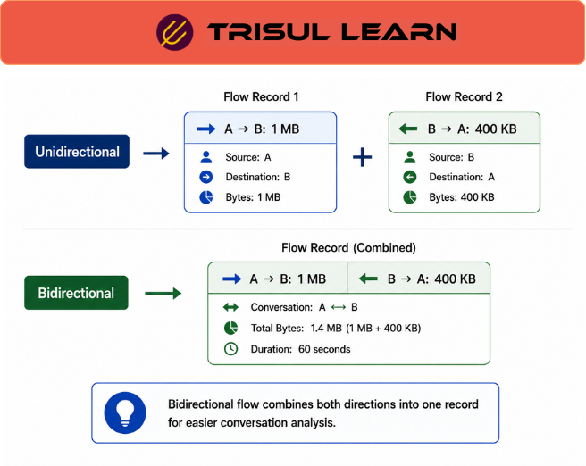

export const jsonLd = {
  "@context": "https://schema.org",
  "@type": "FAQPage",
  "mainEntity": [
    {
      "@type": "Question",
      "name": "How is a bidirectional flow created?",
      "acceptedAnswer": {
        "@type": "Answer",
        "text": "A bidirectional flow is created by matching two unidirectional flow records with reversed 5-tuples. The source and destination IP addresses and ports are swapped between the two records. When the flow collector detects this reversal, it stitches them into one bidirectional record with combined directional metrics."
      }
    },
    {
      "@type": "Question",
      "name": "What fields does a bidirectional flow contain?",
      "acceptedAnswer": {
        "@type": "Answer",
        "text": "A bidirectional flow contains source and destination IP and port, total bytes and packets, bytes in and bytes out, packets in and packets out, start time, last time, and duration. It also includes protocol information and application identification if available."
      }
    },
    {
      "@type": "Question",
      "name": "Why use bidirectional flows instead of unidirectional flows?",
      "acceptedAnswer": {
        "@type": "Answer",
        "text": "Bidirectional flows make network conversations readable at a glance. Instead of mentally pairing two records, analysts see the full exchange in one row. They are more storage-efficient because two exported records become one stored record. They also make data transfer ratio analysis easier for detecting exfiltration."
      }
    },
    {
      "@type": "Question",
      "name": "How does bidirectional flow relate to conversation view?",
      "acceptedAnswer": {
        "@type": "Answer",
        "text": "Conversation view is the display mode that shows bidirectional flows. Bidirectional flow is the underlying data structure. When an operator clicks on a conversation in the interface, they are viewing a stitched bidirectional flow record."
      }
    }
  ]
};

# What is bidirectional flow?

A bidirectional flow is a network conversation that combines two unidirectional flow records into a single record showing both directions of communication between two endpoints. NetFlow‑style exporters emit one record per direction by default; bidirectional flows are created by “stitching” matching records whose 5‑tuples are reversed (source and destination swapped).

---

## How it works
When two unidirectional flow records with reversed IP addresses and ports arrive at the collector, they are matched and stitched into one bidirectional flow. The stitched record shows bytes in, bytes out, packets in, packets out, start time, last time, and duration. Overlapping or duplicate legs are deduplicated before stitching to avoid overcounting.

---

## In network operations
- **NOC:** Read total bandwidth and directionality for each exchange at a glance, without manually pairing two records.  
- **SOC:** Analyze data‑transfer ratios between internal and external hosts to detect exfiltration patterns or unusual conversations.  
- **Investigation:** Pivot from a suspicious IP to all its bidirectional conversations, where both directions of each exchange appear in a single row.

---

## Bidirectional flow vs unidirectional flow
| Dimension                 | Bidirectional flow                       | Unidirectional flow                                  |
|---------------------------|------------------------------------------|------------------------------------------------------|
| Records per exchange      | One per conversation                     | Two (one per direction)                              |
| Readability               | High; full conversation in one row       | Lower; requires manual pairing of records            |
| Storage efficiency        | Higher; two exports → one stored record  | Lower; each direction stored separately              |
| Best fit                  | Conversation‑level and host‑level analysis | Topology, interface‑level, and device‑level views   |

---

## In Trisul
Trisul performs NetFlow‑style conversation analysis by deduplicating overlapping flow records and merging unidirectional flows into bidirectional conversations.  
Explore Flows displays results in **conversation view** by default, with **legs view** available for deeper path‑level investigation. This lets operators see stitched bidirectional flows for easier conversation‑level analysis while still retaining access to individual direction‑level detail when needed.

---

## Related terms
- [Bidirectional flow](/glossary/bidirectional-flow)
- Flow stitching
- [Conversation view](/glossary/conversation-view)
- [Flow legs](/glossary/flow-legs)
- [Flow deduplication](/glossary/flow-deduplication)
- NetFlow biflow
- Flow monitoring

---

## Frequently asked questions
### How is a bidirectional flow created?

A bidirectional flow is created by matching two unidirectional flow records with reversed 5‑tuples. The source and destination IP addresses and ports are swapped between the two records. When the flow collector detects this reversal, it stitches them into one bidirectional record with combined directional metrics.

### What fields does a bidirectional flow contain?

A bidirectional flow contains source and destination IP and port, total bytes and packets, bytes in and bytes out, packets in and packets out, start time, last time, and duration. It also includes protocol information and application identification if available.

### Why use bidirectional flows instead of unidirectional flows?

Bidirectional flows make network conversations readable at a glance. Instead of mentally pairing two records, analysts see the full exchange in one row. They are more storage‑efficient because two exported records become one stored record. They also make data‑transfer‑ratio analysis easier for detecting exfiltration.

### How does bidirectional flow relate to conversation view?

Conversation view is the display mode that shows bidirectional flows. Bidirectional flow is the underlying data structure. When an operator clicks on a conversation in the interface, they are viewing a stitched bidirectional flow record.