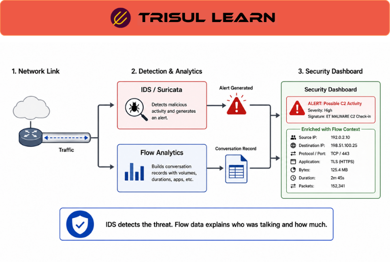

export const jsonLd = {
  "@context": "https://schema.org",
  "@type": "FAQPage",
  "mainEntity": [
    {
      "@type": "Question",
      "name": "What is IDS integration?",
      "acceptedAnswer": {
        "@type": "Answer",
        "text": "IDS integration connects Intrusion Detection Systems with network telemetry, traffic analysis, and security-monitoring platforms to correlate security alerts with network activity for investigation, threat detection, and operational visibility."
      }
    },
    {
      "@type": "Question",
      "name": "How does IDS integration work with network monitoring?",
      "acceptedAnswer": {
        "@type": "Answer",
        "text": "IDS integration correlates intrusion-detection alerts with flow telemetry, packet analysis, DNS activity, and other operational telemetry. This helps analysts investigate suspicious communication patterns, validate alerts, and understand affected systems and traffic behavior."
      }
    },
    {
      "@type": "Question",
      "name": "What are the benefits of IDS integration?",
      "acceptedAnswer": {
        "@type": "Answer",
        "text": "IDS integration improves security visibility by correlating alerts with network behavior, reducing investigation time, supporting traffic-based validation, improving contextual analysis, and helping analysts investigate suspicious communication patterns and potential compromise activity."
      }
    },
    {
      "@type": "Question",
      "name": "What types of IDS support integration?",
      "acceptedAnswer": {
        "@type": "Answer",
        "text": "Both network-based IDS (NIDS) and host-based IDS (HIDS) may integrate with network-monitoring and analytics platforms. Integration commonly involves SIEM systems, flow telemetry, packet analysis, endpoint telemetry, and security investigation workflows."
      }
    },
    {
      "@type": "Question",
      "name": "How does Trisul support IDS integration workflows?",
      "acceptedAnswer": {
        "@type": "Answer",
        "text": "Trisul supports IDS integration workflows through flow telemetry analysis, packet visibility, historical traffic analysis, Explore Flows investigations, and traffic-correlation capabilities that help analysts investigate alerts and suspicious communication behavior."
      }
    }
  ]
};

# What is IDS integration?

IDS integration connects Intrusion Detection Systems with network telemetry, traffic analysis, and security-monitoring platforms to correlate security alerts with network activity for investigation, threat detection, and operational visibility.

Rather than treating IDS alerts as isolated events, integrated monitoring environments allow analysts to correlate alerts with flow telemetry, packet activity, DNS behavior, firewall events, and historical traffic records. This improves investigation quality by providing operational context around suspicious activity, affected systems, communication behavior, and related network events.

For example, an IDS alert indicating possible malware communication may be correlated with NetFlow records, DNS lookups, and packet captures to identify affected hosts, external destinations, communication timelines, and previously unseen traffic behavior.

IDS integration is commonly used for threat investigations, incident response, traffic analysis, threat hunting, and security-monitoring workflows where analysts require visibility beyond the original IDS alert.

---

## How IDS integration works
IDS integration correlates intrusion-detection alerts with network telemetry and operational context.

A typical workflow includes:

1. **Traffic observation** – The IDS monitors network traffic or endpoint behavior for suspicious patterns, signatures, or anomalies.
2. **Alert generation** – Suspicious activity triggers an IDS alert.
3. **Telemetry correlation** – Flow records, packet telemetry, DNS activity, firewall logs, or endpoint telemetry are associated with the alert.
4. **Operational investigation** – Analysts investigate affected traffic, systems, protocols, and communication behavior.
5. **Historical analysis** – Teams review related network activity before and after the alert to identify persistence, lateral movement, scanning activity, or other indicators of compromise.

Successful IDS correlation workflows require strong telemetry visibility, historical retention, metadata enrichment, and accurate time synchronization across monitoring systems.

---

## IDS integration in network operations
IDS integration is widely used across both security and operational monitoring environments.

### SOC operations

Security teams use IDS integration to support threat investigations, incident response, alert validation, malware communication analysis, and threat-hunting workflows. Analysts commonly pivot from IDS alerts into flow telemetry and packet analysis to determine which systems communicated, which destinations were involved, and whether suspicious behavior persisted historically.

Integrated visibility also helps analysts reconstruct attack paths, identify anomalous communication behavior, and investigate potential lateral movement or data-exfiltration activity.

### NOC and operational environments

Operational teams may also use IDS correlation workflows during troubleshooting and traffic analysis activities. Correlating IDS alerts with network telemetry, DNS activity, and firewall events helps operators distinguish between operational anomalies, misconfigurations, and potentially malicious behavior.

These workflows are useful during connectivity investigations, tunnel and VPN analysis, traffic-anomaly investigations, and policy-validation activities.

### Distributed and hybrid environments

IDS integration is particularly valuable in distributed enterprise and hybrid environments where visibility spans multiple sites, WAN links, VPNs, or cloud environments.

Organizations commonly integrate monitoring data from multiple sources including flow exporters, cloud flow logs, VPN infrastructure, DNS systems, endpoint telemetry, and SIEM platforms.

Investigation quality improves when organizations maintain consistent telemetry collection, historical retention, metadata enrichment, and synchronized timestamps across monitoring systems.

---

## Common IDS integration workflows
| Workflow | Operational purpose |
|---|---|
| Alert-to-flow correlation | Match IDS alerts with traffic flows and conversations |
| Historical investigation | Analyze communication before and after alerts |
| Packet drill-down | Inspect packet-level evidence |
| DNS correlation | Analyze suspicious domain activity |
| Traffic attribution | Identify affected hosts, segments, or communication peers |
| Threat hunting | Search for related suspicious behavior patterns |

Additional workflows may include beaconing analysis, lateral-movement investigation, geographic analysis, ASN enrichment, and tunnel-traffic investigation depending on telemetry availability.

---

## IDS integration vs standalone IDS monitoring
| Dimension | IDS integration | Standalone IDS monitoring |
|---|---|---|
| Primary focus | Correlated security visibility | Alert generation |
| Operational visibility | Multi-telemetry correlation | IDS-local visibility |
| Typical workflow | Investigation and traffic analysis | Alert review |
| Common telemetry | IDS alerts plus traffic telemetry | IDS telemetry alone |
| Investigative depth | Higher due to correlation workflows | More limited without additional context |

The two approaches are complementary and commonly used together. IDS platforms provide detection capabilities, while integrated analytics platforms provide broader operational and investigative visibility.

---

## What makes IDS integration effective
Effective IDS integration depends on telemetry completeness, packet visibility, historical retention, time synchronization, and consistent correlation workflows.

Operational challenges commonly include false positives, alert volume, incomplete telemetry, encrypted traffic visibility limitations, distributed infrastructure complexity, and cross-platform normalization issues.

Analysis quality also depends on factors such as monitoring placement, flow-export accuracy, DNS visibility, endpoint context, and metadata enrichment.

In large environments, operational limitations may also include asymmetric routing visibility gaps, packet loss on overloaded SPAN interfaces, east-west traffic blind spots inside data centers, and inconsistent timestamp synchronization caused by NTP drift across monitoring systems.

Encrypted protocols such as TLS 1.3 and QUIC may further reduce payload visibility, making metadata correlation and behavioral analysis increasingly important for modern IDS workflows.

IDS integration becomes significantly more useful when organizations retain searchable historical telemetry and support drill-down workflows from alerts into flow and packet analysis.

Organizations commonly improve IDS visibility through centralized analytics platforms, flow-based monitoring architectures, historical telemetry retention, and telemetry-enrichment workflows.

---

## In Trisul
Trisul supports IDS integration workflows through integrated flow and packet visibility, historical traffic analysis, and investigative drill-down capabilities that help analysts correlate security alerts with broader network activity.

Using telemetry collected from NetFlow, IPFIX, sFlow, J-Flow, packet captures, DNS activity, and routing intelligence, analysts can investigate suspicious communication behavior and reconstruct related traffic activity surrounding IDS alerts.

Relevant Trisul capabilities include:

- NetFlow, IPFIX, sFlow, and J-Flow support
- Flow and packet visibility
- Historical traffic analysis
- Explore Flows investigations
- Flow Taggers for telemetry enrichment
- ASN and BGP context analysis
- Traffic-pattern and behavioral analysis

Explore Flows investigations allow analysts to pivot directly from IDS alerts into historical traffic conversations, traffic metadata, packet evidence, and communication timelines. Historical retention capabilities also support incident reconstruction, threat hunting, malware traffic analysis, and investigation of long-duration or low-volume suspicious activity.

Flow Taggers and enrichment workflows further improve investigative context by associating traffic activity with operational metadata, ASN intelligence, application visibility, and network behavior patterns.

These workflows align naturally with Trisul use cases involving network security monitoring, incident response, traffic forensics, anomaly investigation, and operational visibility across distributed environments.

---

## Related terms
- Threat detection
- [Indicator of compromise](/glossary/indicator-of-compromise)
- [Intrusion prevention system](/glossary/intrusion-prevention-system)
- SIEM
- [Incident response](/glossary/incident-response)
- Network traffic analysis
- Security monitoring

---

## Frequently asked questions
### What is IDS integration?

IDS integration connects Intrusion Detection Systems with network telemetry, traffic analysis, and security-monitoring platforms to correlate security alerts with network activity for investigation, threat detection, and operational visibility.

### How does IDS integration work with network monitoring?

IDS integration correlates intrusion-detection alerts with flow telemetry, packet analysis, DNS activity, and other operational telemetry. This helps analysts investigate suspicious communication patterns, validate alerts, and understand affected systems and traffic behavior.

### What are the benefits of IDS integration?

IDS integration improves security visibility by correlating alerts with network behavior, reducing investigation time, supporting traffic-based validation, improving contextual analysis, and helping analysts investigate suspicious communication patterns and potential compromise activity.

### What types of IDS support integration?

Both network-based IDS (NIDS) and host-based IDS (HIDS) may integrate with network-monitoring and analytics platforms. Integration commonly involves SIEM systems, flow telemetry, packet analysis, endpoint telemetry, and security investigation workflows.

### How does Trisul support IDS integration workflows?

Trisul supports IDS integration workflows through flow telemetry analysis, packet visibility, historical traffic analysis, Explore Flows investigations, and traffic-correlation capabilities that help analysts investigate alerts and suspicious communication behavior.