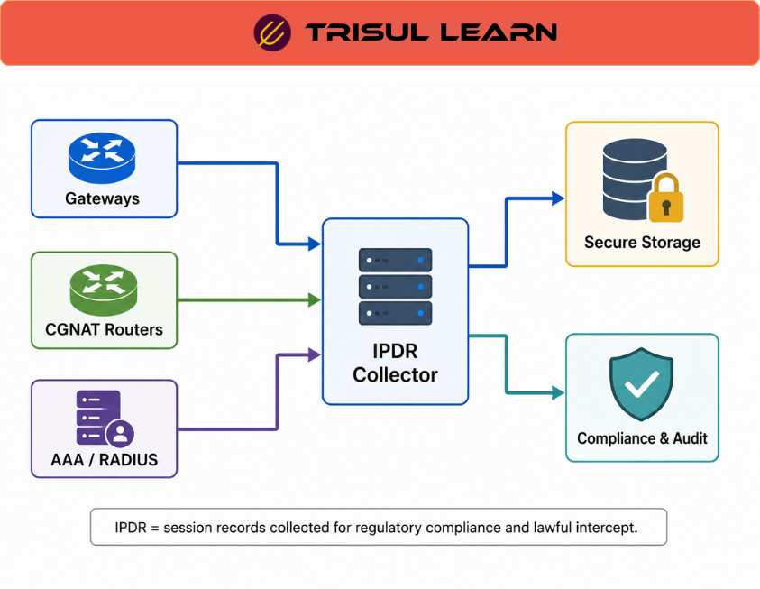

export const jsonLd = {
  "@context": "https://schema.org",
  "@type": "FAQPage",
  "mainEntity": [
    {
      "@type": "Question",
      "name": "What is IPDR?",
      "acceptedAnswer": {
        "@type": "Answer",
        "text": "IPDR (Internet Protocol Detail Record) is a standardized framework for collecting and exchanging IP-based service usage data in telecommunications and service-provider networks. It is commonly used for subscriber visibility, usage accounting, compliance, OSS/BSS integration, and service-provider analytics workflows."
      }
    },
    {
      "@type": "Question",
      "name": "What data does IPDR contain?",
      "acceptedAnswer": {
        "@type": "Answer",
        "text": "IPDR records commonly contain source and destination IP addresses, timestamps, session duration, subscriber identifiers, usage metrics, protocol information, service attributes, and traffic statistics associated with IP-based services."
      }
    },
    {
      "@type": "Question",
      "name": "What are the use cases for IPDR?",
      "acceptedAnswer": {
        "@type": "Answer",
        "text": "IPDR is commonly used for subscriber accounting, usage monitoring, telecom analytics, capacity planning, security investigations, regulatory compliance, and OSS/BSS integration workflows."
      }
    },
    {
      "@type": "Question",
      "name": "What is the IPDR Streaming Protocol?",
      "acceptedAnswer": {
        "@type": "Answer",
        "text": "The IPDR Streaming Protocol is a protocol designed for real-time exchange of IPDR records between exporters and collectors. It supports reliable transport, template-based record exchange, and subscriber-accounting workflows in telecommunications environments."
      }
    }
  ]
};

# What is IPDR?

**IPDR (Internet Protocol Detail Record)** is a standardized framework for collecting and exchanging IP-based service usage data in telecommunications and service-provider networks. It is commonly used for subscriber visibility, usage accounting, billing support, telecom analytics, regulatory compliance, and OSS/BSS integration workflows.

IPDR is often compared to traditional telecom **Call Detail Records (CDR)**, but instead of voice-call metadata, IPDR records capture information about IP-based sessions, subscriber activity, service usage, traffic behavior, and network events across broadband and IP services.

Unlike traditional flow telemetry, IPDR workflows are often tightly integrated with subscriber accounting systems, billing platforms, compliance processes, and telecom-service operations where subscriber-centric visibility is operationally important.

In provider environments, IPDR helps teams maintain visibility into subscriber usage, traffic consumption, service utilization, and network behavior across large-scale access infrastructure.

---

## How IPDR works
IPDR records are generated by network infrastructure elements such as broadband gateways, CMTS platforms, OLT systems, access concentrators, BRAS/BNG devices, and other service-edge infrastructure.

These records typically contain metadata associated with network sessions or subscriber activity, including:

- Source and destination IP addresses
- Session timestamps and duration
- Subscriber identifiers
- Traffic volume and usage statistics
- Protocol or service information
- QoS-related metrics and service attributes

A typical workflow includes:

1. **Session or service activity occurs** – Subscriber traffic or service activity is observed by network infrastructure
2. **Record generation** – Network devices generate IPDR records describing the activity
3. **Collection and export** – Records are exported to collectors, OSS/BSS systems, analytics platforms, or compliance systems
4. **Correlation and analysis** – Teams correlate usage records with subscriber systems, billing platforms, traffic telemetry, or service-management infrastructure
5. **Retention and reporting** – Historical records are retained for analytics, compliance, troubleshooting, or accounting workflows

IPDR implementations commonly use XML-based schemas with extensible fields, allowing providers and vendors to support environment-specific telecom requirements and subscriber-accounting workflows.

---

## IPDR in network operations
In telecommunications and broadband-provider environments, IPDR supports a broad set of subscriber-management and telecom-analysis workflows.

Common uses include:

- Subscriber accounting and usage tracking
- Billing and OSS/BSS integration
- Capacity planning and usage forecasting
- Subscriber-behavior visibility
- Traffic and service analytics
- Regulatory compliance and audit workflows
- Security investigations and infrastructure troubleshooting

In broadband and large-scale access environments, IPDR records help operators understand how subscribers consume services, how bandwidth is utilized, and how traffic patterns evolve across access infrastructure over time.

Provider teams often correlate IPDR records with flow telemetry, DNS visibility, authentication records, subscriber mapping systems, and traffic-analysis platforms to improve attribution accuracy and troubleshooting visibility.

In NAT-heavy or carrier-grade environments, IPDR workflows are especially valuable because subscriber activity may otherwise be difficult to associate with specific users or sessions using flow telemetry alone.

---

## Uses of IPDR data
| Use case | Purpose |
|----------|---------------------|
| Billing and accounting | Support subscriber usage accounting and billing workflows |
| Traffic analysis | Analyze subscriber traffic patterns and bandwidth utilization |
| Capacity planning | Forecast bandwidth growth and infrastructure demand |
| Security investigations | Support investigation and anomaly-analysis workflows |
| QoS monitoring | Analyze service usage and traffic-priority behavior |
| Compliance and auditing | Retain subscriber usage records for regulatory requirements |
| Policy enforcement | Support subscriber-based service or traffic policies |

Depending on the environment, IPDR data may also be correlated with subscriber identity systems, flow telemetry, DNS activity, authentication systems, or telecom analytics platforms.

---

## What makes IPDR workflows effective
Effective IPDR deployments depend on reliable export workflows, accurate subscriber attribution, consistent schemas, synchronized timestamps, and long-term historical retention.

Common challenges include:

- Missing or incomplete export records
- Inconsistent vendor-specific schema extensions
- Duplicate-record handling
- Large-scale subscriber-data retention requirements
- Synchronization issues between telecom systems
- Attribution complexity in NAT-heavy environments

Organizations commonly improve IPDR workflows by centralizing record collection, normalizing schema variations, correlating IPDR records with subscriber systems and flow telemetry, and maintaining searchable historical archives for investigation and compliance workflows.

Reliable retention and attribution workflows are especially important in service-provider environments where subscriber visibility and regulatory reporting requirements are business-critical.

---

## In Trisul
Trisul supports IPDR-oriented subscriber-analysis workflows through flow telemetry analysis, subscriber visibility workflows, historical traffic analysis, and large-scale ISP traffic monitoring capabilities.

Using NetFlow, IPFIX, sFlow, and related telemetry workflows, operators can correlate subscriber usage behavior with historical traffic patterns, DNS activity, authentication telemetry, and flow records to investigate service-consumption trends or troubleshoot subscriber-impact events.

Traffic-analysis workflows help teams investigate subscriber behavior, analyze bandwidth utilization patterns, retain long-term visibility for compliance reporting, and improve attribution accuracy across NAT-heavy or distributed broadband environments.

Trisul workflows commonly combine:

- Flow telemetry
- Historical traffic analysis
- Subscriber visibility workflows
- DNS and subscriber correlation
- Explore Flows investigations

These capabilities are particularly useful for ISPs, broadband providers, telecom operators, and large-scale access networks where subscriber-centric visibility, attribution accuracy, and telecom analytics are important.

Additional subscriber and flow-analysis workflows are documented in the Trisul documentation:

[Trisul Flow Documentation](https://docs.trisul.org/docs/ug/flow/)

---

## Related terms
- NetFlow
- IPFIX
- [CDR](/glossary/cdr)
- [Subscriber mapping](/glossary/subscriber-mapping)
- [OSS/BSS](/glossary/oss-bss)
- Flow telemetry
- Carrier-grade NAT

---

## Frequently asked questions
### What is IPDR?

IPDR (Internet Protocol Detail Record) is a standardized framework for collecting and exchanging IP-based service usage data in telecommunications and service-provider networks. It is commonly used for subscriber visibility, usage accounting, compliance, OSS/BSS integration, and service-provider analytics workflows.

### What data does IPDR contain?

IPDR records commonly contain source and destination IP addresses, timestamps, session duration, subscriber identifiers, usage metrics, protocol information, service attributes, and traffic statistics associated with IP-based services.

### What are the use cases for IPDR?

IPDR is commonly used for subscriber accounting, usage monitoring, telecom analytics, capacity planning, security investigations, regulatory compliance, and OSS/BSS integration workflows.

### What is the IPDR Streaming Protocol?

The IPDR Streaming Protocol is a protocol designed for real-time exchange of IPDR records between exporters and collectors. It supports reliable transport, template-based record exchange, and subscriber-accounting workflows in telecommunications environments.