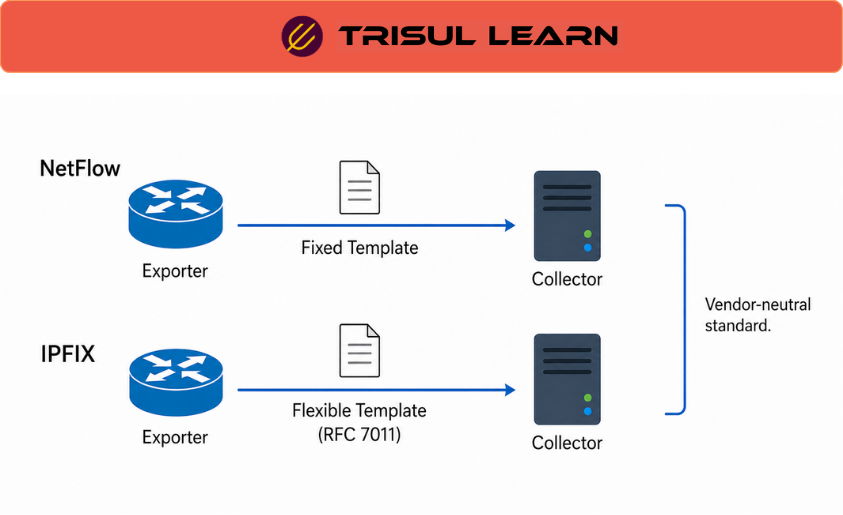

export const jsonLd = {
  "@context": "https://schema.org",
  "@type": "FAQPage",
  "mainEntity": [
    {
      "@type": "Question",
      "name": "What is IPFIX?",
      "acceptedAnswer": {
        "@type": "Answer",
        "text": "IPFIX (IP Flow Information Export) is an IETF standard protocol for exporting IP flow information from network devices to collectors. It provides a vendor-neutral framework for transmitting flow telemetry used in traffic analysis, accounting, billing, security monitoring, and network telemetry workflows."
      }
    },
    {
      "@type": "Question",
      "name": "How does IPFIX differ from NetFlow?",
      "acceptedAnswer": {
        "@type": "Answer",
        "text": "IPFIX is the IETF-standardized evolution of Cisco NetFlow v9. It adopts the template-based flow format introduced in NetFlow v9 while extending it with standardized Information Elements, enterprise-specific extensions, variable-length fields, and broader interoperability across vendors."
      }
    },
    {
      "@type": "Question",
      "name": "What is an IPFIX Information Element?",
      "acceptedAnswer": {
        "@type": "Answer",
        "text": "An IPFIX Information Element is a defined attribute that appears in an IPFIX record, such as source IP address, destination port, packet count, or flow timestamp. Information Elements are standardized by IANA and defined in RFC 7012, while vendors may also define enterprise-specific elements."
      }
    },
    {
      "@type": "Question",
      "name": "What transport protocols does IPFIX use?",
      "acceptedAnswer": {
        "@type": "Answer",
        "text": "IPFIX supports SCTP, TCP, and UDP as transport protocols. SCTP is the preferred transport because it provides reliable, congestion-aware delivery and multi-streaming capabilities designed for large-scale telemetry export."
      }
    }
  ]
};

# What is IPFIX?

**IPFIX (IP Flow Information Export)** is an IETF standard protocol for exporting IP flow information from routers, probes, switches, firewalls, and other network devices to collectors for traffic analysis, accounting, billing, security monitoring, and network telemetry workflows.

IPFIX was designed to provide a vendor-neutral and extensible framework for flow telemetry export across multi-vendor environments. It standardizes the template-based export model originally introduced by Cisco NetFlow v9 and is formally defined in **RFC 7011** (protocol specification) and **RFC 7012** (information model).

Unlike proprietary or vendor-specific export formats, IPFIX allows exporters to describe telemetry dynamically using templates and standardized Information Elements, enabling flexible telemetry exchange across heterogeneous infrastructure environments.

In enterprise, ISP, cloud, and service-provider environments, IPFIX provides centralized visibility into communication patterns, bandwidth consumption, subscriber activity, application usage, and traffic behavior across distributed infrastructure.

---

## How IPFIX works
An **IPFIX exporter** observes packets at one or more observation points and groups related packets into flows using configurable flow keys such as:

- Source and destination IP addresses
- Source and destination ports
- Transport protocol
- VLAN or interface information
- Subscriber or application identifiers

The exporter then generates flow records describing communication behavior and exports them to one or more **IPFIX collectors**.

A typical workflow includes:

1. **Traffic observation** – Packets are observed at routers, probes, switches, or other exporter devices
2. **Flow creation** – Packets sharing common characteristics are grouped into flows
3. **Template generation** – The exporter defines templates describing the structure and field layout of exported records
4. **Flow export** – Flow records are transmitted to collectors using IPFIX transport protocols
5. **Collection and analysis** – Collectors decode, store, correlate, and analyze exported telemetry

Because IPFIX uses a template-based design, exporters can define flexible record structures and include both standardized and vendor-specific Information Elements without breaking interoperability.

Collectors must maintain synchronized template state with exporters because exported flow records cannot be decoded correctly without matching template definitions. Template loss, expiration, or exporter restarts may temporarily affect telemetry interpretation until templates are refreshed.

---

## IPFIX in network operations
In production environments, IPFIX exporters commonly run on routers, switches, firewalls, broadband gateways, probes, and monitoring appliances deployed across access, aggregation, edge, and core infrastructure.

IPFIX telemetry supports a wide range of analytics and infrastructure workflows including:

- Traffic analysis and communication visibility
- Capacity planning and utilization analysis
- Subscriber accounting and billing
- Security investigations and anomaly detection
- Application and service monitoring
- WAN and cloud traffic analysis
- Infrastructure troubleshooting and forensic workflows

IPFIX is frequently correlated with SNMP, DNS telemetry, syslog, AAA systems, packet analysis, authentication telemetry, and subscriber systems to provide broader analytical context.

In ISP and broadband environments, IPFIX is commonly integrated with subscriber-management systems, OSS/BSS infrastructure, and traffic-accounting workflows where subscriber visibility and usage attribution are especially important.

Vendor-specific Information Elements also allow organizations to export environment-specific telemetry such as application identifiers, subscriber metadata, QoS attributes, MPLS context, or custom infrastructure metrics beyond traditional flow fields.

---

## IPFIX message structure
An IPFIX message contains multiple logical components used to describe and transport flow telemetry.

| Component | Description |
|----------|-------------|
| Message Header | Contains metadata such as version, export time, sequence number, and observation domain ID |
| Template Record | Defines the structure and field layout of exported records |
| Data Record | Contains actual flow values based on a template |
| Options Record | Carries exporter metadata, scope information, or configuration-related data |

Templates allow collectors to dynamically interpret exported records without requiring fixed record layouts.

This extensible structure is one of the primary reasons IPFIX is widely used across heterogeneous vendor environments and large-scale telemetry architectures.

---

## What makes IPFIX deployments effective
Effective IPFIX deployments depend on reliable exporters, accurate template synchronization, scalable collectors, transport reliability, and long-term telemetry retention.

Common challenges include:

- Template synchronization issues
- UDP packet loss during export
- High-volume flow processing requirements
- Vendor-specific Information Elements
- Flow sampling accuracy limitations
- Distributed exporter consistency across large environments

Organizations commonly improve IPFIX telemetry quality by:

- Retaining historical flow telemetry
- Using reliable transport protocols where appropriate
- Correlating IPFIX with DNS, SNMP, and security telemetry
- Normalizing vendor-specific fields
- Centralizing flow collection and analytics workflows

Template lifecycle management is especially important because collectors rely on accurate template state to correctly interpret incoming records from exporters.

Long-term telemetry retention and cross-platform telemetry correlation significantly improve troubleshooting, security investigations, traffic engineering, and capacity-planning analysis.

---

## In Trisul
Trisul natively supports IPFIX collection and template-aware flow analysis alongside NetFlow v5, NetFlow v9, sFlow, and J-Flow telemetry workflows.

Trisul can decode template-based IPFIX exports containing both standardized and enterprise-specific Information Elements, allowing operators to analyze vendor-specific telemetry alongside normalized flow records across heterogeneous infrastructure environments.

Using IPFIX telemetry, operators can investigate communication patterns, analyze subscriber and application behavior, monitor utilization trends, correlate telemetry with DNS and ASN context, and perform infrastructure or security investigations using long-term flow visibility.

Traffic-analysis workflows help teams investigate congestion conditions, subscriber activity, WAN behavior, cloud communication patterns, security anomalies, and vendor-specific telemetry exported through custom Information Elements.

Trisul workflows commonly combine:

- Flow telemetry
- Historical traffic analysis
- DNS and ASN correlation
- Template-aware flow decoding
- Explore Flows investigations

These capabilities are particularly useful for ISPs, enterprise networks, WAN monitoring, cloud traffic visibility, subscriber analytics, and multi-vendor telemetry environments where flexible flow visibility and extensible telemetry analysis are important.

Additional IPFIX and flow-analysis workflows are documented in the Trisul documentation:

[Trisul Flow Documentation](https://docs.trisul.org/docs/ug/flow/)

---

## Related terms
- NetFlow
- sFlow
- Flow telemetry
- [Flow exporter](/glossary/flow-exporter)
- [Flow collector](/glossary/flow-collector)
- Information Element
- Network telemetry

---

## Frequently asked questions
### What is IPFIX?

IPFIX (IP Flow Information Export) is an IETF standard protocol for exporting IP flow information from network devices to collectors. It provides a vendor-neutral framework for transmitting flow telemetry used in traffic analysis, accounting, billing, security monitoring, and network telemetry workflows.

### How does IPFIX differ from NetFlow?

IPFIX is the IETF-standardized evolution of Cisco NetFlow v9. It adopts the template-based flow format introduced in NetFlow v9 while extending it with standardized Information Elements, enterprise-specific extensions, variable-length fields, and broader interoperability across vendors.

### What is an IPFIX Information Element?

An IPFIX Information Element is a defined attribute that appears in an IPFIX record, such as source IP address, destination port, packet count, or flow timestamp. Information Elements are standardized by IANA and defined in RFC 7012, while vendors may also define enterprise-specific elements.

### What transport protocols does IPFIX use?

IPFIX supports SCTP, TCP, and UDP as transport protocols. SCTP is the preferred transport because it provides reliable, congestion-aware delivery and multi-streaming capabilities designed for large-scale telemetry export.