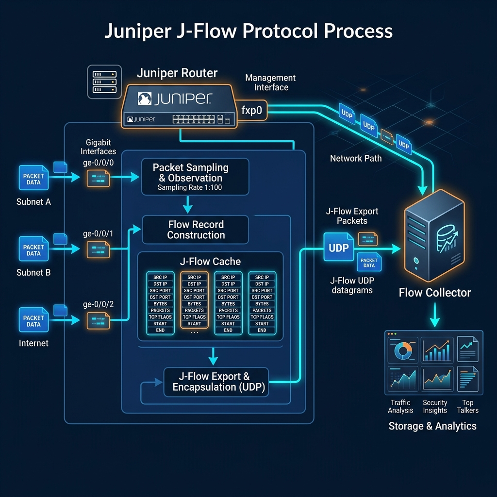

export const jsonLd = {
  "@context": "https://schema.org",
  "@type": "FAQPage",
  "mainEntity": [
    {
      "@type": "Question",
      "name": "What is JFlow?",
      "acceptedAnswer": {
        "@type": "Answer",
        "text": "JFlow is a flow export technology used on Juniper devices that exports summarized traffic-flow records to collectors for traffic analysis, troubleshooting, reporting, and operational visibility."
      }
    },
    {
      "@type": "Question",
      "name": "What does JFlow contain?",
      "acceptedAnswer": {
        "@type": "Answer",
        "text": "JFlow records commonly contain source and destination addresses, ports, protocol information, byte counts, packet counts, interface details, and flow timing information."
      }
    },
    {
      "@type": "Question",
      "name": "Why is JFlow useful?",
      "acceptedAnswer": {
        "@type": "Answer",
        "text": "JFlow is useful because it provides scalable visibility into traffic patterns and communication behavior without requiring continuous full packet capture."
      }
    },
    {
      "@type": "Question",
      "name": "How is JFlow used?",
      "acceptedAnswer": {
        "@type": "Answer",
        "text": "JFlow is used for traffic analysis, troubleshooting, capacity planning, historical reporting, operational visibility, and security-monitoring workflows."
      }
    }
  ]
};

# What is JFlow?

**JFlow** is a flow export technology used on Juniper devices that exports summarized traffic-flow records to collectors for traffic analysis, troubleshooting, reporting, and long-term network visibility.

Instead of exporting full packet payloads, JFlow exports metadata describing communication behavior between systems. This allows operators to analyze traffic patterns, bandwidth consumption, top applications, routing behavior, and communication trends while using significantly less storage and processing overhead than continuous packet capture.

JFlow is widely used in enterprise, ISP, WAN, and service-provider environments running Juniper infrastructure where scalable telemetry retention and long-term traffic visibility are important. In large routing environments, JFlow helps engineering teams understand how traffic traverses gateways, WAN links, peering edges, and backbone infrastructure without requiring full payload inspection.

---

## How JFlow works
Juniper devices observe packets traversing monitored interfaces and group related packets into flows using attributes such as source and destination addresses, transport protocols, ports, interface details, and routing context.

Instead of retaining the entire packet stream, the device generates summarized flow records describing communication activity. These records commonly include metadata such as byte counts, packet counters, timing information, interface activity, and protocol details associated with the observed traffic flow.

The generated flow telemetry is exported to collectors where it can be aggregated, retained, and analyzed over long periods of time. Because JFlow exports summarized communication behavior rather than full packet payloads, providers and enterprise teams can maintain scalable long-term visibility across very large environments without the storage and performance overhead associated with continuous packet capture.

This approach is particularly useful in WAN, broadband, carrier, and distributed enterprise environments where traffic volumes are too large for permanent full-packet retention but long-term communication visibility is still operationally important.

---

## JFlow in network operations
In enterprise and provider environments, JFlow is commonly used to understand how traffic moves across WAN infrastructure, internet gateways, backbone links, peering edges, and distributed branch environments.

Engineering teams use JFlow telemetry to identify bandwidth-heavy applications, investigate communication patterns, analyze utilization trends, troubleshoot congestion conditions, and understand how traffic behavior changes during outages or routing events.

Because JFlow provides flow-level visibility rather than payload inspection, it is especially valuable for long-term telemetry retention and large-scale traffic analysis workflows where full packet capture may be operationally impractical.

In ISP and carrier environments, JFlow telemetry is frequently correlated with BGP visibility, DNS telemetry, SNMP interface metrics, subscriber systems, firewall logs, and historical traffic analysis to provide broader routing and infrastructure context.

JFlow visibility also helps operators investigate abnormal traffic behavior, identify top communication paths, analyze WAN utilization trends, and understand how applications or services consume bandwidth across distributed Juniper infrastructure.

---

## Common JFlow fields
| Field | Operational meaning |
|---|---|
| Source address | IP address where the communication originated |
| Destination address | IP address receiving the communication |
| Ports | Source and destination ports associated with applications or services |
| Protocol | Transport protocol such as TCP or UDP |
| Bytes | Total traffic volume associated with the flow |
| Packets | Total number of packets within the flow |
| Timing | Flow start time, end time, or duration information |

These fields help teams analyze communication behavior, attribute traffic to applications or services, investigate utilization patterns, and troubleshoot network activity across Juniper environments.

---

## What makes JFlow analysis effective
Effective JFlow analysis depends on reliable exporters, scalable collectors, accurate flow generation, and long-term telemetry retention.

In large environments, engineering teams must process high-volume telemetry across distributed routing infrastructure while maintaining consistent visibility between exporters and collectors. Sampling configurations, exporter limitations, and multi-vendor normalization requirements can all affect traffic visibility and analysis quality.

JFlow analysis becomes significantly more useful when flow telemetry is correlated with surrounding telemetry sources such as DNS activity, SNMP telemetry, BGP visibility, routing behavior, firewall logs, and historical traffic patterns.

Because flow telemetry provides summarized communication visibility without requiring payload retention, JFlow is particularly effective for scalable WAN monitoring, traffic engineering, capacity planning, infrastructure troubleshooting, and long-term communication analysis across large Juniper deployments.

---

## In Trisul
Trisul natively supports JFlow collection and analysis alongside NetFlow, IPFIX, and sFlow telemetry workflows.

Operators can analyze how traffic traverses Juniper routing infrastructure, investigate WAN communication behavior, monitor gateway utilization, and correlate flow activity with routing, DNS, and interface telemetry during troubleshooting or traffic-engineering investigations.

This visibility helps teams investigate congestion conditions, analyze application behavior, identify abnormal communication patterns, understand bandwidth consumption trends, and retain long-term traffic visibility across enterprise, ISP, and carrier environments using Juniper infrastructure.

Trisul also allows operators to analyze JFlow telemetry together with multi-vendor flow data, making it easier to investigate traffic behavior across heterogeneous environments containing Juniper and non-Juniper infrastructure.

These workflows are particularly useful for WAN monitoring, routing visibility, capacity planning, traffic engineering, service-provider analysis, operational troubleshooting, and network-security investigations.

Additional flow-analysis workflows are documented in the Trisul documentation:

[Trisul Flow Documentation](https://docs.trisul.org/docs/ug/flow/)

---

## Related terms
- NetFlow
- IPFIX
- sFlow
- Flow telemetry
- Network traffic analysis
- Traffic engineering
- BGP

---

## Frequently asked questions
### What is JFlow?

JFlow is a flow export technology used on Juniper devices that exports summarized traffic-flow records to collectors for traffic analysis, troubleshooting, reporting, and operational visibility.

### What does JFlow contain?

JFlow records commonly contain source and destination addresses, ports, protocol information, byte counts, packet counts, interface details, and flow timing information.

### Why is JFlow useful?

JFlow is useful because it provides scalable visibility into traffic patterns and communication behavior without requiring continuous full packet capture.

### How is JFlow used?

JFlow is used for traffic analysis, troubleshooting, capacity planning, historical reporting, operational visibility, and security-monitoring workflows.