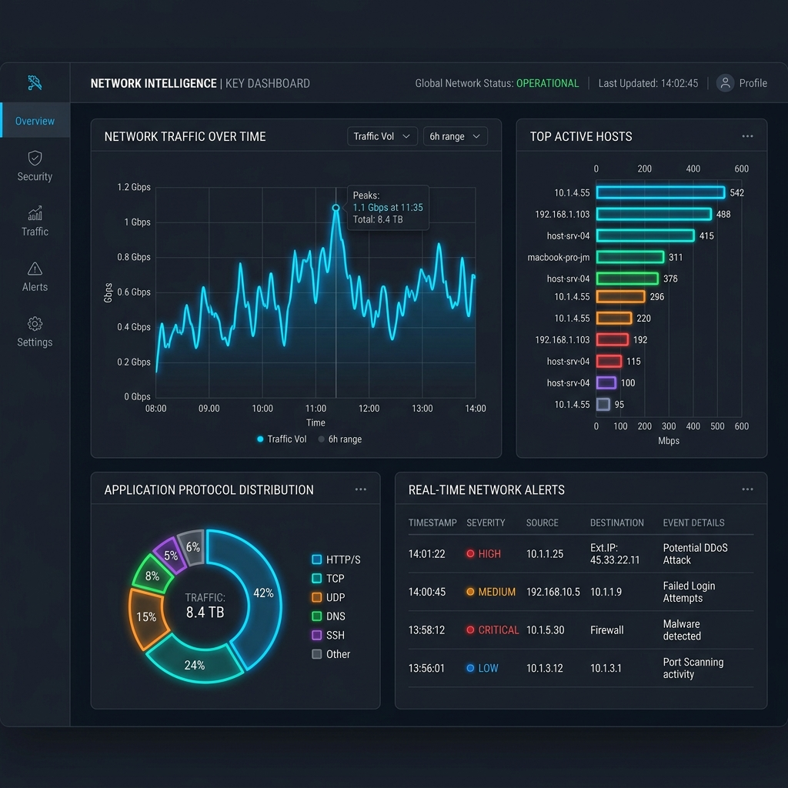

export const jsonLd = {
  "@context": "https://schema.org",
  "@type": "FAQPage",
  "mainEntity": [
    {
      "@type": "Question",
      "name": "What is the Key Dashboard in Trisul?",
      "acceptedAnswer": {
        "@type": "Answer",
        "text": "In Trisul, the Key Dashboard is an entity-centric analysis view for a specific network key such as an IP address, application, port, or host. It provides real-time traffic visibility, historical traffic analysis, and investigative workflows for the selected entity."
      }
    },
    {
      "@type": "Question",
      "name": "What modules are available on the Key Dashboard?",
      "acceptedAnswer": {
        "@type": "Answer",
        "text": "The Key Dashboard includes Key Details, Real Time Stabbers, toppers, flow activity views, and historical traffic charts. These modules help operators analyze traffic patterns, top conversations, application activity, and flow behavior associated with the selected entity."
      }
    },
    {
      "@type": "Question",
      "name": "How do you access the Key Dashboard?",
      "acceptedAnswer": {
        "@type": "Answer",
        "text": "Operators can access the Key Dashboard through Dashboards → Real Time Traffic by selecting a key associated with a host, application, port, or other entity. It can also be opened through search and investigative workflows."
      }
    },
    {
      "@type": "Question",
      "name": "What can you do on the Key Dashboard?",
      "acceptedAnswer": {
        "@type": "Answer",
        "text": "The Key Dashboard allows operators to analyze real-time traffic behavior, investigate historical activity, review active flows, examine top conversations, and perform drill-down investigations for a selected network entity."
      }
    }
  ]
};

# What is Key Dashboard in Trisul?

In **Trisul**, the **Key Dashboard** is an entity-centric analysis view that provides real-time traffic visibility, historical traffic analysis, and investigative workflows for specific network entities such as IP addresses, applications, hosts, ports, services, and other monitored keys.

The Key Dashboard allows operators to pivot from aggregated traffic views into detailed analysis for a selected entity while preserving investigative context across multiple telemetry and analysis workflows. Instead of repeatedly rebuilding searches across separate interfaces, analysts can follow the behavior of a specific host, application, or service through real-time telemetry, historical traffic activity, communication analysis, and flow investigations from a single investigative context.

This workflow becomes especially valuable during troubleshooting and security investigations where teams often begin with only a single observable indicator such as a suspicious IP address, abnormal application, overloaded host, or unexpected communication pattern.

---

## How the Key Dashboard works
The Key Dashboard aggregates telemetry and traffic information associated with a selected key across multiple traffic-analysis workflows and telemetry sources.

When an operator selects an entity such as an IP address, host, application, or port, Trisul retrieves associated traffic behavior, flow activity, communication history, and related telemetry linked to that entity. Operators can then move between real-time traffic visibility, historical activity, flow analysis, and communication investigations without losing the original investigative context.

This continuity is operationally important because many investigations evolve gradually. A troubleshooting workflow may begin with abnormal utilization on a host, expand into flow analysis, pivot into application behavior, and eventually require historical traffic reconstruction. Restarting this process repeatedly across disconnected dashboards significantly slows investigations and increases correlation complexity.

The Key Dashboard reduces this friction by allowing operators to navigate across related telemetry views while maintaining focus on the selected entity throughout the investigation lifecycle.

Depending on the selected entity type and telemetry available, the dashboard may include real-time traffic visibility, historical traffic charts, flow activity, communication analysis, application visibility, top conversations, and retrospective investigation workflows.

---

## Key Dashboard in network operations
In network operations, the Key Dashboard helps teams investigate how specific hosts, applications, services, or communication endpoints behave over time across distributed environments.

During outages, congestion events, routing instability, or abnormal traffic conditions, operators frequently need to determine whether a particular entity exhibited unusual behavior before the disruption occurred. Entity-centric visibility allows investigators to follow communication history, traffic evolution, and flow activity without manually correlating information across multiple disconnected dashboards.

In security operations, the Key Dashboard helps analysts investigate suspicious communication patterns, malware-related traffic behavior, scanning activity, unexpected application usage, lateral movement indicators, and historical traffic associated with specific entities.

Because the dashboard preserves investigative continuity across telemetry views, analysts can move naturally between real-time visibility, historical analysis, flow records, and communication investigations without repeatedly rebuilding search context during incident analysis.

This investigative continuity becomes increasingly important in enterprise, ISP, WAN, SD-WAN, cloud, and hybrid-network environments where operational visibility is distributed across multiple telemetry sources and traffic-analysis workflows.

---

## Key Dashboard modules
| Module | Description |
|---|---|
| Key Details | Displays summary information and operational metrics for the selected entity |
| Real Time Stabbers | Shows near-real-time traffic activity associated with the selected entity |
| Historical Charts | Displays traffic trends and communication history over time |
| Flow Activity | Displays flow records and communication behavior involving the selected entity |
| Toppers | Displays top conversations, applications, hosts, or traffic contributors |
| Retro Analysis | Supports historical traffic reconstruction and retrospective investigations |

The available modules vary depending on the selected counter group, telemetry type, and deployment configuration.

---

## What makes the Key Dashboard operationally effective
The Key Dashboard is operationally effective because it combines real-time telemetry, historical visibility, flow analysis, and investigative drill-down workflows within a single entity-focused analysis context.

Without entity-centric investigative workflows, operators often need to manually correlate traffic behavior across multiple independent dashboards, search interfaces, and telemetry systems. This fragmentation increases investigation time and makes it more difficult to reconstruct how traffic behavior evolved during outages, performance issues, or security incidents.

The Key Dashboard reduces this operational friction by preserving context while analysts pivot between traffic analysis, flow records, communication history, application visibility, and retrospective investigation workflows.

Operational effectiveness depends heavily on reliable telemetry collection, historical retention, indexed traffic analysis, and accurate correlation between entities, flows, and communication behavior across large traffic datasets.

In large-scale environments, these workflows help operators investigate operational issues and security events more efficiently without repeatedly rebuilding investigative context from separate tools and interfaces.

---

## In Trisul
The Key Dashboard is part of Trisul’s core traffic-analysis and investigative workflow system and is deeply integrated into entity-centric analysis workflows across the platform.

Operators commonly access the dashboard through Real Time Traffic views, search workflows, counter-group drill-downs, Explore Flows investigations, and traffic-analysis workflows associated with specific hosts, applications, or services.

Instead of moving separately between flow dashboards, historical analysis views, communication summaries, and traffic-investigation interfaces, operators can pivot through connected workflows while preserving the original entity context throughout the investigation.

This continuity significantly improves troubleshooting, outage analysis, traffic investigations, and security workflows where analysts need to understand how a specific entity behaved across multiple telemetry dimensions over time.

The Key Dashboard also integrates with workflows such as Key Details, Real Time Stabbers, Explore Flows, Flow Tracker, and Retro Analysis to support long-form operational and investigative analysis.

Additional workflow details are documented in the Trisul documentation:

[Trisul Counter Group Tasks Documentation](https://docs.trisul.org/docs/ug/cg/tasks/)

---

## Related terms
- [Explore Flows](/glossary/explore-flows)
- [Real-time traffic monitoring](/glossary/realtime-traffic-monitoring)
- Counter group
- [Flow tracker](/glossary/flow-tracker)
- Retro analysis

---

## Frequently asked questions
### What is the Key Dashboard in Trisul?

In Trisul, the Key Dashboard is an entity-centric analysis view for a specific network key such as an IP address, application, port, or host. It provides real-time traffic visibility, historical traffic analysis, and investigative workflows for the selected entity.

### What modules are available on the Key Dashboard?

The Key Dashboard includes Key Details, Real Time Stabbers, toppers, flow activity views, and historical traffic charts. These modules help operators analyze traffic patterns, top conversations, application activity, and flow behavior associated with the selected entity.

### How do you access the Key Dashboard?

Operators can access the Key Dashboard through Dashboards → Real Time Traffic by selecting a key associated with a host, application, port, or other entity. It can also be opened through search and investigative workflows.

### What can you do on the Key Dashboard?

The Key Dashboard allows operators to analyze real-time traffic behavior, investigate historical activity, review active flows, examine top conversations, and perform drill-down investigations for a selected network entity.