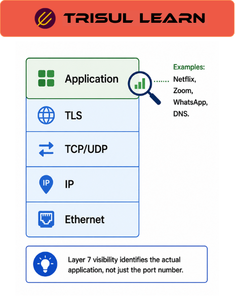

export const jsonLd = {
  "@context": "https://schema.org",
  "@type": "FAQPage",
  "mainEntity": [
    {
      "@type": "Question",
      "name": "What is Layer 7 visibility?",
      "acceptedAnswer": {
        "@type": "Answer",
        "text": "Layer 7 visibility provides application-aware insight into network traffic by identifying applications, services, protocols, and communication behavior using application-layer traffic analysis techniques."
      }
    },
    {
      "@type": "Question",
      "name": "Why is Layer 7 visibility important?",
      "acceptedAnswer": {
        "@type": "Answer",
        "text": "Layer 7 visibility is important because modern applications increasingly use encrypted communication, dynamic ports, shared cloud infrastructure, and SaaS architectures that cannot be reliably understood through Layer 3 and Layer 4 visibility alone."
      }
    },
    {
      "@type": "Question",
      "name": "How does Layer 7 visibility work?",
      "acceptedAnswer": {
        "@type": "Answer",
        "text": "Layer 7 visibility uses techniques such as protocol decoding, metadata extraction, DPI, TLS metadata analysis, DNS correlation, and behavioral traffic analysis to identify applications and reconstruct service behavior."
      }
    },
    {
      "@type": "Question",
      "name": "What are the benefits of Layer 7 visibility?",
      "acceptedAnswer": {
        "@type": "Answer",
        "text": "Layer 7 visibility helps organizations improve application monitoring, troubleshooting, security investigations, SaaS visibility, encrypted-traffic analysis, operational analytics, and service-level traffic understanding."
      }
    }
  ]
};

# What is Layer 7 visibility?

**Layer 7 visibility** provides application-aware insight into network traffic by identifying applications, services, protocols, and communication behavior using application-layer traffic analysis techniques.

It operates at the **application layer (Layer 7)** of the OSI model, where communication is associated with user-facing services such as web applications, DNS, APIs, email, collaboration platforms, streaming services, SaaS applications, and cloud-hosted workloads.

Traditional Layer 3 and Layer 4 visibility primarily describe infrastructure-level communication such as IP addresses, ports, sessions, and transport behavior. While this lower-layer visibility remains operationally important, modern environments increasingly require deeper application context because many applications now use encrypted traffic, dynamic ports, shared cloud infrastructure, CDNs, tunneling behavior, and distributed service architectures that cannot be reliably interpreted through IP and port analysis alone.

Layer 7 visibility addresses this problem by helping operators understand what applications are actually generating traffic, how those services behave operationally, and which application-level behaviors contribute to congestion, degradation, security anomalies, or user-experience problems.

Instead of viewing traffic simply as packets and transport sessions, Layer 7 visibility adds operational meaning and service context to communication behavior across the environment.

---

## How Layer 7 visibility works
Layer 7 visibility reconstructs application context from traffic behavior using multiple analytical techniques simultaneously.

Rather than relying entirely on ports or transport protocols, Layer 7 analysis examines protocol characteristics, communication patterns, metadata, payload structure, DNS relationships, TLS handshakes, behavioral signatures, and application-specific traffic behavior in order to identify services and protocols more accurately.

Depending on encryption levels, telemetry availability, and monitoring location, this visibility may involve:
- Protocol decoding
- Application classification
- Metadata extraction
- Deep packet inspection (DPI)
- TLS metadata analysis
- DNS correlation
- Behavioral traffic analysis

As encrypted traffic became dominant across modern applications, Layer 7 visibility increasingly shifted from direct payload inspection toward metadata correlation, TLS visibility, DNS context, behavioral analysis, and protocol-aware telemetry enrichment.

Even when payload inspection is limited, metadata-level visibility such as TLS SNI values, JA3 fingerprints, DNS requests, flow behavior, and communication patterns can still provide meaningful operational context about applications and services.

This layered analytical approach allows operators to reconstruct application behavior even in environments where direct payload visibility is incomplete or unavailable.

---

## Layer 7 visibility in network operations
Layer 7 visibility is operationally important because application behavior increasingly determines how users experience infrastructure performance.

In modern enterprise, ISP, SD-WAN, cloud, and hybrid-network environments, operators often need to understand:
- which applications consume bandwidth
- how SaaS services behave across WAN links
- which services contribute to congestion
- how encrypted traffic behaves operationally
- whether applications degrade user experience
- which protocols generate suspicious communication behavior

Lower-layer visibility alone often cannot answer these questions reliably because modern applications frequently share infrastructure, dynamically change communication behavior, or operate through encrypted cloud-delivery platforms.

This becomes especially important during troubleshooting and security investigations where operators must distinguish between:
- network-level congestion
- application-specific degradation
- cloud-service instability
- DNS-related issues
- protocol abuse
- abnormal encrypted traffic behavior

Layer 7 visibility therefore helps organizations move beyond infrastructure-only monitoring toward application-aware operational analysis.

Security teams also rely heavily on Layer 7 visibility because many modern threats intentionally blend into legitimate application behavior. Malware communication, DNS abuse, encrypted command-and-control traffic, unauthorized SaaS usage, and application-layer attacks may appear operationally normal at lower layers while remaining identifiable through protocol-aware or behavioral analysis.

---

## Layer 7 vs lower layers comparison
| Layer | Operational focus | Visibility provided |
|---|---|---|
| Layer 3 (Network) | IP addressing and routing | Source and destination IP addresses and subnets |
| Layer 4 (Transport) | Sessions and transport communication | TCP/UDP ports, sessions, and transport behavior |
| Layer 7 (Application) | Application behavior and service context | Applications, protocols, services, and communication patterns |

Layer 7 visibility builds on lower-layer telemetry by enriching traffic analysis with application-aware operational context.

---

## What makes Layer 7 visibility operationally effective
Effective Layer 7 visibility depends heavily on accurate protocol classification, telemetry quality, historical retention, metadata enrichment, and visibility into encrypted communication behavior.

Operationally, the challenge is no longer simply collecting packets, but reconstructing meaningful service behavior from increasingly abstracted and encrypted traffic environments.

Modern applications frequently operate through:
- shared cloud infrastructure
- CDNs
- encrypted sessions
- dynamic service architectures
- rapidly changing SaaS delivery platforms

This makes application-aware visibility significantly more dependent on behavioral analysis, metadata correlation, DNS visibility, TLS telemetry, and historical communication analysis than traditional static protocol identification alone.

Layer 7 visibility therefore becomes most useful when organizations correlate:
- flow telemetry
- DNS activity
- TLS metadata
- packet analysis
- application behavior
- historical traffic visibility
- operational investigations

This correlation allows operators to understand not only which applications exist on the network, but also how those services behave operationally over time.

---

## In Trisul
Trisul supports Layer 7 visibility workflows through protocol-aware traffic analysis, application-oriented telemetry enrichment, flow analysis, packet-analysis workflows, DNS visibility, and historical traffic investigations.

Using packet analysis, NetFlow, IPFIX, sFlow, protocol-aware analytics, and traffic-investigation workflows, Trisul helps operators reconstruct application behavior, identify service activity, analyze encrypted communication patterns, and correlate application-layer behavior with traffic flows, DNS activity, hosts, and operational investigations.

Rather than viewing traffic exclusively through IP addresses and ports, Trisul workflows allow teams to analyze communication behavior using richer application-aware context that improves troubleshooting, traffic analysis, SaaS visibility, WAN investigations, security analysis, and operational analytics.

These workflows are particularly useful in environments where encrypted traffic, cloud-delivered applications, dynamic service architectures, and distributed infrastructure make lower-layer visibility insufficient for understanding actual service behavior operationally.

Additional traffic-analysis workflows are documented in the Trisul documentation:

[Trisul Documentation](https://docs.trisul.org/)

---

## Related terms
- [Deep packet inspection](/glossary/dpi)
- [Application monitoring](/glossary/application-monitoring)
- Flow monitoring
- [TLS inspection](/glossary/tls-inspection)
- [OSI model](/glossary/osi-model)

---

## Frequently asked questions
### What is Layer 7 visibility?

Layer 7 visibility provides application-aware insight into network traffic by identifying applications, services, protocols, and communication behavior using application-layer traffic analysis techniques.

### Why is Layer 7 visibility important?

Layer 7 visibility is important because modern applications increasingly use encrypted communication, dynamic ports, shared cloud infrastructure, and SaaS architectures that cannot be reliably understood through Layer 3 and Layer 4 visibility alone.

### How does Layer 7 visibility work?

Layer 7 visibility uses techniques such as protocol decoding, metadata extraction, DPI, TLS metadata analysis, DNS correlation, and behavioral traffic analysis to identify applications and reconstruct service behavior.

### What are the benefits of Layer 7 visibility?

Layer 7 visibility helps organizations improve application monitoring, troubleshooting, security investigations, SaaS visibility, encrypted-traffic analysis, operational analytics, and service-level traffic understanding.