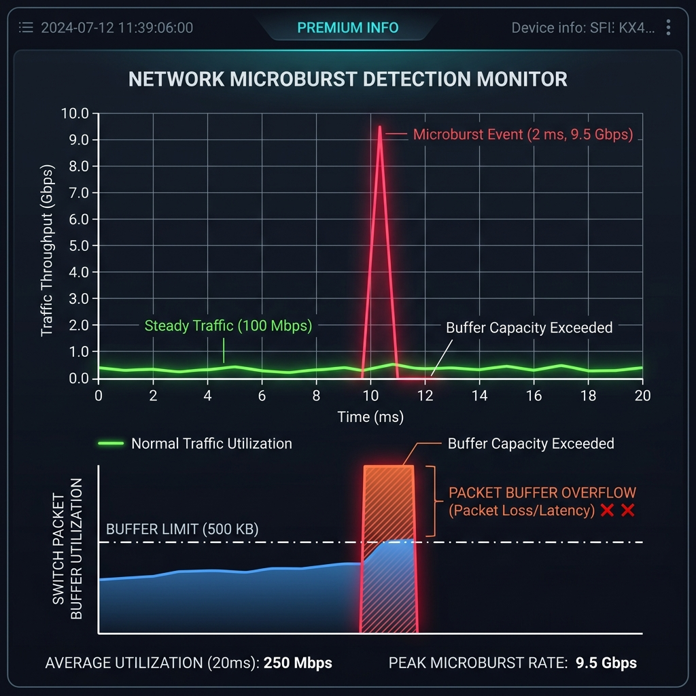

export const jsonLd = {
  "@context": "https://schema.org",
  "@type": "FAQPage",
  "mainEntity": [
    {
      "@type": "Question",
      "name": "What is a microburst?",
      "acceptedAnswer": {
        "@type": "Answer",
        "text": "A microburst is a short-duration traffic spike that temporarily exceeds available forwarding or buffering capacity within a very small time interval, potentially causing congestion, queue buildup, latency spikes, or packet loss."
      }
    },
    {
      "@type": "Question",
      "name": "Why is microburst detection important?",
      "acceptedAnswer": {
        "@type": "Answer",
        "text": "Microburst detection is important because traditional average-based monitoring may completely hide short-duration congestion spikes that still affect application performance, latency, queue stability, and packet delivery."
      }
    },
    {
      "@type": "Question",
      "name": "How is microburst detection performed?",
      "acceptedAnswer": {
        "@type": "Answer",
        "text": "Microburst detection relies on high-resolution telemetry, packet analysis, queue visibility, timestamp analysis, and short-interval traffic monitoring to identify transient congestion and burst-related instability."
      }
    },
    {
      "@type": "Question",
      "name": "Why are microbursts difficult to detect?",
      "acceptedAnswer": {
        "@type": "Answer",
        "text": "Microbursts are difficult to detect because many monitoring systems average traffic over longer intervals, smoothing out very short traffic spikes before operators can observe their operational impact."
      }
    }
  ]
};

# What is microburst detection?

**Microburst detection** identifies short-duration traffic spikes and transient congestion events that may overload buffers, create queue instability, increase latency, or trigger packet loss even when average utilization appears operationally normal.

A **microburst** occurs when traffic arrives faster than a link, switch fabric, queue, or buffer can process within a very small time interval. Although these spikes may last only microseconds or milliseconds, they can still create operational instability that affects application responsiveness, real-time communication quality, packet delivery, or infrastructure performance.

Traditional monitoring systems often average traffic over seconds or minutes. These averages can completely hide short-duration congestion spikes that still overload buffers, trigger queue buildup, or degrade latency-sensitive applications operationally.

As a result, networks may appear healthy statistically while still experiencing transient congestion conditions that affect users and services in ways that are difficult to diagnose using conventional utilization graphs alone.

Microburst detection addresses this visibility gap through higher-resolution traffic analysis and short-interval telemetry workflows capable of exposing burst-driven infrastructure pressure before averaging mechanisms smooth the events away.

---

## How microburst detection works
Microburst detection relies on telemetry granular enough to observe transient congestion before short-duration spikes disappear inside long-interval averages.

Rather than evaluating traffic only through sustained utilization trends, microburst analysis examines traffic behavior across very small time windows in order to identify sudden bursts that exceed forwarding or buffering capacity temporarily.

Depending on the monitoring environment, this visibility may rely on:
- high-frequency interface telemetry
- packet timestamp analysis
- queue and buffer visibility
- hardware-assisted telemetry
- short-interval flow analysis
- congestion-oriented traffic analytics

Operationally, the goal is not simply identifying high traffic rates, but understanding whether burst behavior creates queue instability, transient packet drops, latency spikes, retransmissions, or short-duration congestion conditions that affect application performance.

Modern traffic environments are increasingly burst-driven because cloud synchronization, storage replication, distributed applications, east-west traffic, virtualization workflows, and high-speed switching fabrics can generate extremely rapid fluctuations in traffic demand.

These bursts may be operationally significant even when long-duration utilization averages remain relatively low.

This is why effective microburst analysis depends heavily on timestamp precision, telemetry granularity, queue visibility, and high-resolution historical traffic analysis capable of reconstructing short-lived congestion behavior accurately.

---

## Microburst detection in network operations
Microburst detection is operationally important because transient congestion can significantly affect application behavior even when sustained bandwidth utilization appears acceptable.

In enterprise, ISP, cloud, data-center, and low-latency environments, operators often investigate intermittent latency spikes, jitter, retransmissions, storage instability, VoIP degradation, or unexplained packet loss that traditional monitoring platforms fail to explain clearly.

In many cases, these problems are caused not by sustained congestion, but by extremely short traffic bursts that temporarily overload queues or buffers before disappearing from conventional utilization graphs.

This becomes especially important in:
- high-speed switching fabrics
- east-west traffic environments
- storage and replication networks
- cloud infrastructure
- financial trading environments
- low-latency operational systems
- real-time communication platforms

Microburst visibility helps operators understand how infrastructure behaves during rapid fluctuations in traffic demand rather than relying exclusively on long-duration utilization averages.

Security and operational teams may also investigate abnormal burst behavior associated with DDoS activity, scanning events, traffic floods, distributed workloads, or sudden internal traffic concentration that creates transient infrastructure instability.

---

## Common microburst monitoring parameters
| Parameter | Operational meaning |
|---|---|
| Threshold | Traffic level used to identify burst conditions |
| Window size | Time interval used for burst analysis |
| Queue depth | Amount of buffered traffic during congestion |
| Interface utilization | Traffic load relative to link capacity |
| Packet drops | Traffic discarded because buffers overflowed |

These metrics help operators determine whether transient traffic spikes are operationally affecting infrastructure stability or application performance.

---

## What makes microburst detection operationally effective
Effective microburst detection depends heavily on telemetry granularity, timestamp precision, queue visibility, historical reconstruction capability, and the ability to correlate burst activity with broader infrastructure behavior.

In modern environments, low-resolution polling intervals often smooth burst behavior into seemingly normal utilization averages, making transient congestion operationally invisible even when users experience application instability or packet-delivery problems.

Microburst analysis therefore becomes significantly more useful when operators can:
- observe traffic behavior at very small intervals
- correlate bursts with latency and jitter
- analyze queue behavior historically
- investigate transient packet drops
- compare congestion behavior over time
- correlate traffic spikes with application activity

Queue visibility is especially important because transient bursts often become operationally significant only after they create short-duration buffer pressure, retransmissions, or latency instability.

Operationally effective workflows therefore combine packet analysis, interface telemetry, queue monitoring, flow analysis, and historical traffic investigations to reconstruct how transient congestion evolved across the environment.

---

## In Trisul
Trisul supports microburst-oriented operational analysis through packet-analysis workflows, flow telemetry visibility, historical traffic investigations, and congestion-oriented analytical workflows designed to help operators reconstruct transient traffic instability.

Using packet analysis, NetFlow, IPFIX, sFlow, J-Flow, and historical traffic-analysis workflows, Trisul helps operators analyze how short-duration traffic spikes affect queue behavior, packet delivery, retransmissions, latency conditions, and infrastructure stability across monitored environments.

Rather than relying exclusively on averaged utilization graphs, Trisul workflows allow teams to correlate burst-driven traffic behavior with packet loss, queue instability, application degradation, congestion conditions, and historical operational events in order to understand how transient congestion developed operationally.

These workflows are particularly useful in high-speed, low-latency, cloud, WAN, ISP, and data-center environments where short-duration traffic instability can significantly affect operational performance even when sustained utilization appears normal.

Additional traffic-analysis workflows are documented in the Trisul documentation:

[Trisul Documentation](https://docs.trisul.org/)

---

## Related terms
- [Queueing](/glossary/queueing)
- Packet loss
- [Interface utilization](/glossary/interface-utilization)
- [Congestion detection](/glossary/congestion-detection)
- Traffic spikes
- Latency monitoring

---

## Frequently asked questions
### What is a microburst?

A microburst is a short-duration traffic spike that temporarily exceeds available forwarding or buffering capacity within a very small time interval, potentially causing congestion, queue buildup, latency spikes, or packet loss.

### Why is microburst detection important?

Microburst detection is important because traditional average-based monitoring may completely hide short-duration congestion spikes that still affect application performance, latency, queue stability, and packet delivery.

### How is microburst detection performed?

Microburst detection relies on high-resolution telemetry, packet analysis, queue visibility, timestamp analysis, and short-interval traffic monitoring to identify transient congestion and burst-related instability.

### Why are microbursts difficult to detect?

Microbursts are difficult to detect because many monitoring systems average traffic over longer intervals, smoothing out very short traffic spikes before operators can observe their operational impact.