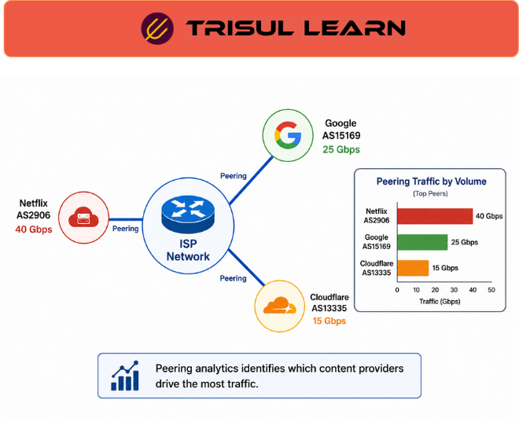

export const jsonLd = {
  "@context": "https://schema.org",
  "@type": "FAQPage",
  "mainEntity": [
    {
      "@type": "Question",
      "name": "What is peering traffic analysis?",
      "acceptedAnswer": {
        "@type": "Answer",
        "text": "Peering traffic analysis examines traffic exchanged between networks at peering and interconnection points using flow telemetry and BGP routing intelligence. It helps operators understand inter-network traffic behavior, interconnect utilization, routing influence, and traffic distribution across autonomous systems."
      }
    },
    {
      "@type": "Question",
      "name": "Why is peering traffic analysis important?",
      "acceptedAnswer": {
        "@type": "Answer",
        "text": "Peering traffic analysis helps operators understand how traffic moves between networks, identify congested interconnects, analyze traffic shifts, optimize capacity planning, and evaluate peering and transit relationships."
      }
    },
    {
      "@type": "Question",
      "name": "What data is used in peering analysis?",
      "acceptedAnswer": {
        "@type": "Answer",
        "text": "Peering analysis commonly uses flow telemetry, BGP routing information, ASN enrichment, interface utilization metrics, and historical traffic analytics to correlate traffic behavior with interconnection and routing activity."
      }
    },
    {
      "@type": "Question",
      "name": "How does peering analysis support ISP operations?",
      "acceptedAnswer": {
        "@type": "Answer",
        "text": "Peering analysis helps ISPs and carriers monitor interconnect utilization, investigate traffic distribution changes, analyze routing influence, identify congested peer links, and support long-term interconnection planning decisions."
      }
    }
  ]
};

# What is peering traffic analysis?

**Peering traffic analysis** is the examination of traffic exchanged between networks at peering and interconnection points using flow telemetry and BGP routing intelligence.

It helps ISPs, carriers, backbone operators, internet exchanges, and large service providers understand how traffic moves between autonomous systems, how routing behavior influences interconnection utilization, and how traffic distribution evolves across peering and transit relationships over time.

Peering traffic analysis is a core operational function in ISP and carrier environments because inter-network traffic behavior directly affects utilization, routing efficiency, congestion, customer experience, and interconnection planning.

---

## How peering traffic analysis works
Peering traffic analysis combines flow telemetry collected from peering interfaces with BGP routing information, ASN enrichment, interface utilization metrics, and historical traffic analytics to correlate traffic behavior with routing activity across interconnection environments.

Analytics platforms correlate flow telemetry with BGP intelligence to visualize how traffic moves across peer relationships, autonomous systems, interconnection links, destinations, and routing paths over time.

Traffic flows are enriched using routing information so operators can associate communication behavior with peer ASNs, origin networks, upstream and downstream paths, transit relationships, interconnection boundaries, and traffic direction.

This allows operators to analyze how routing changes, content-provider behavior, application traffic, and external network activity influence traffic distribution across peer relationships.

Traffic visibility therefore becomes operationally meaningful because telemetry is interpreted within the context of routing behavior and ASN relationships rather than as isolated flow records alone.

---

## Why peering traffic analysis matters in network operations
Peering traffic analysis is operationally important because interconnection environments are highly dynamic and traffic distribution between networks changes continuously over time.

Routing changes, content-delivery behavior, streaming activity, application growth, regional demand shifts, congestion conditions, and external network events can all significantly affect traffic distribution across peering and transit relationships.

Operators therefore use peering analytics to investigate traffic shifts, identify congested interconnects, monitor utilization trends, analyze asymmetric traffic distribution, evaluate peer relationships, and understand which networks or services are responsible for large-scale traffic growth across the environment.

Historical traffic visibility is especially important because peering behavior often changes by time of day, content-provider activity, routing policy changes, regional demand patterns, and evolving application behavior.

Long-term telemetry retention allows operators to compare traffic behavior over time, investigate recurring congestion patterns, validate interconnection upgrades, and analyze how routing or peering decisions influence traffic distribution historically.

Peering traffic analysis is widely used in ISP, carrier, backbone, and interconnection environments where operators require continuous visibility into how traffic exchanges between autonomous systems evolve across peering and transit relationships.

---

## Common peering analysis metrics
| Metric | Operational visibility |
|---|---|
| Traffic per peer ASN | Volume exchanged with specific autonomous systems |
| Ingress and egress traffic | Directional traffic distribution across peers |
| Link utilization | Capacity consumption on interconnects |
| Traffic trends | Utilization and behavioral changes over time |
| ASN distribution | Traffic breakdown across autonomous systems |
| Top destinations | High-volume networks, platforms, or services |

Together, these metrics help operators understand how inter-network traffic behaves across peering environments.

---

## What makes peering analysis operationally effective
Operationally effective peering analysis depends heavily on accurate BGP enrichment, scalable flow telemetry, interface-level visibility, historical retention, and continuous synchronization between routing intelligence and traffic analytics across distributed interconnection environments.

Missing, delayed, or outdated routing information can lead to incorrect ASN attribution, incomplete peer visibility, misleading traffic interpretation, and inaccurate operational analysis across peering environments.

Flow telemetry quality and telemetry retention are also operationally important because high-volume ISP and carrier infrastructures often require large-scale analytics, distributed flow collection, ASN-aware visibility, and long-term traffic analysis across massive interconnection ecosystems.

Peering visibility helps operators identify uneven traffic distribution, congested interconnects, routing instability, traffic-growth trends, dependency concentration, and evolving interconnection requirements before operational impact becomes severe.

As interconnection environments scale, organizations increasingly rely on telemetry correlation and historical traffic analytics to understand how routing behavior and inter-network communication evolve over time across complex carrier infrastructures.

---

## In Trisul
Trisul Network Analytics supports peering traffic analysis using ASN-aware flow analytics, BGP-enriched telemetry visibility, historical traffic analytics, ISP-oriented traffic analysis workflows, and long-term operational visibility across carrier and interconnection environments.

Using NetFlow, IPFIX, sFlow, BGP enrichment, and historical traffic telemetry, Trisul helps operators analyze traffic volume by ASN, investigate interconnect utilization, review peer traffic distribution, monitor upstream and downstream traffic behavior, analyze traffic shifts across peering relationships, and correlate routing behavior with traffic analytics across large ISP and carrier infrastructures.

Trisul also helps operations teams identify congestion trends, investigate changing traffic distribution patterns, review historical interconnection behavior, and maintain visibility into how traffic exchanges evolve across peering and transit ecosystems over time.

This becomes especially valuable in ISP, carrier, broadband, telecom, and internet-exchange environments where operational visibility depends heavily on understanding inter-network traffic behavior and ASN-aware traffic distribution.

Additional ISP analytics and flow-monitoring workflows are documented in the Trisul documentation:

[Trisul Documentation](https://docs.trisul.org/docs/ug/flow/)

---

## Related terms
- [BGP peering analytics](/glossary/bgp-peering-analytics)
- ASN
- [Transit traffic](/glossary/transit-traffic)
- [ISP traffic analytics](/glossary/isp-traffic-analytics)
- Flow monitoring
- BGP routing

---

## Frequently asked questions
### What is peering traffic analysis?

Peering traffic analysis examines traffic exchanged between networks at peering and interconnection points using flow telemetry and BGP routing intelligence. It helps operators understand inter-network traffic behavior, interconnect utilization, routing influence, and traffic distribution across autonomous systems.

### Why is peering traffic analysis important?

Peering traffic analysis helps operators understand how traffic moves between networks, identify congested interconnects, analyze traffic shifts, optimize capacity planning, and evaluate peering and transit relationships.

### What data is used in peering analysis?

Peering analysis commonly uses flow telemetry, BGP routing information, ASN enrichment, interface utilization metrics, and historical traffic analytics to correlate traffic behavior with interconnection and routing activity.

### How does peering analysis support ISP operations?

Peering analysis helps ISPs and carriers monitor interconnect utilization, investigate traffic distribution changes, analyze routing influence, identify congested peer links, and support long-term interconnection planning decisions.