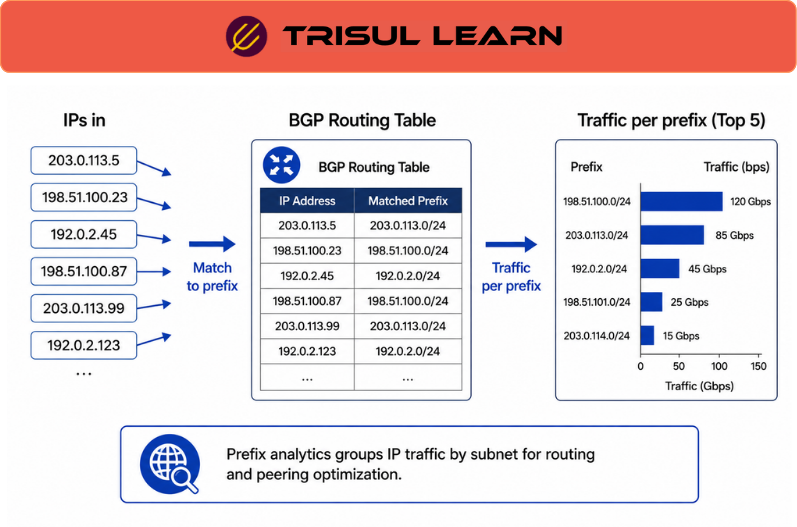

export const jsonLd = {
  "@context": "https://schema.org",
  "@type": "FAQPage",
  "mainEntity": [
    {
      "@type": "Question",
      "name": "What is prefix analytics?",
      "acceptedAnswer": {
        "@type": "Answer",
        "text": "Prefix analytics analyzes traffic by IP prefixes and CIDR blocks to understand routed traffic behavior, interconnection utilization, routing influence, traffic concentration, and ASN-related traffic distribution across enterprise and ISP environments."
      }
    },
    {
      "@type": "Question",
      "name": "What is an IP prefix?",
      "acceptedAnswer": {
        "@type": "Answer",
        "text": "An IP prefix is a CIDR-based representation of an IP address range such as 192.0.2.0/24 or 2001:db8::/32. Routing systems such as BGP use prefixes to represent reachable network ranges."
      }
    },
    {
      "@type": "Question",
      "name": "How does prefix analytics work?",
      "acceptedAnswer": {
        "@type": "Answer",
        "text": "Prefix analytics correlates flow telemetry with routing intelligence to reveal how traffic distributes across routed address space, autonomous systems, interconnection paths, gateways, and network segments over time."
      }
    },
    {
      "@type": "Question",
      "name": "Why is prefix analytics important?",
      "acceptedAnswer": {
        "@type": "Answer",
        "text": "Prefix analytics helps operators understand traffic concentration, routing influence, utilization growth, congested paths, and how traffic distribution changes across routed networks over time."
      }
    }
  ]
};

# What is prefix analytics?

**Prefix analytics** is the analysis of network traffic by IP prefixes and CIDR blocks to understand routed traffic behavior, interconnection utilization, routing influence, traffic concentration, and ASN-related traffic distribution across enterprise and ISP environments.

It correlates traffic telemetry with routing intelligence so operators can understand how traffic distributes across routed address space, autonomous systems, gateways, interconnection paths, and network segments over time.

Prefix analytics is widely used in ISP, carrier, backbone, interconnection, cloud, and traffic-engineering environments where routing behavior directly affects utilization, congestion, interconnect pressure, and operational visibility.

---

## What is an IP prefix?
An IP prefix is a CIDR-based representation of a routed IP address range such as:

- `192.0.2.0/24`
- `203.0.113.0/22`
- `2001:db8::/32`

Routing systems such as BGP use prefixes to advertise reachable networks between autonomous systems.

Traffic analytics platforms use these routed prefixes to classify and correlate traffic behavior across subnet ranges, interconnection environments, upstream networks, customer allocations, cloud infrastructure, and internet routing paths.

Prefix visibility therefore provides operational context that raw IP traffic alone cannot reliably provide.

---

## How prefix analytics works
Flow telemetry records contain source and destination addresses that can be mapped to routed prefixes using BGP routing tables, prefix databases, routing telemetry, and ASN enrichment.

Prefix analytics correlates flow telemetry with routing intelligence to reveal how traffic distributes across routed address space, autonomous systems, interconnection paths, gateways, and network segments over time.

Traffic flows are enriched using routing context so operators can analyze:
- traffic concentration across routed networks
- ingress and egress traffic behavior
- utilization changes by prefix
- ASN-related traffic distribution
- interconnect and gateway pressure
- routing-driven traffic shifts

Historical visibility allows operators to observe how traffic distribution evolves across prefixes during routing changes, application growth, content-distribution shifts, congestion events, and changing interconnection behavior.

Without routing enrichment, large traffic datasets often lose important operational meaning because traffic relationships between prefixes, routes, peers, and autonomous systems become difficult to interpret accurately.

---

## Prefix analytics in network operations
Prefix analytics is operationally important because routed traffic is rarely distributed evenly across networks.

Certain prefixes may suddenly dominate bandwidth consumption because of streaming activity, CDN behavior, cloud workloads, routing changes, customer growth, regional demand shifts, or interconnection changes.

Operators therefore use prefix analytics to understand how traffic distribution changes across routed address space over time, which prefixes contribute most heavily to utilization growth, and how routing behavior influences interconnection pressure, gateway utilization, and traffic-engineering decisions.

Prefix analytics is widely used in ISP, carrier, backbone, and interconnection environments where operators require visibility into how routed traffic distributes across prefixes, gateways, peers, and autonomous systems over time.

Historical analytics also become operationally important because routed traffic behavior changes continuously throughout the day depending on application activity, routing policy adjustments, regional traffic demand, content-provider behavior, and inter-network conditions.

Long-term visibility therefore helps operators investigate congestion patterns, validate traffic-engineering decisions, analyze changing utilization trends, identify traffic concentration risks, and understand how routing behavior affects operational traffic distribution historically.

---

## Common prefix analytics metrics
| Metric | Operational visibility |
|---|---|
| Traffic by prefix | Volume distribution across routed networks |
| Prefix utilization trends | Growth and behavioral changes over time |
| ASN-associated prefixes | Relationship between traffic and autonomous systems |
| Ingress and egress traffic | Directional routed traffic behavior |
| Gateway and interface utilization | Traffic distribution across interconnect paths |
| Top prefixes | Highest-volume routed address ranges |

These metrics help operators understand how traffic behaves across routed address space and interconnection environments.

---

## What makes prefix analytics operationally effective
Operationally effective prefix analytics depends heavily on scalable flow telemetry, accurate BGP enrichment, efficient indexing, historical retention, and continuous synchronization between routing intelligence and traffic visibility across large interconnection environments.

Outdated or incomplete routing information can create incorrect prefix attribution, misleading ASN visibility, inaccurate traffic interpretation, and operational blind spots across routed infrastructures.

Large-scale ISP and carrier environments may also generate enormous telemetry volumes continuously, making scalable ingestion, query efficiency, historical retention, and distributed analytics operationally important for long-term routed traffic visibility.

Prefix analytics becomes significantly more valuable when correlated with ASN analytics, interconnect telemetry, gateway visibility, traffic-engineering workflows, and historical traffic behavior across distributed infrastructures.

As carrier and enterprise networks scale, organizations increasingly rely on routing-aware analytics to maintain visibility into how traffic distribution evolves across prefixes, peers, gateways, and routed interconnection ecosystems over time.

---

## In Trisul
Trisul Network Analytics supports prefix analytics using BGP-enriched flow telemetry, ASN-aware traffic visibility, routed traffic analytics, gateway and interface visibility, and historical operational analytics across enterprise, ISP, telecom, broadband, and carrier environments.

Using NetFlow, IPFIX, sFlow, BGP routing enrichment, and historical traffic telemetry, Trisul helps operators analyze traffic distribution by prefix, investigate routed traffic concentration, review utilization growth across network ranges, monitor gateway and interconnect behavior, correlate ASN-related traffic activity, and analyze how routing behavior influences traffic distribution across large infrastructures.

Trisul also helps operations teams investigate changing traffic patterns, monitor routed utilization trends historically, identify heavily utilized prefixes, analyze interconnection pressure, and maintain visibility into how traffic flows across routed environments over time.

This becomes especially valuable in ISP, carrier, backbone, broadband, and cloud environments where operational visibility depends heavily on understanding routed traffic behavior and routing-aware traffic analytics at scale.

Additional ISP and flow-monitoring workflows are documented in the Trisul documentation:

https://docs.trisul.org/docs/ug/flow/

---

## Related terms
- [BGP peering analytics](/glossary/bgp-peering-analytics)
- ASN
- CIDR
- [Transit traffic](/glossary/transit-traffic)
- [ISP traffic analytics](/glossary/isp-traffic-analytics)
- Flow monitoring

---

## Frequently asked questions
### What is prefix analytics?

Prefix analytics analyzes traffic by IP prefixes and CIDR blocks to understand routed traffic behavior, interconnection utilization, routing influence, traffic concentration, and ASN-related traffic distribution across enterprise and ISP environments.

### What is an IP prefix?

An IP prefix is a CIDR-based representation of an IP address range such as 192.0.2.0/24 or 2001:db8::/32. Routing systems such as BGP use prefixes to represent reachable network ranges.

### How does prefix analytics work?

Prefix analytics correlates flow telemetry with routing intelligence to reveal how traffic distributes across routed address space, autonomous systems, interconnection paths, gateways, and network segments over time.

### Why is prefix analytics important?

Prefix analytics helps operators understand traffic concentration, routing influence, utilization growth, congested paths, and how traffic distribution changes across routed networks over time.