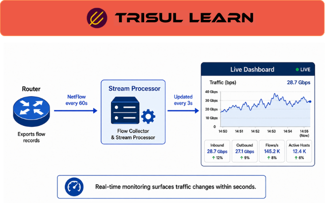

export const jsonLd = {
  "@context": "https://schema.org",
  "@type": "FAQPage",
  "mainEntity": [
    {
      "@type": "Question",
      "name": "What is realtime traffic monitoring?",
      "acceptedAnswer": {
        "@type": "Answer",
        "text": "Realtime traffic monitoring observes network traffic with minimal delay to provide near-immediate visibility into traffic patterns, congestion, anomalies, utilization, and changing network conditions across monitored infrastructure."
      }
    },
    {
      "@type": "Question",
      "name": "How does realtime monitoring work?",
      "acceptedAnswer": {
        "@type": "Answer",
        "text": "Realtime monitoring continuously collects and processes telemetry such as NetFlow, sFlow, IPFIX, packet data, or interface metrics, then updates dashboards, alerts, and traffic views with minimal delay."
      }
    },
    {
      "@type": "Question",
      "name": "What is the latency of realtime monitoring?",
      "acceptedAnswer": {
        "@type": "Answer",
        "text": "Realtime monitoring latency depends on telemetry-export intervals, processing capacity, collection architecture, and dashboard refresh behavior. Visibility is commonly available within seconds, although timing varies by deployment."
      }
    },
    {
      "@type": "Question",
      "name": "Why is realtime monitoring important?",
      "acceptedAnswer": {
        "@type": "Answer",
        "text": "Realtime monitoring is important because it helps operators quickly detect congestion, outages, abnormal traffic behavior, security-related activity, and performance degradation before issues significantly affect users or applications."
      }
    }
  ]
};

# What is realtime traffic monitoring?

**Realtime traffic monitoring** observes network traffic with minimal delay to provide near-immediate visibility into traffic patterns, congestion, anomalies, utilization, and changing network conditions across monitored infrastructure.

Realtime monitoring helps operators investigate traffic behavior as it occurs instead of relying only on delayed reporting or historical analysis.

It is widely used in enterprise, ISP, telecom, cloud, SD-WAN, and security-monitoring environments where rapid detection and fast response are important.

Realtime visibility helps operators identify and respond to rapidly evolving network conditions before they escalate into larger outages or performance problems.

---

## How realtime monitoring works
Realtime monitoring continuously processes incoming telemetry streams and updates dashboards, alerts, and traffic views with minimal delay.

Common telemetry sources include NetFlow, IPFIX, sFlow, packet-analysis workflows, interface telemetry, SNMP metrics, routing telemetry, and infrastructure monitoring systems.

This allows operators to observe changing traffic behavior, congestion, outages, application problems, routing instability, and abnormal activity as they occur.

Depending on telemetry frequency and infrastructure scale, realtime visibility may range from sub-second updates to several-second refresh intervals.

For example, during a DDoS attack or sudden traffic spike, realtime monitoring can immediately reveal changing bandwidth usage, affected interfaces, abnormal flows, or unexpected traffic sources.

Historical reporting is useful for trend analysis and long-term investigations, while realtime monitoring focuses on rapidly changing conditions that require immediate visibility.

---

## Realtime monitoring in network operations
Realtime monitoring is commonly used for congestion detection, interface-utilization analysis, WAN and SD-WAN visibility, application troubleshooting, security monitoring, VoIP analysis, outage investigations, and traffic-engineering workflows.

Operators commonly investigate traffic spikes, congested interfaces, high-bandwidth hosts, routing instability, packet loss, retransmissions, abnormal flows, DDoS-related traffic behavior, and sudden application-performance degradation.

Realtime monitoring is especially valuable during outages, congestion events, or security incidents where traffic behavior changes rapidly.

Because many network conditions evolve dynamically and may disappear before later analysis begins, realtime visibility is important for troubleshooting active incidents and understanding how traffic conditions change over time.

Historical visibility is also useful alongside realtime monitoring because many investigations require correlation between current conditions and earlier traffic behavior.

---

## Common realtime monitoring features
| Feature | Purpose |
|---|---|
| Traffic graphs | Visualize changing traffic patterns and utilization |
| Top-N visibility | Identify dominant hosts, applications, or conversations |
| Interface monitoring | Track bandwidth utilization and link behavior |
| Realtime alerts | Detect abnormal traffic or infrastructure conditions |
| Traffic-pattern analysis | Identify deviations from expected traffic behavior |

Available capabilities depend on telemetry frequency, infrastructure scale, processing architecture, and monitoring design.

---

## Challenges in realtime monitoring
Effective realtime monitoring depends on reliable telemetry export, scalable ingestion pipelines, efficient processing, accurate timestamps, and responsive visualization systems.

Common challenges include high-volume telemetry ingestion, export-interval variability, telemetry sampling limitations, distributed infrastructure scale, alert fatigue, temporary visibility gaps, and processing delays during large traffic spikes.

Organizations commonly combine flow telemetry, packet analysis, interface monitoring, alert correlation, historical traffic analysis, and traffic-pattern analysis to investigate changing network conditions more accurately.

Correlating these telemetry sources helps operators determine whether observed conditions represent transient bursts, sustained congestion, infrastructure instability, security-related activity, or abnormal traffic behavior.

---

## In Trisul
Trisul supports realtime traffic monitoring through flow telemetry analysis, realtime dashboards, packet analysis, historical traffic visibility, and traffic investigations.

Using NetFlow, J-Flow, sFlow, IPFIX, packet-analysis workflows, and historical traffic analysis, operators can monitor changing traffic behavior across interfaces and applications, analyze top hosts and conversations, investigate congestion and abnormal traffic spikes, correlate traffic behavior with historical patterns, troubleshoot active incidents, and perform realtime and historical investigations across enterprise, ISP, telecom, WAN, SD-WAN, cloud, and security-monitoring environments.

Additional traffic-analysis workflows are documented in the Trisul documentation:

https://docs.trisul.org/docs/ug/cg/tasks/

---

## Related terms
- What is flow monitoring?
- What is live traffic monitoring?
- [What is traffic pattern analysis?](/glossary/traffic-pattern-analysis)
- What is a network dashboard?
- [What is NetFlow?](/glossary/netflow)

---

## Frequently asked questions
### What is realtime traffic monitoring?

Realtime traffic monitoring observes network traffic with minimal delay to provide near-immediate visibility into traffic patterns, congestion, anomalies, utilization, and changing network conditions across monitored infrastructure.

### How does realtime monitoring work?

Realtime monitoring continuously collects and processes telemetry such as NetFlow, sFlow, IPFIX, packet data, or interface metrics, then updates dashboards, alerts, and traffic views with minimal delay.

### What is the latency of realtime monitoring?

Realtime monitoring latency depends on telemetry-export intervals, processing capacity, collection architecture, and dashboard refresh behavior. Visibility is commonly available within seconds, although timing varies by deployment.

### Why is realtime monitoring important?

Realtime monitoring is important because it helps operators quickly detect congestion, outages, abnormal traffic behavior, security-related activity, and performance degradation before issues significantly affect users or applications.

### What is the difference between realtime monitoring and historical analysis?

Realtime monitoring focuses on rapidly changing conditions requiring immediate visibility, while historical analysis is used for long-term trend analysis, reporting, and retrospective investigations.

### Why is realtime monitoring useful during incidents?

Realtime monitoring helps operators observe changing traffic conditions while incidents are actively occurring, making it easier to investigate outages, congestion, DDoS events, abnormal flows, or sudden application-performance problems.