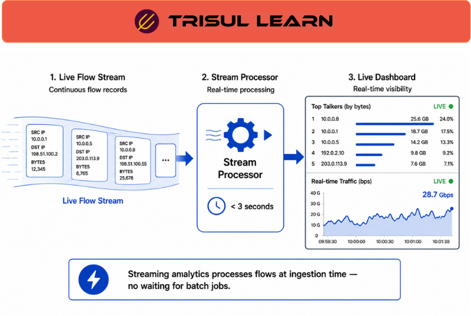

export const jsonLd = {
  "@context": "https://schema.org",
  "@type": "FAQPage",
  "mainEntity": [
    {
      "@type": "Question",
      "name": "What is streaming analytics?",
      "acceptedAnswer": {
        "@type": "Answer",
        "text": "Streaming analytics continuously processes telemetry and event data as it arrives to provide near real-time visibility, anomaly detection, alerting, and traffic analysis across network environments."
      }
    },
    {
      "@type": "Question",
      "name": "How does streaming analytics work?",
      "acceptedAnswer": {
        "@type": "Answer",
        "text": "Streaming analytics continuously processes incoming telemetry and event streams as they arrive. Metrics, aggregations, alerts, and anomaly detection logic are updated incrementally without waiting for scheduled batch-processing cycles."
      }
    },
    {
      "@type": "Question",
      "name": "What are the benefits of streaming analytics?",
      "acceptedAnswer": {
        "@type": "Answer",
        "text": "Streaming analytics improves detection speed and visibility by reducing the delay between event occurrence and analysis. It supports faster troubleshooting, anomaly detection, traffic analysis, and security response."
      }
    },
    {
      "@type": "Question",
      "name": "When is streaming analytics used?",
      "acceptedAnswer": {
        "@type": "Answer",
        "text": "Streaming analytics is commonly used for near real-time traffic monitoring, anomaly detection, DDoS visibility, security monitoring, application analysis, alerting, and live dashboarding."
      }
    }
  ]
};

# What is streaming analytics?

**Streaming analytics** continuously processes telemetry and event data as it arrives to provide near real-time visibility, anomaly detection, alerting, and traffic analysis across network environments.

Unlike traditional batch analytics, which analyzes stored data periodically, streaming analytics evaluates incoming telemetry continuously while the data is still flowing through monitoring systems.

Streaming analytics is widely used in enterprise, ISP, telecom, cloud, and security-monitoring environments where rapid detection and low-latency visibility are important.

Streaming analytics is commonly used in event-driven monitoring architectures where continuous telemetry processing and rapid response are required.

---

## How streaming analytics works
Streaming analytics platforms process telemetry continuously as events arrive instead of waiting for scheduled batch-processing intervals.

Metrics, aggregations, alerts, anomaly-detection logic, and traffic views are updated incrementally in near realtime.

This allows teams to detect congestion, attacks, failures, application degradation, or abnormal traffic behavior while events are still actively developing.

Streaming analytics commonly processes telemetry such as:

- NetFlow
- IPFIX
- sFlow
- Packet-analysis telemetry
- SNMP telemetry
- Application telemetry
- Security-event streams
- Infrastructure events

Streaming analytics is especially valuable when delayed analysis could allow outages, attacks, congestion, or application problems to worsen before detection occurs.

For example, a streaming analytics platform may detect a sudden DDoS traffic spike within seconds and immediately trigger alerts before link congestion becomes severe.

Depending on telemetry volume, export frequency, infrastructure scale, and processing architecture, streaming systems may operate with varying levels of near real-time processing latency.

---

## Streaming analytics in network operations
Streaming analytics is commonly used for near real-time traffic monitoring, anomaly detection, DDoS visibility, congestion detection, application-performance analysis, security-event monitoring, WAN and SD-WAN visibility, capacity monitoring, and live dashboarding.

Teams commonly investigate traffic spikes, anomalous flows, high-bandwidth hosts, congested interfaces, packet loss, jitter, routing instability, suspicious communication behavior, and application slowdowns.

Because many network and security events evolve rapidly, continuous telemetry analysis is important for detecting abnormal behavior before service degradation or outages become widespread.

Historical visibility is especially useful for validating alerts, investigating recurring anomalies, analyzing traffic trends, and correlating past events with live telemetry conditions.

---

## Streaming vs batch analytics
| Aspect | Streaming analytics | Batch analytics |
|---|---|---|
| Processing model | Continuous event processing | Periodic scheduled processing |
| Visibility latency | Near realtime | Delayed |
| Typical use case | Live monitoring and anomaly detection | Historical analysis and reporting |
| Processing behavior | Incremental updates | Deferred large-scale computation |
| Best suited for | Rapid detection and live visibility | Long-term trend analysis |

Both approaches are commonly used together because streaming analytics provides rapid visibility while batch analytics supports historical analysis and large-scale reporting.

---

## Benefits and challenges of streaming analytics
Streaming analytics improves detection speed, anomaly visibility, alert responsiveness, and continuous awareness of changing network conditions.

However, high telemetry volume, distributed processing complexity, processing backpressure, alert fatigue, temporary telemetry gaps, scaling limitations, and short-lived event visibility can complicate large-scale deployments.

Organizations commonly combine flow telemetry, packet analysis, historical traffic analysis, interface monitoring, alert correlation, traffic-pattern analysis, and security telemetry to investigate abnormal network behavior.

Correlating these telemetry sources helps teams determine whether observed events represent transient spikes, sustained congestion, security incidents, infrastructure instability, application degradation, or abnormal communication patterns.

---

## In Trisul
Trisul supports streaming-oriented traffic visibility through flow telemetry analysis, near real-time dashboards, historical traffic visibility, anomaly analysis, and traffic investigations.

Using NetFlow, J-Flow, sFlow, IPFIX, packet-analysis workflows, and traffic-analysis capabilities, operators can analyze traffic behavior as telemetry arrives, investigate anomalies, congestion, DDoS activity, and abnormal traffic patterns, correlate traffic behavior with hosts, applications, interfaces, and network conditions, support near real-time monitoring and alerting workflows, and perform historical investigations alongside live telemetry analysis across enterprise, ISP, telecom, cloud, WAN, and security-monitoring environments.

Additional traffic-analysis and monitoring workflows are documented in the Trisul documentation:

https://docs.trisul.org/docs/ug/cg/tasks/

---

## Related terms
- [What is realtime traffic monitoring?](/glossary/realtime-traffic-monitoring)
- What is flow monitoring?
- [What is traffic pattern analysis?](/glossary/traffic-pattern-analysis)
- [What is alerting?](/glossary/alerting)
- [What is batch processing?](/glossary/batch-processing)

---

## Frequently asked questions
### What is streaming analytics?

Streaming analytics continuously processes telemetry and event data as it arrives to provide near real-time visibility, anomaly detection, alerting, and traffic analysis across network environments.

### How does streaming analytics work?

Streaming analytics continuously processes incoming telemetry and event streams as they arrive. Metrics, aggregations, alerts, and anomaly detection logic are updated incrementally without waiting for scheduled batch-processing cycles.

### What are the benefits of streaming analytics?

Streaming analytics improves detection speed and visibility by reducing the delay between event occurrence and analysis. It supports faster troubleshooting, anomaly detection, traffic analysis, and security response.

### When is streaming analytics used?

Streaming analytics is commonly used for near real-time traffic monitoring, anomaly detection, DDoS visibility, security monitoring, application analysis, alerting, and live dashboarding.

### Why is streaming analytics important for security monitoring?

Streaming analytics helps security teams detect attacks, suspicious traffic, or abnormal communication behavior quickly before incidents spread or significantly affect services.

### What is the difference between streaming analytics and batch analytics?

Streaming analytics processes events continuously as they occur, while batch analytics analyzes stored data periodically after collection. Streaming analytics prioritizes rapid detection, while batch analytics focuses more on historical analysis and reporting.