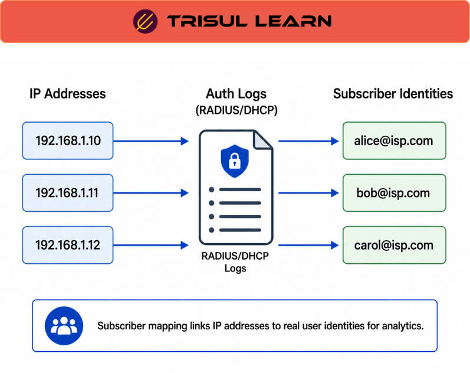

export const jsonLd = {
  "@context": "https://schema.org",
  "@type": "FAQPage",
  "mainEntity": [
    {
      "@type": "Question",
      "name": "What is subscriber mapping?",
      "acceptedAnswer": {
        "@type": "Answer",
        "text": "Subscriber mapping correlates IP addresses, session activity, authentication telemetry, and network identifiers with subscriber identities in order to preserve attribution continuity, reconstruct operational activity, investigate subscriber behavior, and maintain searchable subscriber-aware visibility across ISP and service-provider environments."
      }
    },
    {
      "@type": "Question",
      "name": "How does subscriber mapping work?",
      "acceptedAnswer": {
        "@type": "Answer",
        "text": "Subscriber mapping correlates network identifiers such as IP addresses, authentication sessions, DHCP leases, PPPoE sessions, and session telemetry with subscriber identities using RADIUS logs, authentication systems, DHCP records, and historical session correlation workflows."
      }
    },
    {
      "@type": "Question",
      "name": "Why is subscriber mapping important?",
      "acceptedAnswer": {
        "@type": "Answer",
        "text": "Subscriber mapping is important because providers must associate traffic activity with subscriber identity in order to support troubleshooting, operational investigations, usage analysis, customer-experience visibility, abuse management, and historical attribution workflows."
      }
    },
    {
      "@type": "Question",
      "name": "What challenges affect subscriber mapping?",
      "acceptedAnswer": {
        "@type": "Answer",
        "text": "Dynamic IP addressing, NAT environments, roaming sessions, timestamp inconsistency, incomplete telemetry, and changing subscriber-session relationships can significantly complicate historical attribution and subscriber-identity correlation workflows."
      }
    }
  ]
};

# What is subscriber mapping?

**Subscriber mapping** correlates IP addresses, session activity, authentication telemetry, and network identifiers with subscriber identities in order to preserve attribution continuity, reconstruct operational activity, investigate subscriber behavior, and maintain searchable subscriber-aware visibility across ISP and service-provider environments.

Unlike generic traffic analytics that primarily expose IP addresses or infrastructure identifiers independently, subscriber mapping helps organizations understand which subscriber, user, customer account, or operational session generated specific traffic behavior across evolving network conditions.

Subscriber mapping therefore preserves operational identity continuity by correlating changing network identifiers, authentication telemetry, session state, infrastructure activity, and historical operational records into searchable attribution workflows across time.

This becomes operationally important because subscriber identity relationships continuously evolve in real-world provider environments due to:
- dynamic IP addressing
- DHCP lease changes
- PPPoE reconnections
- roaming behavior
- NAT and CGNAT environments
- session expiration
- infrastructure mobility

Without subscriber mapping, traffic investigations frequently lose meaningful subscriber context and become limited to infrastructure identifiers that may no longer represent the original user or session accurately.

---

## How subscriber mapping works
Subscriber mapping correlates network identifiers with subscriber identity information using authentication systems, session telemetry, infrastructure records, and historical operational correlation workflows.

Subscriber attribution commonly relies on correlating:
- RADIUS authentication activity
- DHCP lease records
- PPPoE session telemetry
- authentication systems
- IP allocation records
- access-network information
- session-management telemetry
- historical connection activity

with subscriber identity context such as:
- subscriber accounts
- usernames
- session ownership
- service identifiers
- customer relationships

Traffic analytics systems can then associate flow telemetry, traffic behavior, application activity, session analytics, QoE visibility, and historical traffic patterns with subscriber-aware operational context.

Subscriber mapping enables operators to reconstruct subscriber-specific bandwidth usage, application behavior, session activity, historical traffic patterns, congestion impact, and operational anomalies across large provider environments.

Dynamic IP addressing and NAT environments often require historical correlation workflows because subscriber-to-IP relationships may change continuously across time.

Operationally effective subscriber mapping therefore depends heavily on maintaining searchable historical attribution relationships rather than relying only on current infrastructure state.

---

## Subscriber mapping in network operations
Subscriber mapping is operationally important because providers must continuously associate traffic activity with subscriber identity across changing infrastructure conditions and evolving session behavior.

Operations and security teams rely on subscriber mapping to investigate subscriber-specific operational issues, reconstruct historical attribution, analyze bandwidth consumption behavior, investigate abuse complaints, troubleshoot customer-impacting issues, analyze QoE degradation, and maintain subscriber-aware operational visibility across distributed infrastructures.

This becomes especially important in ISP, broadband, telecom, wireless, mobile, and managed-service environments where subscriber attribution accuracy directly affects:
- troubleshooting workflows
- customer-experience analysis
- operational investigations
- abuse management
- lawful investigations
- capacity planning
- traffic engineering
- historical operational visibility

Subscriber mapping also helps organizations identify:
- high-bandwidth subscriber behavior
- recurring service degradation
- abnormal usage activity
- congestion-affected subscriber groups
- unstable session behavior
- historical traffic anomalies
- subscriber-impacting infrastructure conditions

Historical subscriber visibility becomes critically important during retrospective investigations because operators often need to reconstruct subscriber identity relationships long after the original activity occurred.

Subscriber mapping therefore functions as a long-term operational attribution framework that preserves subscriber identity continuity across changing network state and evolving infrastructure conditions.

---

## Common subscriber mapping sources
| Source | Operational purpose |
|---|---|
| RADIUS telemetry | Subscriber authentication and session attribution |
| DHCP lease records | Dynamic IP-to-subscriber correlation |
| PPPoE session telemetry | Session ownership and subscriber visibility |
| Authentication systems | Identity validation and access correlation |
| IP allocation systems | Historical address-management visibility |
| Session-management telemetry | Historical attribution reconstruction |

Different provider architectures may implement subscriber mapping differently depending on operational scale, access-network design, and attribution requirements.

---

## What makes subscriber mapping operationally effective
Operationally effective subscriber mapping depends heavily on authentication accuracy, timestamp consistency, historical retention, session correlation, telemetry reliability, and searchable attribution workflows because inaccurate or incomplete mappings can significantly reduce investigative accuracy and subscriber visibility.

Dynamic addressing, NAT environments, roaming behavior, session expiration, inconsistent telemetry, and fragmented attribution systems can complicate historical subscriber reconstruction and weaken operational investigations substantially.

Subscriber mapping becomes significantly more valuable when correlated with:
- flow telemetry
- QoE analytics
- authentication activity
- application visibility
- infrastructure telemetry
- operational investigations
- historical traffic visibility
- anomaly analysis

within unified subscriber-aware analytical workflows.

As subscriber populations scale, organizations increasingly rely on searchable historical mappings, distributed attribution systems, subscriber-aware indexing, telemetry correlation, and long-term retention workflows to preserve operational attribution continuity across large environments.

Subscriber mapping therefore functions as a searchable operational identity-correlation framework that helps providers maintain accurate subscriber attribution visibility across evolving infrastructure conditions over time.

---

## In Trisul
Trisul Network Analytics supports subscriber-aware traffic analysis workflows using flow-based traffic analytics, historical traffic visibility, RADIUS-aware telemetry correlation, searchable attribution workflows, subscriber usage analysis, and operational traffic investigation across distributed environments.

Using NetFlow, IPFIX, sFlow, historical traffic analytics, authentication-aware telemetry correlation, and searchable operational visibility, Trisul helps operators correlate subscriber identity with traffic behavior, investigate subscriber-specific operational anomalies, reconstruct historical usage activity, analyze bandwidth-consumption behavior, investigate congestion-related service impact, maintain subscriber-aware historical visibility, and support retrospective attribution investigations across ISP, broadband, telecom, and managed-service infrastructures.

Trisul also helps organizations correlate subscriber traffic behavior with QoE analysis, infrastructure utilization, anomaly visibility, historical investigations, and operational troubleshooting workflows in order to improve visibility into how subscriber activity evolves across changing network conditions over time.

This becomes especially valuable in environments where operational investigations, subscriber-aware analytics, customer troubleshooting, and historical attribution workflows depend heavily on long-term searchable subscriber visibility.

For subscriber-aware traffic analytics and flow visibility workflows, see the Trisul documentation:

https://docs.trisul.org/docs/ug/flow/

---

## Related terms
- [Subscriber analytics](/glossary/subscriber-analytics)
- [RADIUS logging](/glossary/radius-logging)
- [ISP traffic analytics](/glossary/isp-traffic-analytics)
- User traffic analytics
- [DHCP](/glossary/dhcp)
- [Quality of experience](/glossary/quality-of-experience)

---

## Frequently asked questions
### What is subscriber mapping?

Subscriber mapping correlates IP addresses, session activity, authentication telemetry, and network identifiers with subscriber identities in order to preserve attribution continuity, reconstruct operational activity, investigate subscriber behavior, and maintain searchable subscriber-aware visibility across ISP and service-provider environments.

### How does subscriber mapping work?

Subscriber mapping correlates network identifiers such as IP addresses, authentication sessions, DHCP leases, PPPoE sessions, and session telemetry with subscriber identities using RADIUS logs, authentication systems, DHCP records, and historical session correlation workflows.

### Why is subscriber mapping important?

Subscriber mapping is important because providers must associate traffic activity with subscriber identity in order to support troubleshooting, operational investigations, usage analysis, customer-experience visibility, abuse management, and historical attribution workflows.

### What challenges affect subscriber mapping?

Dynamic IP addressing, NAT environments, roaming sessions, timestamp inconsistency, incomplete telemetry, and changing subscriber-session relationships can significantly complicate historical attribution and subscriber-identity correlation workflows.