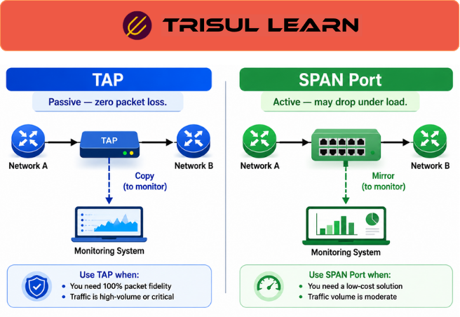

export const jsonLd = {
  "@context": "https://schema.org",
  "@type": "FAQPage",
  "mainEntity": [
    {
      "@type": "Question",
      "name": "What is the difference between TAP and SPAN port?",
      "acceptedAnswer": {
        "@type": "Answer",
        "text": "Network TAPs (Test Access Points) passively copy network traffic directly from a link, while SPAN ports (Switched Port Analyzer) use switch-based traffic mirroring. TAPs generally provide more reliable packet visibility, while SPAN ports are easier to deploy using existing switch infrastructure."
      }
    },
    {
      "@type": "Question",
      "name": "When should you use a TAP?",
      "acceptedAnswer": {
        "@type": "Answer",
        "text": "TAPs are commonly used for packet capture, forensic analysis, high-fidelity traffic monitoring, IDS visibility, and environments where complete packet visibility is important."
      }
    },
    {
      "@type": "Question",
      "name": "When should you use a SPAN port?",
      "acceptedAnswer": {
        "@type": "Answer",
        "text": "SPAN ports are commonly used for troubleshooting, temporary monitoring, protocol analysis, and environments where rapid deployment and flexible configuration are more important than complete packet fidelity."
      }
    },
    {
      "@type": "Question",
      "name": "What are the pros and cons of TAP vs SPAN?",
      "acceptedAnswer": {
        "@type": "Answer",
        "text": "TAPs generally provide high-fidelity passive visibility with minimal forwarding impact but require additional hardware and physical installation. SPAN ports are easier to configure and require no dedicated monitoring hardware, but mirrored traffic may be affected by switch load or oversubscription."
      }
    }
  ]
};

# What is TAP vs SPAN port?

**TAP vs SPAN port** compares two common methods for network traffic observation and packet visibility.

- **Network TAPs (Test Access Points)** passively copy traffic directly from a network link.
- **SPAN ports (Switched Port Analyzer)** use switch-based traffic mirroring to forward copied packets to monitoring systems.

Both approaches are widely used for packet capture, traffic analysis, troubleshooting, security monitoring, and protocol visibility across enterprise, ISP, telecom, cloud, and data-center environments.

The primary difference is that TAPs prioritize reliable packet fidelity, while SPAN ports prioritize flexible deployment using existing switch infrastructure.

---

## How TAP and SPAN work
### Network TAPs

A network TAP is installed directly in the traffic path and passively copies packets to monitoring interfaces without modifying production traffic.

Because TAPs operate independently of switch forwarding logic, monitoring visibility is less affected by switch CPU load, mirroring limitations, or oversubscription conditions.

TAPs are commonly used for packet capture, forensic analysis, IDS visibility, security monitoring, compliance monitoring, and environments where complete packet visibility is important.

TAP deployments may include passive optical TAPs, active copper TAPs, aggregation TAPs, or regeneration TAPs depending on infrastructure design and monitoring requirements.

Because TAPs operate independently of switch forwarding behavior, they generally provide highly reliable packet visibility even during periods of heavy traffic.

### SPAN ports

SPAN ports use switch-based traffic mirroring to duplicate selected traffic from interfaces, VLANs, trunks, or port channels to a monitoring destination port.

SPAN ports are commonly used for troubleshooting, protocol analysis, temporary monitoring, packet visibility, traffic analysis, and rapid monitoring deployment using existing switching infrastructure.

Unlike TAPs, SPAN traffic visibility depends on switch architecture, available mirroring resources, and switch load conditions.

Under high utilization or oversubscription conditions, mirrored packets may become incomplete, delayed, or dropped.

SPAN ports are often preferred when flexible monitoring configuration is more important than complete packet fidelity.

TAPs are generally preferred when complete packet visibility is required because SPAN traffic may become incomplete during switch congestion or oversubscription.

---

## TAP vs SPAN in network operations
TAPs are commonly preferred for packet capture, forensic analysis, security monitoring, and environments where highly reliable packet visibility is important.

SPAN ports are commonly preferred for flexible troubleshooting, temporary monitoring, protocol inspection, and rapid deployment without requiring additional hardware installation.

Teams commonly investigate retransmissions, packet loss, VoIP-quality problems, application latency, DNS anomalies, suspicious traffic behavior, east-west traffic patterns, and protocol-level communication issues.

Because monitoring visibility depends heavily on observation-point placement, incomplete or poorly positioned visibility can limit troubleshooting accuracy and security investigations.

Historical visibility is especially useful for comparing traffic behavior across TAP-fed and SPAN-fed monitoring environments and validating packet-capture quality during investigations.

---

## TAP vs SPAN comparison
| Aspect | Network TAP | SPAN Port |
|---|---|---|
| Visibility model | Passive traffic copy | Switch-based traffic mirroring |
| Packet fidelity | Generally highly reliable | May be affected by switch load |
| Infrastructure impact | Minimal forwarding impact | Consumes switch mirroring resources |
| Deployment | Physical installation required | Software configuration on switch |
| Hardware requirements | Dedicated TAP hardware | Existing switch infrastructure |
| Flexibility | Fixed monitoring point | Rapid and flexible configuration |
| Common use cases | Packet capture, forensics, IDS visibility | Troubleshooting, protocol analysis, temporary monitoring |

Actual deployment suitability depends on traffic volume, infrastructure architecture, packet-fidelity requirements, monitoring objectives, and operational constraints.

---

## Why TAP vs SPAN matters
Effective packet visibility depends on observation-point placement, monitoring-link capacity, packet-fidelity requirements, and the scalability of monitoring infrastructure.

SPAN deployments may suffer from oversubscription, switch-resource limitations, or incomplete mirrored traffic during heavy utilization.

TAP deployments generally provide more reliable packet visibility but may require additional hardware, physical installation, and higher deployment complexity.

Organizations commonly combine packet analysis, flow telemetry, historical traffic analysis, IDS/IPS telemetry, interface monitoring, and alert correlation to investigate traffic behavior across monitored environments.

Correlating these telemetry sources helps teams determine whether observed issues originate from congestion, application behavior, security activity, routing instability, protocol anomalies, or infrastructure limitations.

---

## In Trisul
Trisul supports packet-analysis and traffic-visibility workflows using traffic feeds from both TAPs and SPAN ports.

Using NetFlow, IPFIX, packet-analysis workflows, and traffic-analysis capabilities, operators can analyze packet-level traffic behavior, investigate retransmissions, latency, packet loss, and protocol anomalies, correlate traffic activity with hosts, applications, interfaces, and network conditions, support troubleshooting and security-monitoring workflows, and perform historical investigations across TAP-fed and SPAN-fed monitoring environments.

Additional packet-analysis workflows are documented in the Trisul documentation:

https://docs.trisul.org/docs/ug/caps/

---

## Related terms
- [What is network TAP?](/glossary/network-tap)
- [What is SPAN port?](/glossary/span-port)
- [What is packet capture?](/glossary/packet-capture)
- [What is observation point?](/glossary/observation-point)
- [What is passive network monitoring?](/glossary/passive-network-monitoring)

---

## Frequently asked questions
### What is the difference between TAP and SPAN port?

Network TAPs (Test Access Points) passively copy network traffic directly from a link, while SPAN ports (Switched Port Analyzer) use switch-based traffic mirroring. TAPs generally provide more reliable packet visibility, while SPAN ports are easier to deploy using existing switch infrastructure.

### When should you use a TAP?

TAPs are commonly used for packet capture, forensic analysis, high-fidelity traffic monitoring, IDS visibility, and environments where complete packet visibility is important.

### When should you use a SPAN port?

SPAN ports are commonly used for troubleshooting, temporary monitoring, protocol analysis, and environments where rapid deployment and flexible configuration are more important than complete packet fidelity.

### What are the pros and cons of TAP vs SPAN?

TAPs generally provide high-fidelity passive visibility with minimal forwarding impact but require additional hardware and physical installation. SPAN ports are easier to configure and require no dedicated monitoring hardware, but mirrored traffic may be affected by switch load or oversubscription.

### Why are TAPs considered more reliable for packet visibility?

Because TAPs operate independently of switch forwarding logic, packet visibility is less affected by switch load, oversubscription, or mirroring limitations.

### Why can SPAN ports miss packets?

SPAN ports rely on switch mirroring resources. During congestion or high utilization, mirrored traffic may become incomplete, delayed, or dropped.