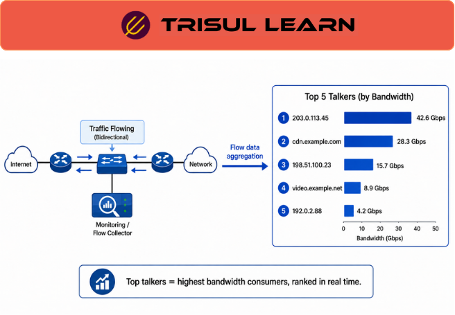

export const jsonLd = {
"@context": "https://schema.org",
"@type": "FAQPage",
"mainEntity": [
{
"@type": "Question",
"name": "What are top talkers?",
"acceptedAnswer": {
"@type": "Answer",
"text": "Top talkers are the hosts, applications, conversations, or network entities responsible for the largest share of network traffic. Top-talker analysis helps operators identify bandwidth consumers, investigate congestion, understand traffic behavior, and support capacity planning."
}
},
{
"@type": "Question",
"name": "How are top talkers identified?",
"acceptedAnswer": {
"@type": "Answer",
"text": "Top talkers are identified by aggregating traffic metrics such as bytes, packets, or flows and ranking entities by volume. Analysis can be performed across hosts, conversations, applications, interfaces, autonomous systems, subscribers, or other traffic dimensions."
}
},
{
"@type": "Question",
"name": "Why analyze top talkers?",
"acceptedAnswer": {
"@type": "Answer",
"text": "Top-talker analysis helps operators quickly identify where bandwidth is being consumed, investigate traffic anomalies, validate traffic policies, support capacity planning, and understand changing traffic behavior across the network."
}
},
{
"@type": "Question",
"name": "What are common top-talker use cases?",
"acceptedAnswer": {
"@type": "Answer",
"text": "Top-talker analysis is commonly used for bandwidth monitoring, congestion investigations, capacity planning, traffic engineering, application visibility, subscriber analysis, and troubleshooting workflows."
}
}
]
};

# What are top talkers?

**Top talkers** are the hosts, applications, conversations, or network entities responsible for the largest share of network traffic during a given period.

Top-talker analysis helps operators quickly identify where bandwidth is being consumed, explain traffic growth, investigate congestion, validate network policies, and understand changing traffic behavior across the network.

Because a relatively small number of entities often account for a large percentage of overall traffic, top-talker views provide a fast way to understand how network resources are being used without examining every individual flow or packet.

As a result, top-talker analysis remains one of the most widely used traffic-analysis techniques in enterprise networks, ISPs, cloud environments, and service-provider infrastructures.

---

## How top talkers work
Top-talker analysis aggregates traffic metrics such as bytes, packets, or flows and ranks entities by volume. The analysis can be applied to hosts, conversations, applications, interfaces, subscribers, autonomous systems, countries, or other traffic dimensions depending on operational requirements.

By reducing large traffic datasets into a small set of dominant entities, top-talker analysis helps operators rapidly identify where network resources are being consumed and which traffic sources deserve further investigation.

Different time windows can reveal different operational insights. Short intervals help identify current traffic conditions, while longer historical periods reveal sustained usage patterns, recurring behavior, and long-term traffic trends.

---

## Top talkers in network operations
Top-talker analysis is often one of the first views operators examine during troubleshooting because it immediately reveals where traffic is concentrated.

A sudden increase in bandwidth consumption, unexpected application growth, overloaded WAN links, subscriber abuse, or abnormal traffic behavior often becomes visible through changes in top-talker rankings. These changes provide valuable operational context during congestion investigations, capacity-planning exercises, traffic-engineering decisions, and security investigations.

While high traffic volume is not inherently suspicious, identifying the entities responsible for the majority of network activity helps operators move quickly from symptoms to root-cause analysis.

Top-talker visibility is also valuable for validating QoS policies, understanding application adoption, identifying inefficient traffic patterns, and ensuring infrastructure resources are being used as expected.

---

## What makes top-talker analysis effective
Top-talker analysis is effective because it compresses large traffic datasets into a small number of high-impact entities that operators can investigate immediately.

Rather than examining millions of flows individually, analysts can focus on the hosts, applications, conversations, subscribers, or destinations responsible for the majority of network activity and then drill deeper into the underlying traffic behavior.

Historical visibility further improves top-talker analysis by allowing operators to compare current traffic patterns against previous baselines, identify meaningful changes in network usage, and understand how traffic behavior evolves over time.

Top-talker views are therefore most valuable when integrated with broader traffic-analysis workflows that support filtering, drill-down investigation, historical analysis, and root-cause troubleshooting.

---

## In Trisul
Top-talker analysis is a core investigative workflow in Trisul Network Analytics.

Trisul helps operators identify dominant traffic consumers, investigate bandwidth growth, analyze application usage, validate capacity-planning decisions, and understand changing traffic behavior across enterprise and ISP environments.

Because top-talker views are integrated with historical traffic visibility, flow analytics, ASN analytics, subscriber analytics, and drill-down investigation workflows, operators can move quickly from high-level rankings into detailed traffic analysis and root-cause investigations.

This makes top-talker analysis particularly valuable during congestion investigations, bandwidth-planning exercises, subscriber troubleshooting, application-performance analysis, and operational visibility workflows.

For examples of traffic visibility and network analytics workflows, see the Trisul use cases:

https://www.trisul.org/trisul-netflow-analyzer-usecases/

---

## Related terms
* What is bandwidth monitoring?
* What is flow monitoring?
* [What is network traffic analysis?](/glossary/network-traffic-analysis)
* [What is Top-K Analyticsᵀ?](/glossary/top-k-analytics)
* [What is traffic pattern analysis?](/glossary/traffic-pattern-analysis)

---

## Frequently asked questions
### What are top talkers?

Top talkers are the hosts, applications, conversations, or network entities responsible for the largest share of network traffic during a given period.

### How are top talkers identified?

Top talkers are identified by aggregating traffic metrics such as bytes, packets, or flows and ranking entities by volume. Analysis can be performed across hosts, conversations, applications, interfaces, subscribers, autonomous systems, or other traffic dimensions.

### Why analyze top talkers?

Top-talker analysis helps operators identify bandwidth consumers, investigate congestion, understand traffic behavior, validate traffic policies, and support capacity planning.

### What are common top-talker use cases?

Top-talker analysis is commonly used for bandwidth monitoring, congestion investigations, capacity planning, traffic engineering, application visibility, subscriber analysis, and troubleshooting workflows.
