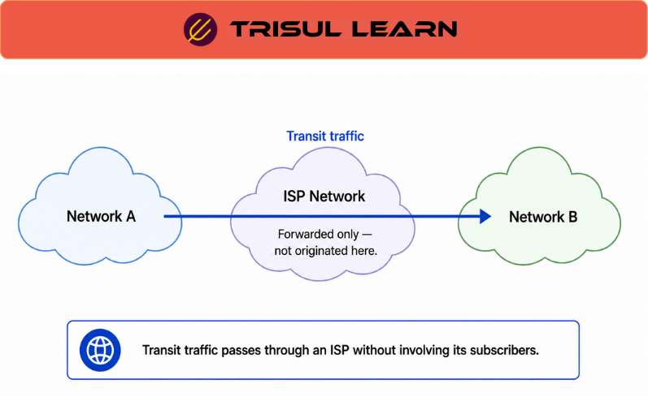

export const jsonLd = {
"@context": "https://schema.org",
"@type": "FAQPage",
"mainEntity": [
{
"@type": "Question",
"name": "What is transit traffic?",
"acceptedAnswer": {
"@type": "Answer",
"text": "Transit traffic is traffic that an ISP or network operator forwards between external networks. Transit traffic analysis helps operators understand traffic exchange patterns, optimize routing and peering decisions, manage upstream utilization, and plan network capacity."
}
},
{
"@type": "Question",
"name": "How does transit traffic differ from customer traffic?",
"acceptedAnswer": {
"@type": "Answer",
"text": "Customer traffic originates from or terminates at subscriber networks, while transit traffic passes between external networks. Transit traffic is primarily analyzed for routing, interconnection, peering, and backbone-planning purposes."
}
},
{
"@type": "Question",
"name": "Why analyze transit traffic?",
"acceptedAnswer": {
"@type": "Answer",
"text": "Transit traffic analysis helps operators understand traffic distribution across autonomous systems, evaluate peering effectiveness, optimize routing policies, manage transit costs, and support capacity-planning decisions."
}
}
]
};

# What is transit traffic?

**Transit traffic** is traffic that an ISP or network operator forwards between external networks. Unlike customer traffic, which originates from or terminates at subscriber networks, transit traffic passes through the provider's infrastructure as part of broader internet routing and interconnection workflows.

Transit traffic is important because it consumes backbone capacity, affects upstream utilization, influences peering decisions, and contributes directly to routing and interconnection costs. Understanding how transit traffic moves across the network helps operators make informed decisions about infrastructure growth, traffic engineering, and interconnection strategy.

## How transit traffic works
Transit traffic enters a network from one external connection and exits through another based on routing decisions. These paths are typically determined using BGP and related routing policies.

Transit traffic analysis combines flow telemetry with routing information, ASN attribution, interface utilization, and historical traffic visibility to understand how traffic moves between networks and which external entities consume the largest share of infrastructure resources.

This visibility helps operators understand traffic exchange patterns, identify heavily used transit paths, and evaluate how routing decisions affect network utilization.

## Transit traffic in network operations
Transit traffic analysis is widely used in ISP, carrier, and large interconnection environments.

Operators use transit visibility to understand how traffic is distributed across upstream providers, peers, autonomous systems, and backbone links. These insights support routing optimization, peering evaluations, capacity planning, utilization analysis, and cost-management initiatives.

Transit analysis also helps identify changes in traffic distribution, validate routing policies, and understand how external network behavior affects infrastructure demand over time.

## What makes transit traffic analysis useful
Transit traffic analysis becomes significantly more valuable when traffic flows can be correlated with routing and ASN information.

Traffic volumes alone show how much traffic exists, but routing context explains where it came from, where it is going, and which external networks are involved. This additional visibility allows operators to make more informed decisions about peering relationships, transit providers, backbone investments, and routing policies.

Historical visibility further improves analysis by helping operators identify long-term traffic shifts, growth trends, and changing interconnection patterns.

## In Trisul
Transit traffic analysis is a common workflow in ISP and carrier deployments of Trisul Network Analytics.

By combining flow telemetry with ASN analytics, BGP visibility, peering analytics, and historical traffic analysis, Trisul helps operators understand how traffic is distributed across upstream providers, peers, and autonomous systems.

These workflows help network engineering and operations teams analyze traffic exchange patterns, investigate utilization changes, evaluate routing decisions, support peering strategies, and plan infrastructure growth using both real-time and historical visibility.

For ISP traffic analytics and peering workflows, see the Trisul documentation:

https://docs.trisul.org/

---

## Related terms
* ASN
* [BGP peering analytics](/glossary/bgp-peering-analytics)
* [Peering traffic analysis](/glossary/peering-traffic-analysis)
* [ISP traffic analytics](/glossary/isp-traffic-analytics)
* Traffic engineering

---

## Frequently asked questions
### What is transit traffic?

Transit traffic is traffic that an ISP or network operator forwards between external networks. Transit traffic analysis helps operators understand traffic exchange patterns, optimize routing and peering decisions, manage upstream utilization, and plan network capacity.

### How does transit traffic differ from customer traffic?

Customer traffic originates from or terminates at subscriber networks, while transit traffic passes between external networks. Transit traffic is primarily analyzed for routing, interconnection, peering, and backbone-planning purposes.

### Why analyze transit traffic?

Transit traffic analysis helps operators understand traffic distribution across autonomous systems, evaluate peering effectiveness, optimize routing policies, manage transit costs, and support capacity-planning decisions.
