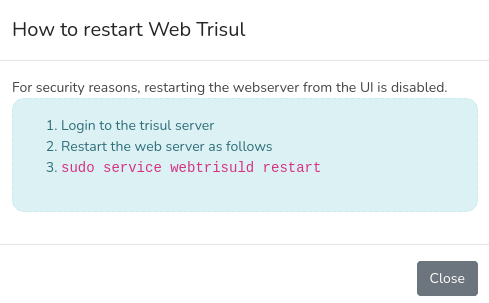

# Start/Stop Tasks

:::info navigation
:point_right: Go to Web Admin &rarr; Manage &rarr; Start/Stop Tasks
:::

This is where admins start or stop tasks including
1) [Restart Web Server](/docs/ag/webadmin/startorstop_tasks#restart-web-server)
2) [Restart Email Notification Service](/docs/ag/webadmin/startorstop_tasks#email-notification-service)

  
*Figure: Start or Stop Tasks*

## Restart Web Server

:::info navigation
:point_right: Go to Web Admin &rarr; Manage &rarr; Start/Stop Tasks &rarr; Restart Web Server
:::

Due to security considerations, the option of restarting your web server is not available through the user interface. To restart your web server, click the *Restart* button in this module to access instructions on how to manually restart from your Trisul Server.

  
*Figure: Instructions to Restart Web Server*

## Email Notification Service

:::info navigation
:point_right: Go to Web Admin &rarr; Manage &rarr; Start/Stop Tasks &rarr; Email Notification Service
:::

In this section, you can turn the email notification service on or off.
This service is responsible for sending alert emails to the recipients you’ve configured.
  
- If the service is **stopped**  
You’ll see a message saying "Email notification service is currently stopped" along with a *Start* button. 
- If the service is **running**  
You’ll see that it’s active (with the process ID) "Email notification service is running with pid xxxxx" with a *Stop* button.
  
Click **Start** when you want Trisul to begin sending alert emails to your configured addresses.  
Click **Stop** if you want to temporarily pause email delivery, for example, during maintenance or testing.
  
The service reads new alerts from syslog and emails them to your recipients. If too many alerts arrive at once, the service is careful not to flood < 5 minutes, it slows down the rate and groups them into a summary email so your inbox doesn’t get flooded.