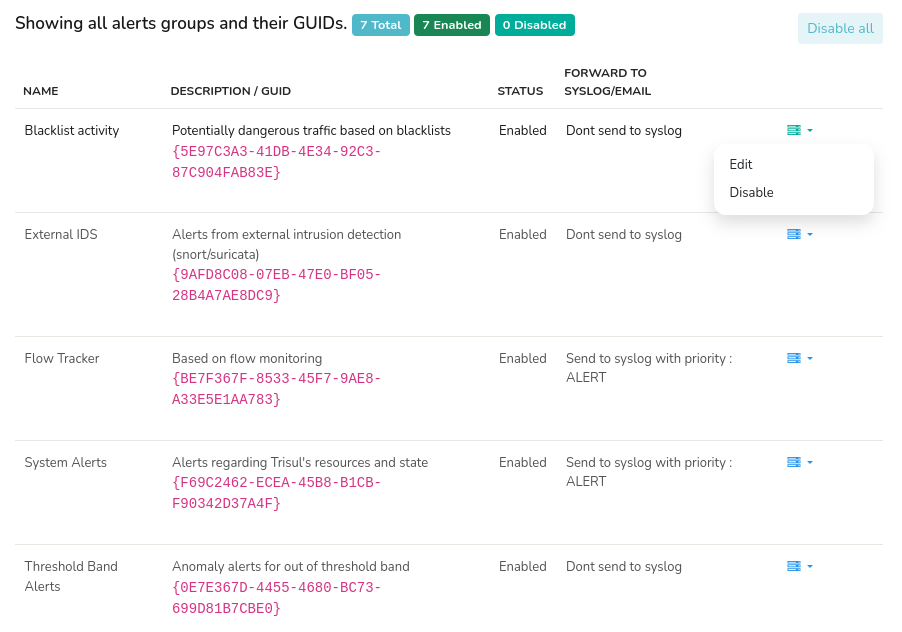

# Email Alert Delivery

## Overview  

This page shows you how to set up email alerts so you get notified the moment something important like an alert or event happens on your network.   
>For that the workflow goes like this:   
**Select the alerts you want → Forward those alerts to syslog → Let the Email Alert Service read those alerts → Alerts are emailed using your SMTP settings**

But the process is simpler than it sounds,to make this easy, Trisul bundles all the four required configurations into one unified interface- the **Email Alerts Wizard**.

As you go through the **Email Alerts Wizard**, you can see a green status label right next to each action button to verify if the configuration is completed.

To access **Email Alerts Wizard** Login as `Admin`

:::info navigation
:point_right: Go to Context: default → Profile0 → Alerts → Setup Email
:::

*Figure: Email Alerts Configuration Wizard*

## Step 1: Email Account Settings

✅ Click [**Email Account Settings**](/docs/ag/webadmin/emailsettings) and configure your SMTP server. This enables Trisul to send outgoing email.

## Step 2: Configure Email Alert Recipients & Alert Groups

✅ Click [**Configure Email Alerts Recipients**](/docs/ag/webadmin/emailsettings#ensure-who-receives-the-alert-emails) and configure who to send email to when alerts fire.

## Step 3: Start the Email Notification Service

✅ Click [**Start/Stop**](/docs/ag/webadmin/startorstop_tasks#email-notification-service) to access the administrative task controls. This service must be running for email alerts to actually be sent.

## Step 4: Verify Syslog Forwarding

✅ Finally, click **Alerts go to syslog**. This will open the alert groups window and you can see the list of all the alert groups and their GUIDs status. You can see the total number of alert groups and the number of alert groups currently enabled and disabled right next to the title.   

Tip: You can disable all the alert groups by clicking **Disable all** on the top right corner.
  
  
  
  *Figure: Email Alerts Groups and their GUIDs*
  
  The alert groups table contains the following components and options.
  
  | Components              | Descriptions                                                                    |
  | ----------------------- | ------------------------------------------------------------------------------- |
  | Name                    | Name of the Alert Group                                                         |
  | Description/GUID        | Description of the Alert group and its GUID                                     |
  | Status                  | Status of the Alert group if its enabled or disabled                            |
  | Forward to syslog/email | Syslog level to automatically forward all alerts in this group to syslog and email|
  | Option toolbar          | You can edit or disable each alert group by clicking on the three lines options against each alert group.                                                                                   |

These components can be edited or disabled by clicking on the option toolbar against each alert group. Once providing all the fields, click **Update** to save the configuration.

Now you can see all the four status label has turned green. Voila! This confirms that your end-to-end email alert delivery is fully enabled .

## Advanced Customization of Email Subjects and Bodies

If you want more control over how alert emails look or which alerts should be sent or skipped, Trisul allows you to customize this through ERB templates.

These settings are managed in  
`/usr/local/share/webtrisul/config/initializers/emailalert_settings.rb` file, where each alert type has its own section. You can fine-tune subjects, message formats, or decide which alert priorities or signatures should generate emails.  

The config file is well documented and should be self describing.

The file contains 5 sections. Each controlling a particular type of alert

1. TCA = Threshold Crossing Alerts
2. FT = Flow Tracker Alerts
3. BADFELLAS = Blacklist based Alerts
4. IDS = Snort/Suricata alerts
5. TBA = Threshold Band Alerts

### IDS Alerts

IDS alerts from Snort/Suricata processed via Trisul.

| EMAIL_BLOCK_PRIORITIES | []  | Block these priorities. Set this to `[3]` to block emails for low priority alerts|
| ---------------------- | --- | ---------------------------------------------------------------------------------|
| EMAIL_BLOCK_SIGS       | []  | Block these signatures for email alerts                                          |