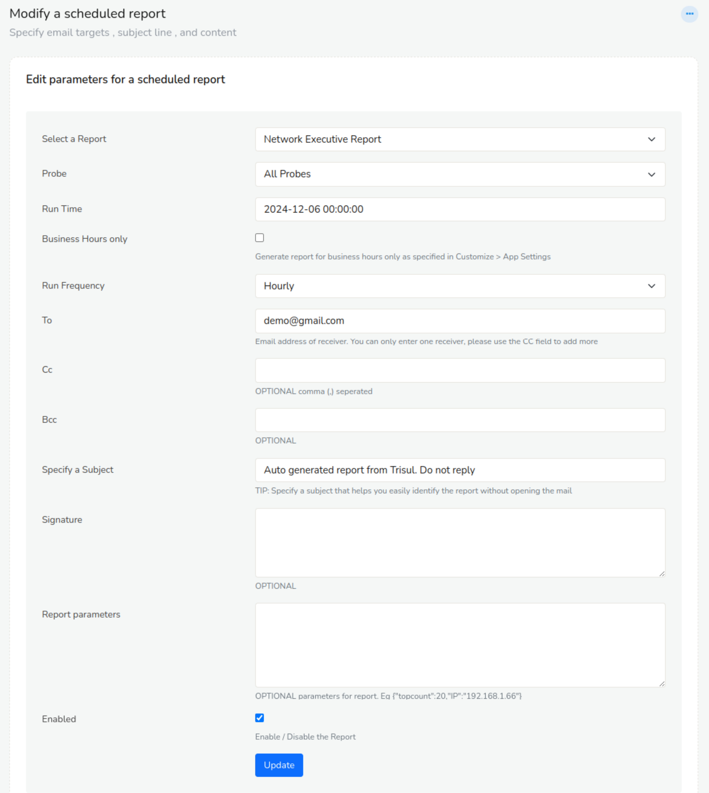
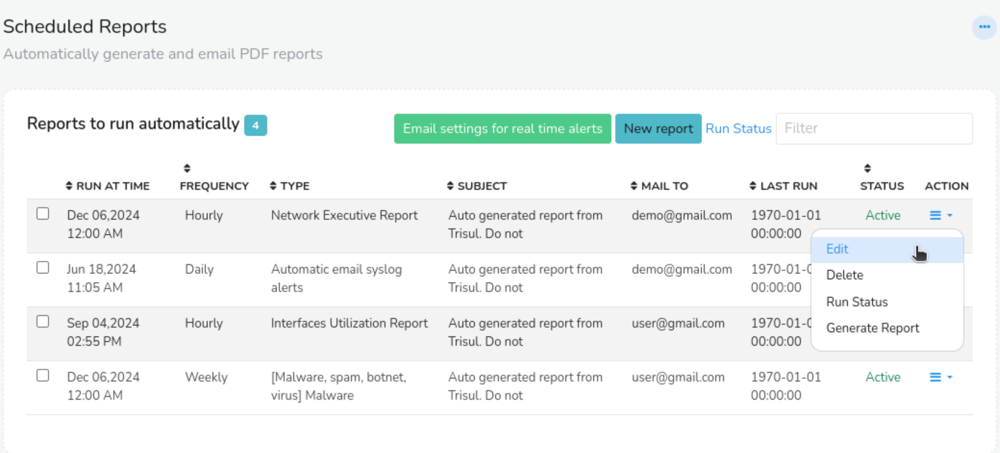

# Schedule Email Reports

You can have Trisul automatically email reports periodically.

## Report Intervals

You may dispatch by email any of the supported report types at these intervals.

1. Hourly
2. Daily
3. Weekly
4. Monthly

## Schedule a New Report

To schedule a new report

:::info navigation

:point_right: Login as `user` Go to Reports → Schedule or you can also   
:point_right: Login as `admin` Go to Context: Default &rarr; Admin Tasks &rarr; Schedule Email Reports

:::

1. A list of all reports scheduled will appear
2. Click **New report**
3. Fill out these fields



*Figure: Showing Schedule a New Email Report Configuration*

Here is the table with the description of all available fields to schedule a new report.

| Field Name                   | Description                                                                     |
| ---------------------------- | --------------------------------------------------------------------------------|
| Select a Report              | You can choose various type of reports                                          |
| Probes                       | You can choose among different nodes if multiple probes are setup               |
| Run Time                     | At the top of what time do you want to run the report. The actual run times of the reports also depends on the frequency. For example if you select “2011-12-20 10:20:00” for hourly report runs. The report will be generated at 10:20, 11:20, 12:20, etc..                                                       |
| Business Hours               | Runs the report for business hours only                                         |
| Run Frequency                | Select from Hourly,Daily,Weekly, or Monthly                                     |
| To                           | Email address of receiver                                                       |
| Cc                           | Recipient received a copy of the message.                                       |
| Bcc                          | Recipients are invisible to all the other recipients of the message             |
| Specify a Subject            | Subject of the report                                                           |
| Signature                    | Signature of the sender                                                         |
| [Report parameters](/docs/ug/reports/schedreports#report-parameters) (optional) | Optional parameters, if present must be in valid `JSON` format. This parameter is only required for these three reports Endpoint Activity, Application Activity, Router and Interfaces             |
| Enabled                      | Keep this checkbox checked to generate reports on schedule and unchecked to temporarily disable scheduled reports                                                                            | 

Once you schedule the report, all your scheduled reports will appear on the index page and you can toggle from there.



*Figure: Showing List of Currently Scheduled Reports in Index Page*

The following is the list of options and their description of all scheduled reports you can see on the index page of scheduled reports.

| Options | Descriptions |
|---------|--------------|
| Run at Time | The scheduled time at which the report will be generated and sent. |
| Frequency | The frequency at which the report will be generated and sent, such as daily, weekly, or hourly. |
| Type | The type of report being generated, such as network executive report, automatic email syslog alerts reports etc. |
| Subject | The subject line of the email that will be sent with the report. |
| Mail to | The email address(es) to which the report will be sent. |
| Last Run | The date and time at which the report was last generated and sent. |
| Status | The current status of the scheduled report, such as active or inactive. |
| Action | The actions that can be taken on the scheduled report, such as "Edit", "Delete", or "Run Status". |

With the action button of the scheduled reprots, you can,

- **Edit** You can edit the parameters of the scheduled report one report at a time.  
- **Delete** You can delete the scheduled report.  
- **Run Status** You can check if the report has been sent successfully to the destination mail address.  
- **Generate Report** You can download the scheduled report manually.  


### Bulk Edit

To bulk edit scheduled reports select and click on the checkboxes on the left side against each scheduled report.

  
*Figure: Bulk Edit Options*

- **Delete** Permanently removes the selected scheduled reports. Use with caution, as deleted reports cannot be recovered.
- **Edit** Allows you to modify the parameters of the selected scheduled reports.
- **Select All** Selects all scheduled reports on the page, enabling bulk actions to be applied to all reports at once.
- **Unselect All** Deselects all scheduled reports on the page, allowing you to start the selection process again.
- **Invert** Toggles the selection of all scheduled reports on the page, selecting those that were previously unselected and vice versa.


## Report Parameters

Some reports are generated for a particular entity such as a specific host or application. For these reports you need to tell Trisul about the entity via the *Report parameters* field. Currently there are three types of such reports.

### Parameters for the Endpoint Activity Report

The *Endpoint activity report* expects you to specify a host.

1. Specify all common fields for a scheduled report
2. In addition enter report parameters as shown below

Say you want to schedule an endpoint report for host 192.168.1.151, enter the ip address in this format  
`{"IP":"192.168.1.151"}` You can also enter a host name instead of an IP like `{"IP":"dns00.unleashnetworks.com"}`

### Parameters for the Application Activity Report

The *Application activity* report expects you to specify an application or port.

1. Specify all common fields for a scheduled report
2. In addition enter report parameters as shown below

Say you want to schedule an for the http app, use this format `{"port1":"http"}` You can also enter a port number `{"port1":"Port-80"}`

### Parameters for the Interface Activity Report

Netflow only You can generate a report for any netflow interface.

1. Specify all common fields for a scheduled report
2. In addition enter report parameters as shown below

Say you want to schedule an report for interface with ifIndex 22 on router 192.168.1.1, use the following format  
`{"interface":"192.168.1.1_22"}`

## Enable Email Dispatching

After you have setup email, you need to enable the job that actually generates the report and sends out the email.

To enable this :

:::info navigation

:point_right: Select Customize → App Settings

:::

Check the **Automatically email scheduled reports**

> Note: Ensure you have set up your [Email Settings](/docs/ug/reports/emailsettings)

## Troubleshooting

Are your reports not coming through ? Here are some possible reasons.

### Check if cron support is available in your system

As root type

```
crontab -l
```

### Check the Logs

If you are not receiving the email reports, check the logs.

:::info navigation

:point_right: Login as Admin → WebAdmin → View Logs  
Click on **Background tasks log**

:::

You can see if any errors are observed there.

## Executive Network Report


The Executive Network Report provides a comprehensive overview of network activity and performance, including:

|Content| Description |
|--------|-------------|
| Bandwidth Utilization| Total bandwidth received and transmitted |
| Alerts | Notifications from threshold crossing alerts, , Flow tracker indicating analysis of network flows to identify trends and patterns, Badfellas for identification of suspicious or malicious hosts, and IDS indicating potential issues |
| Bandwidth Utilization Chart| Visual representation of total bandwidth usage|
| Top Internal Hosts | Most active internal hosts | 
| Top External Hosts | Most active external hosts|
| Top Applications | Most used applications |
| Top Network Layers | Most used network layers |
| Top HTTP URL Category | Most accessed URL categories |
| Top Country | Countries with the most network activity |

This report provides a concise and informative snapshot of network performance, security, and usage patterns.

Download Sample Report here : [Executive Network Report](images/execnwreport.pdf)

## Application Activity Report

The Application Usage Report provides a comprehensive overview of application activity and performance, including,


|Content| Description |
|--------|-------------|
| Top Hosts by Total Volume | Ranking of hosts with the highest total data transfer volume |
| Top Applications | Identification of the most frequently used applications |
| Top Server Hosts | List of server hosts with the highest levels of activity |
| Top Client Hosts | Ranking of client hosts generating the most network traffic |
| Top Internal Hosts | Identification of internal hosts with the highest levels of activity |
| Top External Hosts | List of external hosts communicating with the network |
| Top Tags | Categorization of network activity by relevant tags or keywords |
| Top Flows | Analysis of the most prominent network flows, highlighting patterns and trends |

Download Sample Report here : [Application Activity Report](images/applicationreport.pdf)

## Subscriber Activity Report

The Subscriber Activity Report provides a comprehensive overview of network activity and performance, including:

|Content| Description |
|--------|-------------|
| Inbound and Outbound Traffic Chart | Visual representation of incoming and outgoing network traffic |
| TCP Connection Activity | Analysis of TCP connections, highlighting potential issues such as large spikes indicating P2P or infected systems scanning |
| Blacklisted Connection Trends | Aggregate view of malware, spamming, and botnet activity |
| Top 50 Users by Total Traffic | Ranking of users by total uploaded and downloaded traffic |
| Top 50 Users by Connections | Identification of users with the most TCP connections, often indicative of P2P app usage |
| Top 50 Downloaders | List of users with the highest received traffic |
| Top 50 Uploaders | List of users with the highest transmitted traffic |
| Top 50 Potentially Infected | Identification of users hitting malware, virus, phishing, and spamming blacklists |
| Top 50 Apps for Uploads | Applications responsible for the most upload traffic |
| Top 50 Apps for Downloads | Applications responsible for the most download traffic |


Download Sample Report here : [Application Activity Report](images/subscriberactivityreport.pdf)

## Malware Report

The Malware Report provides a comprehensive overview of malware activity and performance, including:

|Content| Description |
|--------|-------------|
| Malware Alerts | Identification of potential malware threats |
| Blacklist Matches | Categorization of blacklisted traffic, indicating type of malicious activity |
| Connection Activity with Blacklist Hits | Analysis of connections with known malicious entities |
| ICMP Activity | Monitoring of ICMP traffic, potentially indicating port scanning, PING flood, and other attacks |
| Top 50 Blacklisted Internal Hosts | Ranking of internal hosts with the most blacklist hits, based on malware, virus, phishing, and spamming activity |
| Top 50 Blacklisted External Hosts | Identification of external hosts with the most blacklist hits, based on malware, virus, phishing, and spamming activity |
| Top Alerts Type | Categorization of most common alert types |
| Latest Malware Alerts | List of most recent malware alerts |

Download Sample Report here : [Malware Report](images/Malwarealertsreport.pdf)

## Interface Activity Report

The Interface Activity Report provides a comprehensive overview of interface activity and performance, including:

|Content| Description |
|--------|-------------|
| Top Hosts by Total Volume | 	Ranking of hosts with the highest total data transfer volume |
| Top Applications | Idetification of most frequently used applications. |
| Top Server Hosts | List of server hosts with the highest levels of activity |
| Top Client hosts | Ranking of clients hosts generating the most network traffic | 
| Top Internal Hosts | 	Identification of internal hosts with the highest level of activity |
| Top External Hosts | List of external hosts communicating with the network |
| Top Tags | Categorization of network activity by relevant tags or keywords |
| Top Flows | Analysis of the most prominent network flows, highlighting patterns and trends |
 
Download Sample Report here : [Interface Activity Report](images/interfacereport.pdf)

## Routers and Interfaces Report

The Routers and Interface Activity Report provides a comprehensive overview of router and interface activity, including:

|Content| Description |
|--------|-------------|
| Router Activity Report Chart | Visual representation of top 20 routers by volume, highlighting network traffic patterns |
| Interface Report Chart | Breakdown of top 2 interfaces for each of the top 20 routers, showing total traffic per interface |

Download Sample Report here : [Routers and Interfaces Report](images/routersandinterfacereport.pdf)

## Traffic and Toppers (Internal Hosts)

The Top Toppers and Traffic (Internal Hosts) Report provides a comprehensive overview of network activity and performance, including:

|Content| Description |
|--------|-------------|
| Top Toppers and Traffic by Total | Total top toppers and traffic received and transmitted |
| Newly Seen Top Toppers and Traffic by Total | Newly detected top toppers and traffic patterns |
| Top Toppers and Traffic by Received | Top toppers and traffic received by the network |
| Newly Seen Top Toppers and Traffic by Received | Newly seen top toppers and traffic patterns in received data |
| Top Toppers and Traffic by Transmit | Top toppers and traffic transmitted from the network |
| Newly Seen Top Toppers and Traffic by Transmit | Newly detected top toppers and traffic patterns in transmitted data|
| Top Toppers and Traffic by Total Packets | Top toppers and traffic based on total packets |
| Newly Seen Top Toppers and Traffic by Total Packets | Newly seen top toppers and traffic patterns in packet data |
| Top Toppers and Traffic by Active Connections | Top toppers and traffic associated with active connections |
| Newly Seen Top Toppers and Traffic by Active Connections | Newly detected top toppers and traffic patterns in active connections |
| Top Toppers and Traffic by Attacker Alerts | Top toppers and traffic linked to attacker alerts |
| Newly Seen Top Toppers and Traffic by Attacker Alerts | Newly seen top toppers and traffic patterns related to attacker alerts |
| Top Toppers and Traffic by Homenet | Top toppers and traffic within the homenet |
| Newly Seen Top Toppers and Traffic by Homenet | Newly detected top toppers and traffic patterns in the homenet |
| Top Toppers and Traffic by External | Top toppers and traffic from external sources |
| Newly Seen Top Toppers and Traffic by External | Newly seen top toppers and traffic patterns from external sources |
| Top Toppers and Traffic by TCP SYN Sent | Top toppers and traffic associated with TCP SYN sent |
| Newly Seen Top Toppers and Traffic by TCP SYN Sent | Newly detected top toppers and traffic patterns in TCP SYN sent |
| Top Toppers and Traffic by TCP SYN Received | Top toppers and traffic linked to TCP SYN received |
| Newly Seen Top Toppers and Traffic by TCP SYN Received | Newly seen top toppers and traffic patterns in TCP SYN received |
| Top Toppers and Traffic by Blacklist Alerts | Top toppers and traffic associated with blacklist alerts|
| Newly Seen Top Toppers and Traffic by Blacklist Alerts | Newly detected top toppers and traffic patterns in blacklist alerts |
| Top Toppers and Traffic by Victim Alerts | Top toppers and traffic linked to victim alerts |
| Newly Seen Top Toppers and Traffic by Victim Alerts | Newly seen top toppers and traffic patterns related to victim alerts |
| Top Toppers and Traffic by New Connections | Top toppers and traffic associated with new connections |
| Newly Seen Top Toppers and Traffic by New Connections | Newly detected top toppers and traffic patterns in new connections |
| Top Toppers and Traffic by Incoming Interface | Top toppers and traffic entering through specific interfaces |
| Newly Seen Top Toppers and Traffic by Incoming Interface | Newly seen top toppers and traffic patterns in incoming interfaces |
| Top Toppers and Traffic by Outgoing Interface | Top toppers and traffic exiting through specific interfaces |
| Newly Seen Top Toppers and Traffic by Outgoing Interface | Newly detected top toppers and traffic patterns in outgoing interfaces |
| Top Toppers and Traffic by Flow Records | Top toppers and traffic associated with flow records |
|	Newly Seen Top Toppers and Traffic by Flow Records | Newly seen top toppers and traffic patterns in flow records |
| Top Toppers and Traffic by Unused Cardinality Counter | Top toppers and traffic linked to unused cardinality counters |
| Newly Seen Top Toppers and Traffic by Unused Cardinality Counter | Newly detected top toppers and traffic patterns in unused cardinality counters |

Download Sample Report here : [Traffic and Toppers (Internal Hosts)](images/toptoppersandtraffic.pdf)

## Toppers and Traffic (Applications)

The Toppers and Traffic Report provides a comprehensive overview of network activity and performance, including: 

|Content| Description |
|--------|-------------|
| Top Toppers and Traffic by Total | Overall statistics on top toppers and traffic |
| Newly Seen Top Toppers and Traffic by Total | Newly seen top toppers and traffic statistics |
| Top Toppers and Traffic by Security Alerts | Statistics on top toppers and traffic related to security alerts |
| Newly Seen Top Toppers and Traffic by Security Alerts | Newly seen top toppers and traffic statistics related to security alerts |
| Top Toppers and Traffic by Into Homenet | Statistics on top toppers and traffic entering the Homenet |
| Newly Seen Top Toppers and Traffic by Into Homenet | Newly seen top toppers and traffic statistics entering the Homenet |
| Top Toppers and Traffic by Outof Homenet | Statistics on top toppers and traffic leaving the Homenet |
| Newly Seen Top Toppers and Traffic by Outof Homenet | Newly seen top toppers and traffic statistics leaving the Homenet |
| Top Toppers and Traffic by Connections | Statistics on top toppers and traffic by connection type |
| Newly Seen Top Toppers and Traffic by Connections | Newly seen top toppers and traffic statistics by connection type |
| Top Toppers and Traffic by Internal Homenet | Statistics on top toppers and traffic within the Homenet |
| Newly Seen Top Toppers and Traffic by Internal Homenet | Newly seen top toppers and traffic statistics within the Homenet |
| Top Toppers and Traffic by Transit Homenet | Statistics on top toppers and traffic transiting the Homenet |
| Newly Seen Top Toppers and Traffic by Transit Homenet | Newly seen top toppers and traffic statistics transiting the Homenet |
| Top Toppers and Traffic by Active Conns | Statistics on top toppers and traffic by active connections |
| Newly Seen Top Toppers and Traffic by Active Conns | Newly seen top toppers and traffic statistics by active connections |
| Top Toppers and Traffic by Into Interface | Statistics on top toppers and traffic entering through specific interfaces |
| Newly Seen Top Toppers and Traffic by Into Interface | Newly seen top toppers and traffic statistics entering through specific interfaces |
| Top Toppers and Traffic by Outof Interface | Statistics on top toppers and traffic leaving through specific interfaces |
| Newly Seen Top Toppers and Traffic by Outof Interface | Newly seen top toppers and traffic statistics leaving through specific interfaces |
| Top Toppers and Traffic by Unused Cardinality Counter | Statistics on top toppers and traffic related to unused cardinality counters |
| Newly Seen Top Toppers and Traffic by Unused Cardinality Counter | Newly seen top toppers and traffic statistics related to unused cardinality counters |

Download Sample Report here : [Traffic and Toppers (Applications)](images/toppersandtrafficapps.pdf)

## System Health Report

The System Health Report provides a comprehensive overview of the Trisul deployment’s operational status, resource usage, and component health. It includes the following key sections:

|Content| Description |
|--------|-------------|
| Overall System Health Summary | Shows the global health status of the Trisul system, including the condition of disk, memory, hub, probe, flow flushing, routers, and IPDR services. |
| Disk Usage Status | Detailed usage statistics for each configured storage area, including total size, used and available space, percentage utilization, mount paths, and configured vs. available counter counts. |
| Memory Usage | Summary of total system memory and breakdown of memory consumption between Trisul processes and the underlying system. |
| Process Running Status | Displays the operational status of core Trisul components such as Hub, Probe, and IPDR to confirm whether they are active and running as expected. |
| Last Flushed Count | Reports the most recent flush activity for flows and routers, showing the timestamp and the number of items flushed. Useful for verifying that data processing is up-to-date. |
| Available Time | Indicates the total duration of available monitoring history, showing the earliest retained timestamp up to the latest captured time. |

Download Sample Report here : [System Health Report](images/syshealthreport.pdf)